# 尚硅谷\_JavaSE\_day01

# JavaSE\_day01【Java基础语法】

## 今日内容

-   Java语言的发展历史
-   编写HelloWorld程序
-   常量
-   变量

## 学习目标

-   [ ] 能够使用常见的DOS命令
-   [ ] 理解Java语言的跨平台实现原理
-   [ ] 理解JDK/JRE/JVM的组成和作用
-   [ ] 能够编写HelloWorld程序编译并执行
-   [ ] 能够配置环境变量JAVA\_HOME
-   [ ] 能够辨识关键字
-   [ ] 理解标识符的含义
-   [ ] 理解Java中的基本数据类型分类
-   [ ] 能够定义8种基本数据集类型的变量

# 第一章  开发前奏

## 1.1 计算机语言介绍

### 计算机语言是什么

所谓计算机编程语言，就是人们可以使用编程语言对计算机下达命令，让计算机完成人们需要的功能。

### 计算机语言发展

-   第一代：机器语言
-   第二代：汇编语言
-   第三代：高级语言
    -   面向过程语言
    -   面向对象语言

### 计算机语言排行榜

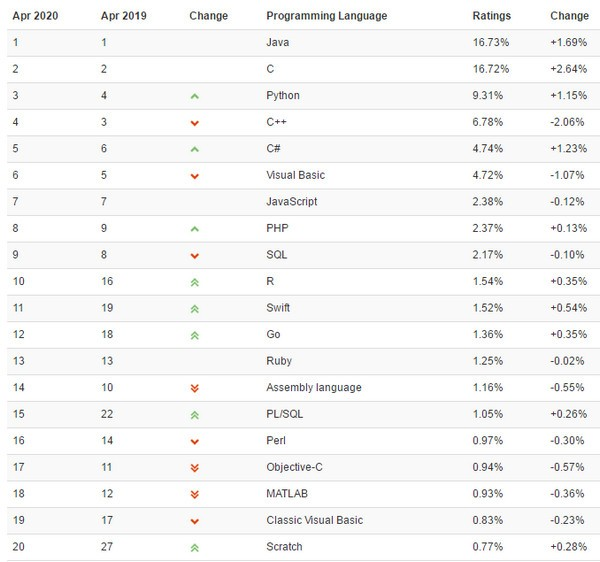

### 计算机语言走势

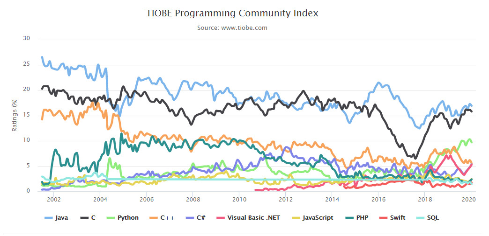

## 1.2 进制和进制转换（了解）

### 进制

-   进制也就是进位计数制，是人为定义的带进位的计数方法。对于任何一种进制，它是几进制，就表示每一位置上的数运算时都是逢几进一位。

### 进制转换

-   **十进制数据转成二进制数据：** 使用除以2获取余数的方式

    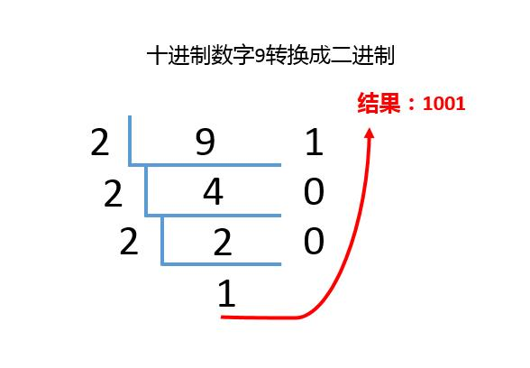
-   **二进制数据转成十进制数据：** 使用8421编码的方式

    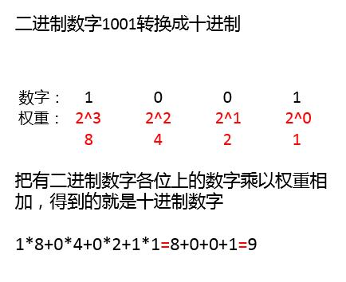

## 1.3 字节和位

-   **字节（Byte）：** 是计算机信息技术用于计量存储容量的一种计量单位，通常情况下一字节等于有八位， 也表示一些计算机编程语言中的数据类型和语言字符。
-   **位（bit）：** 是数据存储的最小单位。也就是二进制。二进制数系统中，每个0或1就是一个位，叫做bit（比特），其中8 bit 就称为一个字节(Byte)。
-   **转换关系：**
    -   8 bit = 1 Byte
    -   1024 Byte = 1 KB
    -   1024 KB = 1 MB
    -   1024 MB = 1 GB
    -   1024 GB = 1 TB

## 1.4  常用DOS命令

Java语言的初学者，学习一些DOS命令，会非常有帮助。DOS是一个早期的操作系统，现在已经被Windows系统取代，对于我们开发人员，目前需要在DOS中完成一些事情，因此就需要掌握一些必要的命令。

-   **进入DOS操作窗口**
    -   按下`Windows+R`键，打开运行窗口，输入`cmd`回车，进入到DOS的操作窗口。

        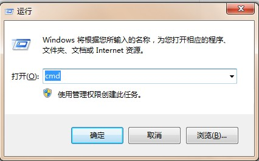
    -   打开DOS命令行后，看到一个路径 `C:\Users\...`  就表示我们现在操作的磁盘是C盘。

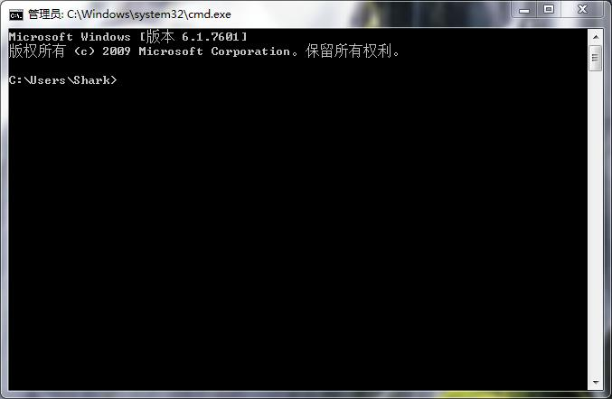

-   **常用命令**
    | 命令        | 操作符号      |
    | --------- | --------- |
    | 盘符切换命令    | `盘符名:`    |
    | 查看当前文件夹内容 | ` dir`    |
    | 进入文件夹命令   | `cd 文件夹名` |
    | 退出文件夹命令   | `cd ..`   |
    | 退出到磁盘根目录  | `cd \`    |
    | 清屏        | `cls`     |
    | 退出        | `exit`    |

# 第二章  初识Java

## 2.1 JavaSE课程体系介绍

### JavaSE知识图解

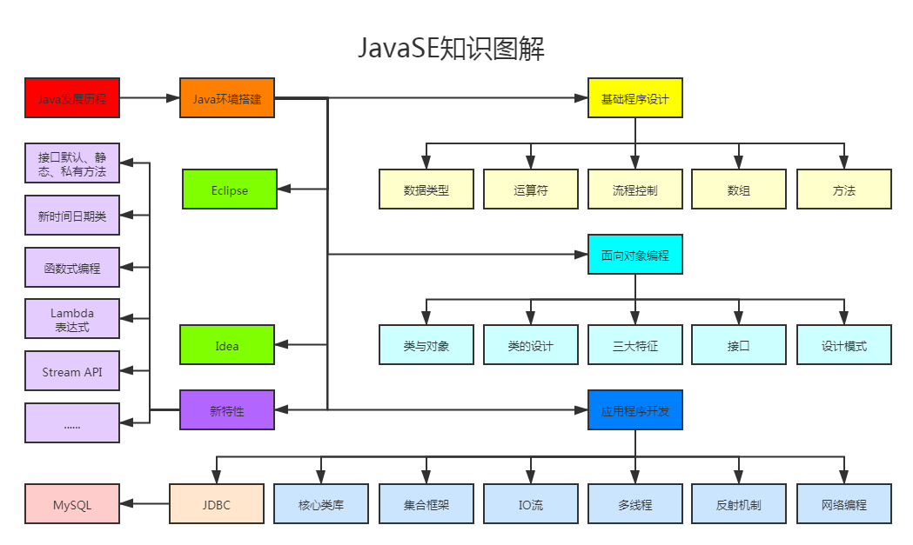

### JavaSE和数据库知识模块介绍

-   **第一部分：计算机编程语言核心结构：**`数据类型`、`运算符`、`流程控制`、`数组`、`方法`、…
-   **第二部分：Java面向对象核心逻辑：**`封装`、`继承`、`多态`、`抽象`、`接口`、…
-   **第三部分：JavaSE核心高级应用：**`集合`、`I/O`、`多线程`、`网络编程`、`反射机制`、…
-   **第四部分：Java新特性：**`Lambda表达式`、`函数式编程`、`新Date/Time API`、`接口的默认、静态和私有方法`、…
-   **第五部分：MySQL/JDBC核心技术：**`SQL语句`、`数据库连接池`、`DBUtils`、`事务管理`、`批处理`、…

## 2.2 Java语言概述

### Java语言发展历史

| 发行版本          | 发行时间       | 备注                                          |
| ------------- | ---------- | ------------------------------------------- |
| Java          | 1995.05.23 | SUN公司在Sun world会议上正式发布Java和HotJava浏览器       |
| Java 1.0      | 1996.01.23 | Sun公司发布了Java的第一个开发工具包                       |
| Java 1.1      | 1997.02.19 |                                             |
| Java 1.2      | 1998.12.08 | 拆分成：J2SE（标准版）、J2EE（企业版）、J2ME（小型版）           |
| Java 1.3      | 2000.05.08 |                                             |
| Java1.4       | 2004.02.06 |                                             |
| ​**Java 5.0** | 2004.09.30 | ①版本号从1.4直接更新至5.0；②平台更名为JavaSE、JavaEE、JavaME |
| Java 6.0      | 2006.12.11 | 2009.04.20 Oracle宣布收购SUN公司                  |
| Java 7.0      | 2011.07.02 |                                             |
| ​**Java 8.0** | 2014.03.18 | ​**LTS版本**                                  |
| Java 9.0      | 2017.09.22 | ①每半年更新一次；②Java 9.0开始不再支持windows 32位系统       |
| Java 10.0     | 2018.03.21 |                                             |
| Java 11.0     | 2018.09.25 | ①JDK安装包取消独立JRE安装包；②**LTS版本**                |
| Java 12.0     | 2019.03.19 |                                             |
| Java 13.0     | 2019.09.17 |                                             |
| Java 14.0     | 2020.03.17 |                                             |
| Java 15.0     | 2020.09.16 |                                             |
| Java 16.0     | 2021.03.16 |                                             |
| Java17.0      | 2021.09.14 | LTS版本                                       |

-   LTS（Long Term Support）:长期支持版本，下一个LTS版本为Java 17.0

### Java技术体系平台

-   JavaSE（标准版）：是为开发普通桌面应用程序和商务应用程序提供的解决方案。
-   JavaME（小型版）：是为开发电子消费产品和嵌入式设备提供的解决方案，但已经被Android所取代。
-   JavaEE（企业版）：是为开发企业环境下的应用程序提供的一套解决方案，主要针对于Web应用程序开发。

## 2.2 Java语言跨平台原理

### Java语言的特点

-   **完全面向对象：** Java语言支持封装、继承、多态，面对对象编程，让程序更好达到`高内聚`，`低耦合`的标准。
-   **支持分布式：** Java语言支持Internet应用的开发，在基本的Java应用编程接口中有一个网络应用编程接口（java net），它提供了用于网络应用编程的类库，包括URL、URLConnection、Socket、ServerSocket等。Java的RMI（远程方法激活）机制也是开发分布式应用的重要手段。
-   **健壮型：** Java的强类型机制、异常处理、垃圾的自动收集等是Java程序健壮性的重要保证。对指针的丢弃是Java的明智选择。
-   **安全：** Java通常被用在网络环境中，为此，Java提供了一个安全机制以防恶意代码的攻击。如：安全防范机制（类ClassLoader），如分配不同的名字空间以防替代本地的同名类、字节代码检查。
-   **跨平台性：** Java程序（后缀为java的文件）在Java平台上被编译为体系结构中立的字节码格式（后缀为class的文件），然后可以在实现这个Java平台的任何系统中运行。

### Java语言的跨平台原理

-   **跨平台**：任何软件的运行，都必须要运行在操作系统之上，而我们用Java编写的软件可以运行在任何的操作系统上，这个特性称为**Java语言的跨平台特性**。该特性是由JVM实现的，我们编写的程序运行在JVM上，而JVM运行在操作系统上。
-   **JVM**（Java Virtual Machine ）：Java虚拟机，简称JVM，是运行所有Java程序的假想计算机，是Java程序的运行环境之一，也是Java 最具吸引力的特性之一。我们编写的Java代码，都运行在**JVM** 之上。


如图所示，Java的虚拟机本身是不具备跨平台功能的，每个操作系统下都有不同版本的虚拟机。

## 2.3 JRE和JDK

-   \*\*JRE \*\* (Java Runtime Environment) ：是Java程序的运行时环境，包含`JVM` 和运行时所需要的`核心类库`。
-   **JDK**  (Java Development Kit)：是Java程序开发工具包，包含`JRE` 和开发人员使用的工具。

我们想要运行一个已有的Java程序，那么只需安装`JRE` 即可。

我们想要开发一个全新的Java程序，那么必须安装`JDK` ，其内部包含`JRE`。


> 友情提示：
> 三者关系： JDK > JRE > JVM

## 2.4 JDK下载和安装

### JDK的下载

-   下载网址：[www.oracle.com](http://www.oracle.com "www.oracle.com")
-   下载步骤：
    -   登录Oracle公司官网，[www.oracle.com，如图所示：]()

        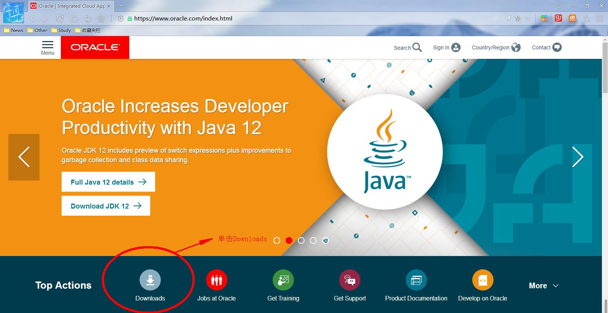
    -   在**Developer Downloads**处，选择`Java`，单击进入，如图所示：

        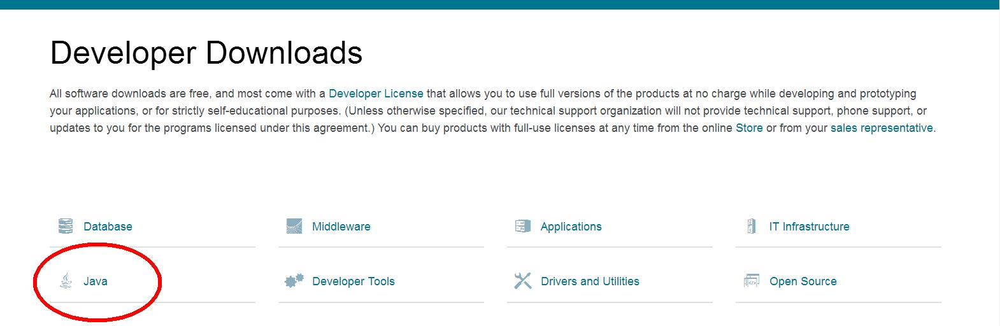
    -   下拉页面，找到**Java**，在此选择`Java (JDK) for Developers`，单击进入，如图所示：

        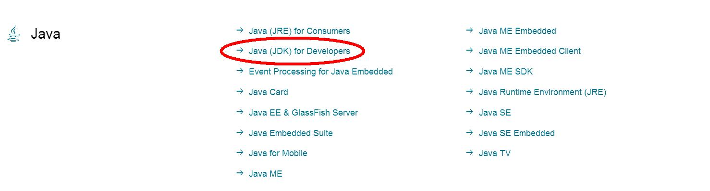
    -   下拉页面，找到**Java SE 8u201 / Java SE 8u202**，在此处选择`JDK DOWNLOAD`，单击进入，如图所示：

        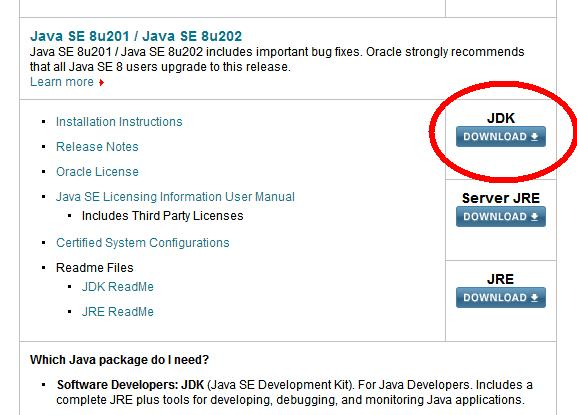
    -   下拉页面，找到 **Java SE Development Kit 8u202**，选择**Accept License Agreement**，如图所示：

        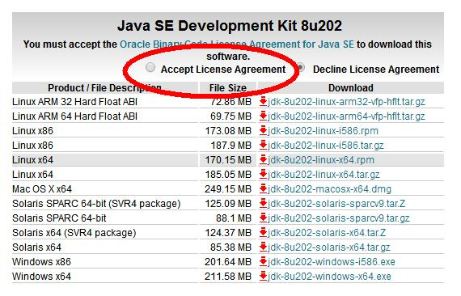
    -   如果电脑系统版本是32位的，请选择`jdk-8u202-windows-i586.exe`下载；如果电脑系统版本是64位的，请选择`jdk-8u202-windows-x64.exe`下载。如图所示：

        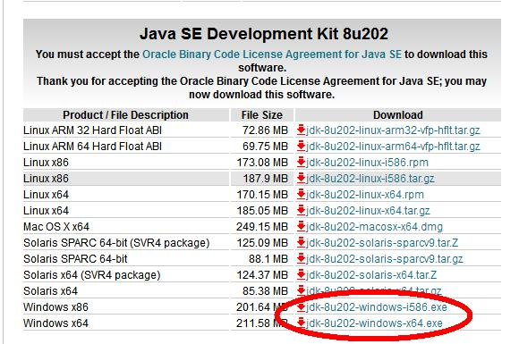

### JDK的安装

-   安装步骤：
    -   双击`jdk-8u202-windows-x64.exe`文件，并单击`下一步`，如图所示：

        
    -   取消独立JRE的安装，单击`公共JRE前的下拉列表`，选择`此功能将不可用`，如图所示：

        
    -   修改安装路径，单击`更改`，如图所示：

        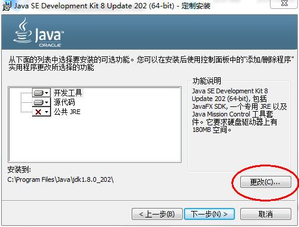
    -   将安装路径修改为`D:\develop\Java\jdk1.8.0_202\`，并单击`确定`，如图所示：

        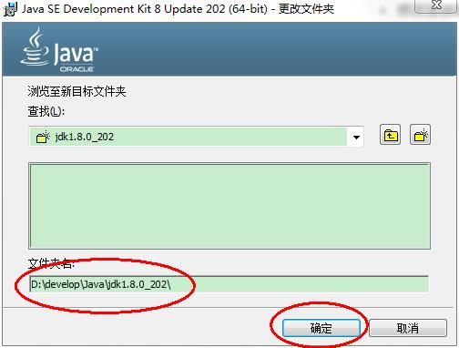
    -   单击`下一步`，如图所示：

        
    -   稍后几秒，等待安装，安装完成，如图所示：

        

# 第三章 入门程序HelloWorld

## 3.1 HelloWorld案例

### 程序开发步骤说明

JDK安装完毕，可以开发我们第一个Java程序了。

Java程序开发三步骤：**编写**、**编译**、**运行**。


### 编写Java源程序

-   在`D:\develop\Java\jdk1.8.0_202\bin` 目录下新建文本文件，完整的文件名修改为`HelloWorld.java`，其中文件名为`HelloWorld`，后缀名必须为`.java` 。
-   用记事本打开
-   在文件中键入文本并保存，代码如下：
    ```java
    public class HelloWorld {
        public static void main(String[] args) {
          System.out.println("HelloWorld");
        }
    }
    ```

> 友情提示：
> 文件名必须是`HelloWorld` ，保证文件名和类的名字是一致的，注意大小写。
> 每个字母和符号必须与示例代码一模一样。

第一个`HelloWord` 源程序就编写完成了，但是这个文件是程序员编写的，JVM是看不懂的，也就不能运行，因此我们必须将编写好的`Java源文件` 编译成JVM可以看懂的`字节码文件` ，也就是`.class`文件。

### 编译Java源文件

在DOS命令行中，**进入**`D:\develop\Java\jdk1.8.0_202\bin`**目录**，使用`javac` 命令进行编译。

命令：

```java
javac Java源文件名.后缀名
```

举例：

```纯文本
javac HelloWorld.java
```

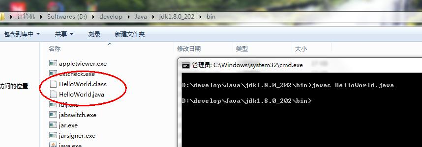

编译成功后，命令行没有任何提示。打开`D:\develop\Java\jdk1.8.0_202\bin`目录，发现产生了一个新的文件 `HelloWorld.class`，该文件就是编译后的文件，是Java的可运行文件，称为**字节码文件**，有了字节码文件，就可以运行程序了。

> Java源文件的编译工具`javac.exe`

### 运行Java程序

在DOS命令行中，**进入Java源文件的目录**，使用`java` 命令进行运行。

命令：

```java
java 类名字
```

举例：

```纯文本
java HelloWorld
```

> 友情提示：
> java HelloWord  不要写 不要写 不要写 .class

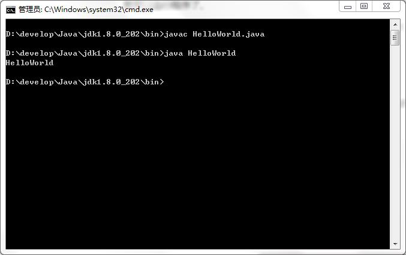

> Java程序`.class文件` 的运行工具`java.exe`
> 思考：目前我们将Java源文件放到了JDK的bin目录下，如果放到其他路径下，是否可以正常编译

## 3.2 HelloWorld案例常见错误

-   单词拼写问题：**Java语言是一门严格区分大小写的语言**
-   正确：class				错误：Class
-   正确：String              错误：string
-   正确：System            错误：system
-   正确：main	        	错误：mian
-   符号使用问题
-   不能用中文符号，英文半角的标点符号（正确）
-   括号问题，成对出现

## 3.3 Editplus文本编辑器的安装和配置

-   安装步骤
    -   双击打开软件，点击`Accept`进入下一步，如图所示：

        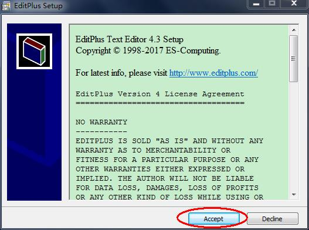
    -   将安装路径修改为`D:\develop\EditPlus`，点击`Star Copy`，如图所示：

        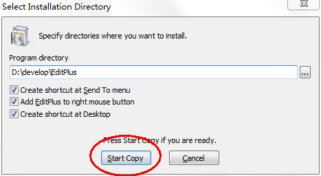
    -   安装成功后，会弹出成功界面，并在桌面上生成Editplus图标，如图所示：

        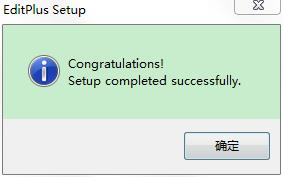
-   配置步骤
    -   在安装成功后，将day01资料中的`java.acp`和`template.java`复制粘贴到`D:\develop\EditPlus`文件夹中即可。
    -   在桌面双击Editplus图标，进入Editplus软件协议界面，单击`Yes`，如图所示：

        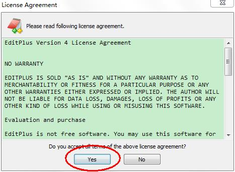
    -   弹出文件存储界面，不做任何修改，单击`OK`，如图所示：

        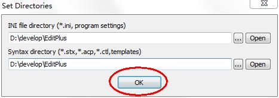
    -   修改文件备份设置，在进入Editplus软件后，依次点击`Tools`==> `Preferences`==>`File`，取消`Create backup file when saving`设置前的对号，如图所示：

        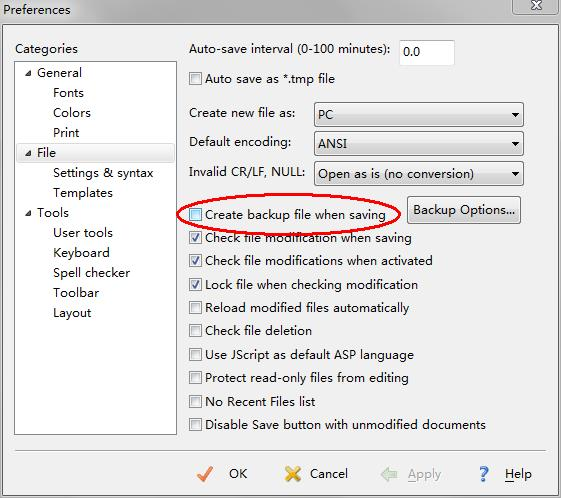
    -   修改缩进符，在进入Editplus后，依次点击`Tools`==> `Preferences`==>`File`==>`Settings & syntax`==>`Tab/Indet`，弹出窗口，将Tab size后面的数字修改为4，如图所示：

        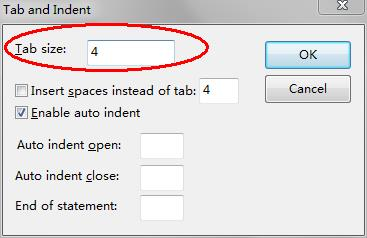

## 3.4 JAVA\_HOME环境变量的配置

-   步骤：
    -   打开桌面上的计算机，进入后在左侧找到`计算机`，单击鼠标`右键`，选择`属性`，如图所示：

        
    -   选择`高级系统设置`，如图所示：

        
    -   在`高级`选项卡，单击`环境变量`，如图所示：

        
    -   在`系统变量`中，单击`新建` ，创建新的环境变量，如图所示：

        
    -   变量名输入`JAVA_HOME`，变量值输入 `D:\develop\Java\jdk1.8.0_202` ，并单击`确定`，如图所示：

        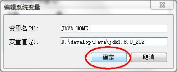
    -   选中`Path` 环境变量，`双击`或者`点击编辑` ,如图所示：

        
    -   在变量值的最前面，键入`%JAVA_HOME%\bin;`  分号必须要写，而且还要是**英文符号**。如图所示：

        
    -   环境变量配置完成，重新开启DOS命令行，在任意目录下输入`javac` 命令，运行成功。

        

# 第四章  Java基础语法

## 4.1 注释（*Comment*）

-   **注释**：就是对代码的解释和说明。其目的是让人们能够更加轻松地了解代码。为代码添加注释，是十分必须要的，它不影响程序的编译和运行。
-   Java中有`单行注释`、`多行注释`和`文档注释`
    -   单行注释以 `//`开头，以`换行`结束，格式如下：
        ```java
        // 注释内容
        ```
    -   多行注释以 `/*`开头，以`*/`结束，格式如下：
        ```java
        /*
          注释内容
         */
        ```
    -   文档注释以`/**`开头，以`*/`结束
        ```java
        /**
          注释内容
         */
        ```

## 4.2 关键字（*Keyword*）

**关键字**：Java语言中，被赋予特殊含义和用途的单词。

-   HelloWorld案例中，出现的关键字有 `public ` 、`class` 、 `static` 、  `void`  等，这些单词已经被Java定义好
-   关键字的特点：全部都是`小写字母`。
-   关键字比较多，不需要死记硬背，学到哪里记到哪里即可。
-   基本数据类型相关关键字（8个）

    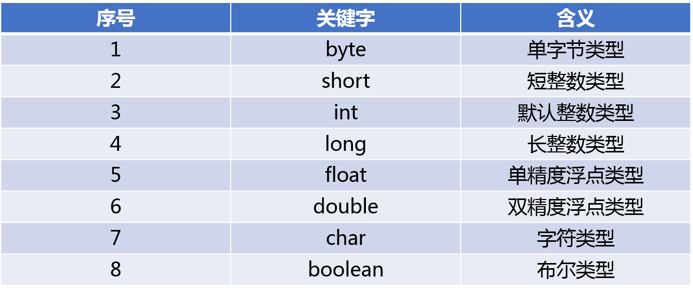
-   特殊值关键字（3个）

    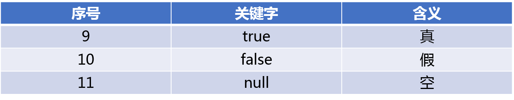
-   声明引用数据类型相关关键字（3个）

    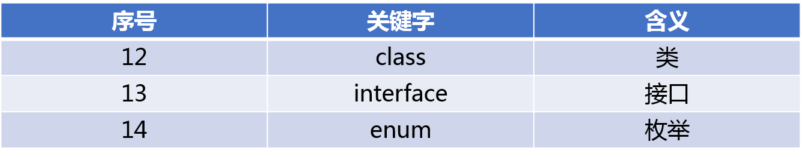
-   特殊空类型关键字（1个）

    
-   流程控制语句相关关键字（10个）

    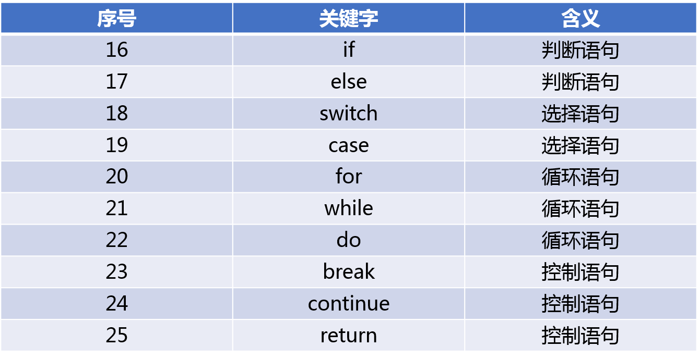
-   关系关键字（3个）

    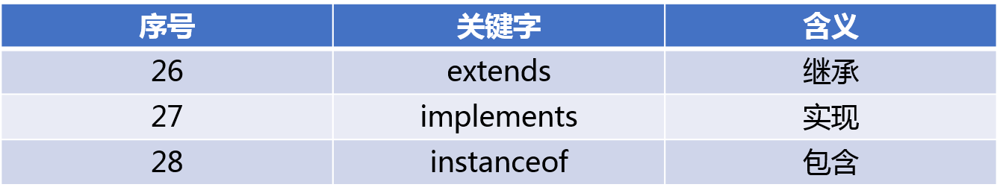
-   引用关键字（2个）

    
-   开辟内存空间关键字（1个）

    
-   包关键字（2个）

    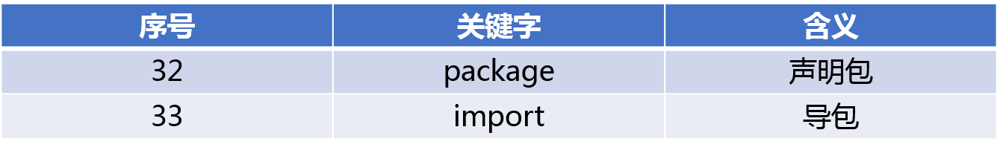
-   权限修饰关键字（3个）

    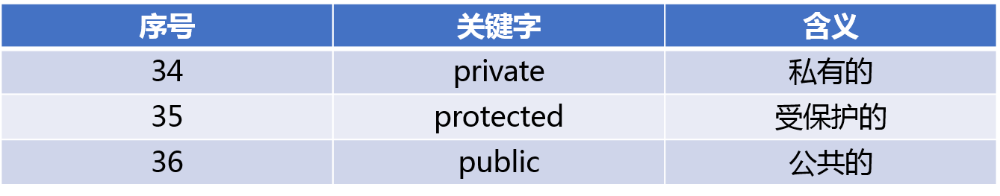
-   其它修饰关键字（9个）

    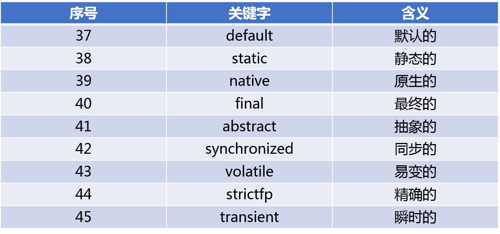
-   异常处理关键字（5个）

    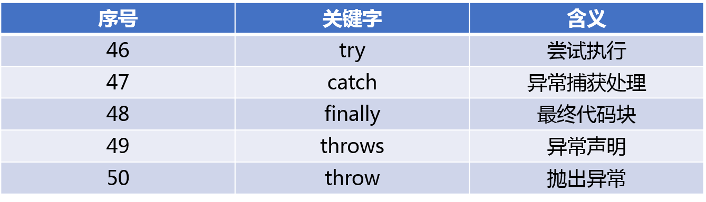
-   断言关键字（1个）

    
-   保留关键字（2个）

    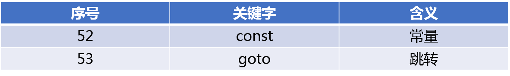

## 4.5 变量（*Variable*）

-   **变量：在程序执行的过程中，其值可以发生改变的量**
-   变量定义的格式包括三个要素：
    -   数据类型
    -   变量名
    -   初始化值
-   变量的定义格式：
    ```java
    数据类型 变量名 = 数据值;
    ```

## 4.6 数据类型（*Data Type*）

### 数据类型分类

Java的数据类型分为两大类：

-   **基本数据类型**：包括 `整数`、`浮点`、`字符`、`布尔`。
-   **引用数据类型**：包括 `类`、`数组`、`接口`。

### 基本数据类型

四类八种基本数据类型：


## 4.7 标识符

-   **标识符**：是指在程序中，我们自己定义内容。比如类的名字、方法的名字和变量的名字等等，都是标识符。
    -   HelloWorld案例中，出现的标识符有类名字`HelloWorld` 。
-   **命名规则：`硬性规定`**
    -   标识符可以包含`英文字母26个(区分大小写)`、`0-9数字` 、`$（美元符号）`和`_（下划线）`等。
    -   标识符不能以数字开头。
    -   标识符不能是关键字。
-   **命名规范：`软性要求`**
    -   包名规范：
        -   多个英文单词：开头为公司域名的倒序，每个单词之间用`.`进行连接，例如：com.atguigu.demo01
    -   类名规范：
        -   一个英文单词：单词首字母大写，例如：Dog
        -   多个英文单词：每个单词首字母大写（大驼峰式），例如：HelloWorld
    -   方法名规范：
        -   一个英文单词：单词字母全部小写，例如：main
        -   多个英文单词：第一个单词首字母小写，第二个单词以后（包含）每个单词首字母大写（小驼峰式）；例如：getMax，getSum，getName
    -   变量名规范：
        -   一个英文单词：单词字母全部小写，例如：result
        -   多个英文单词：第一个单词首字母小写，第二个单词以后（包含）每个单词首字母大写（小驼峰式），例如：maxNum
    -   自定义常量名：
        -   一个英文单词：单词字母全部大写，例如：PI
        -   多个英文单词：单词字母全部大写，每个单词之间用下划线`_`进行连接，例如：DEFAULT\_CAPACITY

## 4.8 练习：定义所有基本数据类型的变量和字符串变量并输出

```java
public class VariableDemo {
  public static void main(String[] args){
        // 定义字节型变量
        byte var1 = 100;
        System.out.println(b);
        // 定义短整型变量
        short var2 = 1000;
        System.out.println(s);
        // 定义整型变量
        int var3 = 123456;
        System.out.println(i);
        // 定义长整型变量
        long var4 = 12345678900L;
        System.out.println(l);
        // 定义单精度浮点型变量
        float var5 = 5.5F;
        System.out.println(f);
        // 定义双精度浮点型变量
        double var6 = 8.5;
        System.out.println(d);
        // 定义布尔型变量
        boolean var7 = false;
        System.out.println(bool);
        // 定义字符型变量
        char var8 = 'A';
        System.out.println(c); 
        // 定义字符串变量
        String var9 = "HelloWorld";
        System.out.println(s);
  }
}
```

## 4.9 整数型（扩展）

-   int是最常用的整数类型，因此在通常请下，直接给出一个整数值默认就是int类型。除此之外，有如下三种情形必须指出。
    -   如果直接将一个较小的整数值（在byte或short类型的取值范围内）赋给一个byte或者short类型的变量，JVM会自动把这个整数值转换成byte或者short类型来处理。
    -   如果使用一个巨大的整数值（超出了int类型的取值范围,且在long的取值范围内）时，JVM不会自动把这个整数值当成long类型处理。如果希望JVM把一个整数值当成long类型来处理，应在这个整数值后增加1或者L作为后缀。通常推荐使用L，因为英文字母l很容易跟数字1搞混。
    -   如果把一个较小的整数值（在int类型的取值范围以内）直接赋给一个long类型的变量，这并不是因为JVM会把这个较小的整数值当成long类型来处理，JVM依然把这个整数值当成int类型来处理，只是因为int类型的值会自动类型转换到long类型。（类型转换后面讲解）
    ```java
    public class DataTypeDemo01 {
      public static void main (String[] args) {
        // 下面代码是正确的，JVM会自动把95当成byte类型处理
            byte b = 95;
            // 下面代码是错误的，JVM不会把9876543210当成long类型处理，所以超出int的取值范围，从而引起错误
            long bigNum01 = 9876543210;
             // 下面代码是正确的，在巨大的整数值后使用L后缀，强制使用long类型
            long bigNum2 = 9876543210L;
            // 下面代码是正确的，将较小的整数值（在int类型的取值范围以内）自动类型转换到long类型进行赋值
            long num = 1234567890;
      }
    }
    ```
-   Java中整数值有4种表示方式：
    -   十进制
    -   二进制，Java7.0种新增的特性，以0b或0B开头。
    -   八进制，以0开头
    -   十六进制，以0x或者0X开头，其中10~~15分别以a~~f（此处的a\~f不区分大小写）来表示。

## 4.10 字符类型和字符集（扩展）

-   字符集：在计算机的内部都是二进制的0、1数据，为了让计算机可以直接识别人类文字，将人类的文字和一个十进制数进行对应起来组成一张表格。
-   字符集是各种文字和符号的总称，包括各国家文字、标点符号、图形符号、数字等。字符集(Character set)是多个字符的集合，字符集种类较多，每个字符集包含的字符个数不同，常见字符集名称:ASCII字符集、GB2312字符集、GBK字符集、 GB18030字符集、Unicode字符集等。计算机要准确的处理各种字符集文字，需要进行字符编码，以便计算机能够识别和存储各种文字。
-   将所有的英文字母，数字，符号都和十进制进行了对应，因此产生了世界上第一张编码表**ASCII（American Standard Code for Information Interchange 美国标准信息交换码）。**
-   Unicode（又称统一码、万国码、单一码）是计算机科学领域里的一项业界标准，包括字符集、编码方案等。Unicode是为了解决传统的字符编码方案的局限而产生的，它为每种语言中的每个字符设定了统一并且唯一的二进制编码，以满足跨语言、跨平台进行文本转换、处理的要求。Java语言内部使用16位的Unicode字符集作为编码方式（在JVM内部，文本是用16位码元序列表示的），而Unicode被设计成支持世界上所有书面语言的字符，包括中文字符，因此Java程序支持各种语言的字符。
    | 字符 | 数值 |
    | -- | -- |
    | 0  | 48 |
    | A  | 65 |
    | a  | 97 |
-   字符值有如下四种表现形式：
    -   直接通过单个字符来指定字符值，单引号`'`括起来，其中单引号`'`括中的字符值必须有且仅有一个字符表示，例如`‘A’`，`'9'`，`'沙'`等
    -   直接使用Unicode值来表示字符值，格式是`'\uXXXX'`，其中`XXXX`代表一个十六进制的整数（必须为四位的十六进制数，不足四位，前面用0占位）。
    -   因为Unicode字符集里面一共含有65536个字符（对应的十进制为0 \~ 65535），所以把0 \~ 65535范围内的某个整数值赋给char类型变量，JVM会自动把这个整数值当成char类型来处理。超出0 \~ 65535范围，编译会出现错误。
    -   通过转义字符表示特殊字符型值，例如`‘\n’`，`‘\t’`等。Java语言中常用的转义字符如下表所示。
        | 转义字符 | 说明  | Unicode表示方式 |
        | ---- | --- | ----------- |
        | `\b` | 退格符 | \u0008      |
        | `\n` | 换行符 | \u000a      |
        | `\r` | 回车符 | \u000d      |
        | `\t` | 制表符 | \u0009      |
        | `\“` | 双引号 | \u0022      |
        | `\‘` | 单引号 | \u0027      |
        | `\\` | 反斜线 | \u005c      |

## 4.11 浮点型（扩展）

-   Java的浮点类型有两种，float和double。默认的浮点类型是double。
-   float类型的初始化值，需要在其值的后面加上大写字母F，否则会默认为double，导致编译报错
-   浮点类型可以理解为小数，但并不是真正意义上的小数，底层数据结构不是以十进制为标准，而是一套`IEEE二进制浮点数算术标准（IEEE 754）`。

## 4.12 布尔型（扩展）

-   布尔型只有一个boolean类型，用于表示逻辑上的“真”或“假”。在Java语言中，boolean类型的数值只能是true或false，不能用0或者非0来表示。
-   Java规范并没有强制指定boolean类型的变量所占用的内存空间。虽然boolean类型的变量或值只要1位即可保存，但由于大部分计算机在分配内存时允许分配的最小内存单元是字节（8位），因此bit大部分时候实际上占用8位。

## 4.13 基础数据类型变量定义的注意事项

-   初始化值必须在变量的取值范围内，如果超出，编译报错；
-   定义初始化long类型变量，初始化值后面需要添加字母L或者l，推荐使用L；
-   定义初始化float类型变量，初始化值后面需要添加字母F或者f；
-   在方法中定义的变量，在使用前必须进行初始化；
-   在同一作用域内定义的变量不可以同名；
    【作用域】：就是变量直接所属的那对大括号；
-   变量的使用不能超出所属的作用域范围，否则编译报错；
-   在定义初始化的变量时，可以先定义后初始化，推荐使用直接定义初始化方式；
-   在定义初始化同一种数据类型多个变量时，可以通过一个数据类型在一行上直接定义多个变量，中间用`逗号“,”`间隔
