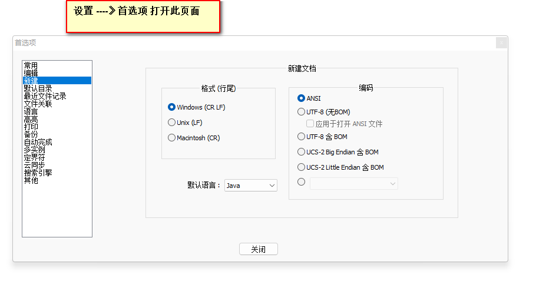
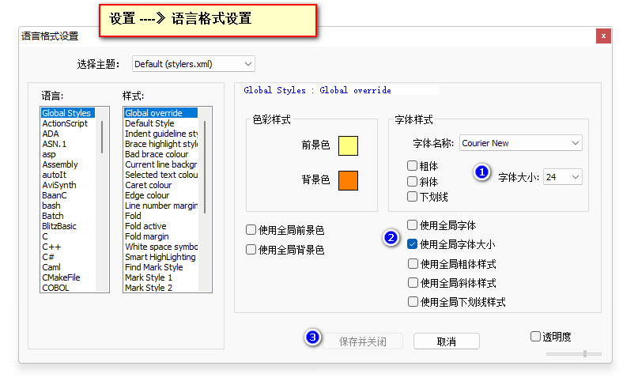

## day01 Java语言概述

### 1. 单位换算

> 1TB = 1024GB
>
> 1GB = 1024MB
>
> 1MB = 1024KB
>
> 1KB = 1024Byte(字节)
>
> 1Byte = 8bit(位) 
>
> 1字节占8位 位是计算机最小的存储单位 即表示每一位只能存储一个0 或者 一个1 

### 2.DOS命令

> DOS : Disk Operation System 磁盘操作系统 其实就是用于直接操作系统磁盘文件的一种命令 可以直接通过DOS命令操作磁盘上的文件。

### 3. 名词解释

>  **JVM**（Java Virtual Machine ）：Java虚拟机，简称JVM，是运行所有Java程序的假想计算机，是Java程序的运行环境之一，也是Java 最具吸引力的特性之一。我们编写的Java代码，都运行在**JVM** 之上。
>
> **`JVM相当于一个软件，用于在不同的平台模拟相同的环境，以实现跨平台`**
>
> **JRE** (Java Runtime Environment) ：是Java程序的运行时环境，包含`JVM` 和运行时所需要的`核心类库`。
>
> **JDK**  (Java Development Kit)：是Java程序开发工具包，包含`JRE` 和开发人员使用的工具。
>
> **`JDK包含JRE  JRE包含JVM  所以我们只需要安装JDK即可`**

### 4. Java跨平台原理

> Java跨平台的原理是JVM  Java虚拟机   不同的平台(操作系统)有不同版本的虚拟机。

### 5. 安装JDK

> 所有选项全部下一步 默认安装在 C盘 Program Files 文件夹下 
>
> `C:\Program Files\Java`

### 6.配置环境变量

> 右键此电脑---》属性---》高级系统设置---》高级---》环境变量
>
> 系统变量---》新建环境变量
>
> 名：JAVA_HOME
>
> 值：安装JDK根目录   C:\Program Files\Java\jdk1.8.0_131
>
> 选择Path变量编辑---》新建----》直接写值为：  %JAVA_HOME%\bin

### 7. 测试环境变量

> 徽标 +R 输入 CMD
>
> 在DOS命令窗口中输入
>
> java -version
>
> javac -version
>
> 以上两个命令都出现版本号表示配置成功

### 8. 配置环境变量相关问题

> 1.为什么要配置环境变量(配置环境变量的作用)？
>
> 配置环境变量相当于将我们安装JDK目录的bin目录这个路径 通知给操作系统 表示可以去此目录下查找我们输
>
> 入的相关的命令  比如 java  javac等等 如果不配置环境变量 这些位于bin目录下的命令将无法直接使用
>
> 2.为什么要配置JAVA_HOME
>
> 如果不配置JAVA_HOME直接在Path变量中写上JDK目录下的bin目录绝对路径  也是可以使用的
>
> 但是推荐配置JAVA_HOME  因为后续我们学习相关的软件 以及业界的规范 统一都识别 JAVA_HOME  所以我们还是要配置JAVA_HOME
>
> 3.classpath是什么  以及  为什么不配置classpath 
>
> classpath表示类路径 作用为指定类加载器加载类所对应的路径   
>
> 从JDK1.5开始不需要人为的配置类路径 JDK有默认设置
>
> `如果你配置了类路径 一定要删掉 `

### 9. 第一个Java程序

> 1.新建文本文件 注意 将后缀名展示出来 默认是不展示的 
>
> 2.将文件的扩展名改为 .java 会有提示改变扩展名会导致文件不可用…… 点击是
>
> 波浪键 英文模式下 按三下 + 对应语言名称 呼出对应语言编辑框

```java
public class HelloWorld{
	public static void main(String [] args){
		System.out.print("hello world java0522");
	}
}
```

> public 公开的
>
> class 类
>
> static 静态的
>
> void 空的 无效的
>
> main 主要的
>
> String 字符串
>
> args  arguments 参数 复数
>
> System 系统
>
> out 出
>
> print 打印

### 10. 编写Java程序注意事项

> 1.严格区分大小写 
>
> 2.所有的括号成对出现 
>
> 3.所有的标点符号都是英文的
>
> 4.注意合适的缩进(每遇到一个大括号另起一行 并且缩进一个tab键的距离)
>
> 5.public修饰的类 称之为公开类 要求类名必须与文件名保持一致 
>
> **`main方法有固定的格式，千万不要写错，否则将无法正确执行`**
>
> **`public static void main(String [] args){}`**

### 11. 类的阐述

> 同一个源文件中可以定义多个类。
>
> 编译后，每个类都会生成独立的 .class文件。
>
> 一个类中，只能有一个main方法，每个类都可以有自己的main方法
>
> public修饰的类称为公开类，要求类名必须与文件名称完全相同，包括大小写。
>
> 一个源文件中，只能有一个公开类。

### 12. Notepad设置





### 13.关于记事本乱码问题

> 1.乱码产生的原因
>
> 因为记事本默认编码格式为UTF-8  而JVM文件默认编码格式为GBK  因为编码格式不统一导致的
>
> 2.解决方案
>
> 将记事本文件编码格式改为GBK即可   
>
> 3.常见编码
>
> UTF-8 万国码 记录了世界上大多数国家的语言  
>
> GB2312 国标标准版 记录了绝大多数中文 简体
>
> GBK 国标扩展版 记录了绝大多数中文 简体 以及 繁体 
>
> ANSI 在不同的操作系统表示不同的编码 在中文操作系统表示GBK

### 14. 关键字

**关键字**：Java语言中，被赋予特殊含义和用途的单词。

- HelloWorld案例中，出现的关键字有 `public ` 、`class` 、 `static` 、  `void`  等，这些单词已经被Java定义好
- 关键字的特点：全部都是`小写字母`。
- 关键字比较多，不需要死记硬背，学到哪里记到哪里即可。


### 15. 注释

> 单行注释

```java
public class Test1{
	public static void main(String [] args){
		// 单行注释 
		// 以下代码用于打印输出两句话
		// 我们可以使用println() 这个方法实现打印完之后换行  ln 为line的缩写 
		// print()方法是没有换行效果的
		System.out.println("hello world 世界你好1"); // 在这里做解释说明
		System.out.print("hello world 世界你好2");
	}
}
```

> 多行注释
>
>
>
> 连续两次回车将跳出绿色背景编辑框 
>
> ctrl + 回车 将空一行

```java
public class Test2{
	public static void main(String [] args){
		/*
			多行注释
			吟诗一首
			床前明月光
			……
		*/
		
		/*
			以下四条语句用于打印四次 hello world
		*/
		System.out.println("hello world1");
		System.out.println("hello world2");
		System.out.println("hello world3");
		System.out.println("hello world4");
	}
}
```

> 文档注释 通常用来说明 某个类 或者 某个方法的作用
>
> doc -- document 文档
>
> 命令： javadoc -d      .   文件名.java

```java
/**
 *	此类用于讲解文档注释 
 *  文档注释通常用来说明 某个类 或者 某个方法的作用
 *
 * 	API Application Programming Interface 应用程序接口 （帮助文档-使用说明书）
 */
public class Test3{
	
	/**
	 *	main方法为程序的入口 有固定的格式 不能写错 
	 *  否则将无法执行 
	 */
	public static void main(String [] args){
		// 单行注释
		
		/*
			多行注释
		*/
		System.out.println("hello world 文档注释");
	}
}
```


