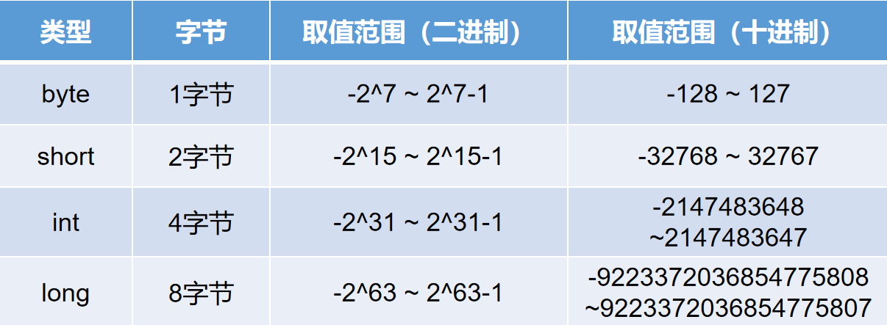
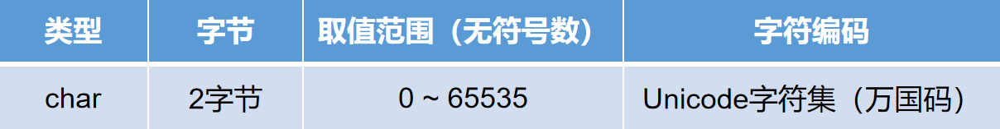
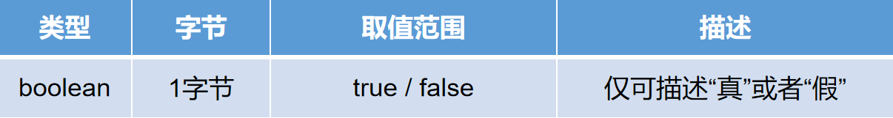
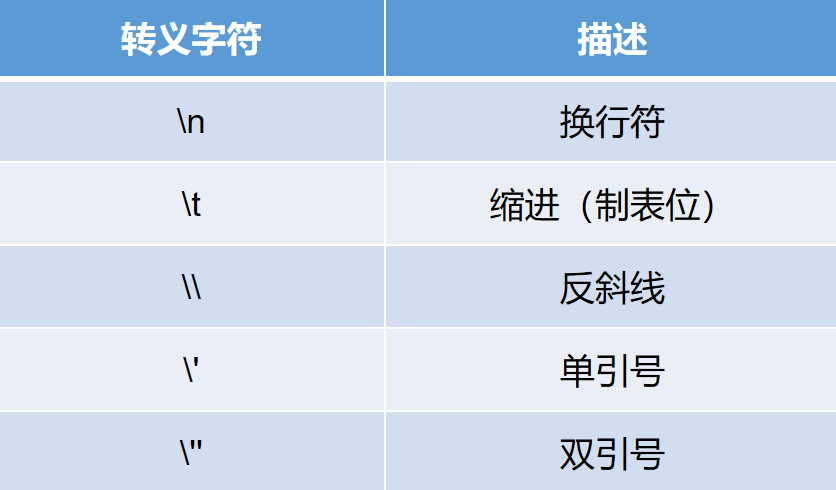
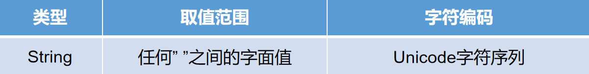

## 变量和数据类型

### 1. 变量的概念

> 生活中我们通常需要记录数据，程序中也是如此，生活中通过各种方式途径来记录数据，程序中使用变量记录数据。
>
> 生活中的数据有不同的数据类型，程序中也是如此。

### 2. 变量的定义方式

> 先声明，再赋值：【常用】
> 数据类型 变量名;
> 变量名 = 值;
>
> 声明并赋值：【常用】
> 数据类型 变量名 = 值;
>
> 多个同类型变量的声明与赋值：【了解】
> 数据类型 变量1 , 变量2 , 变量3 = 值3 , 变量4 , 变量5 = 值5;

```java
public class TestVariableDefine{
	public static void main(String [] args){
		// 变量的定义方式
		
		// 方式1 先声明 再赋值
		int a;
		a = 200;
        a = 300;
		
		System.out.println(a);
		
		
		// 方式2 连声明带赋值写为一条语句
		int b = 123;
		System.out.println(b);
		
		
		// 方式3（了解） 同时声明多个    同类型  的变量
		// 一下语句只有 e取值55  h 取值66 其余四个变量是没有值的 
		// 未赋值的局部变量不能使用 
		int c,d,e = 55 , f ,g ,h = 66;
		
		System.out.println(e);
		System.out.println(h);
		
		// System.out.println(c);
		// System.out.println(d);
		// System.out.println(f);
		// System.out.println(g);
		
	}
}
```

### 3.数据类型

#### 3.1 整数类型

>  给long类型赋值 需要根据情况是否必须在值的末尾追加L  
> 大小写都可以 推荐大写 因为小写阅读性差
> 如果取值范围在int以内 则L 可加 可不加 
> 如果取值范围超出int  则必须在值的末尾追加L  否则编译报错



```java
public class TestDataTypeInteger{
	public static void main(String [] args){
		// 整数类型 整数默认的类型为int类型  
		// byte 1个字节 取值范围 -128 ~ 127 
		byte b1 = 20;
		byte b2 = 120;
		byte b3 = -110;
		
		System.out.println("b1的取值为：" + b1);
		System.out.println("b2的取值为：" + b2);
		System.out.println("b3的取值为：" + b3);
		
		// byte b4 = -129;
		// System.out.println("b4的取值为：" + b4);
		
		
		System.out.println("----------------------------------------------");
		
		
		// short 类型 短整型  2个字节 取值范围 -32768 ~ 32767 
		short s1 = 2356;
		short s2 = -8855;
		short s3 = 18956;
		
		System.out.println("s1的取值为：" +s1);
		System.out.println("s2的取值为：" +s2);
		System.out.println("s3的取值为：" +s3);
		
		
		// short s4 = 32768;
		// System.out.println("s4的取值为：" +s4);
		
		System.out.println("----------------------------------------------");
		
		// int 类型 4个字节 取值范围 -2147483648 ~ 2147483647
		
		int i1 = 89457845;
		int i2 = -12457412;
		int i3 = 100;
		
		System.out.println("i1的取值为：" + i1);
		System.out.println("i2的取值为：" + i2);
		System.out.println("i3的取值为：" + i3);
		
		System.out.println("int最大的取值为：" + Integer.MAX_VALUE);
		System.out.println("int最小的取值为：" + Integer.MIN_VALUE);
		
		
		// int i4 = 2147483648;
		// System.out.println("i4的取值为：" + i4);
		
		
		// long 类型8个字节 取值范围  -9223372036854775808 ~ 9223372036854775807
		
		System.out.println("long类型最大的取值为：" + Long.MAX_VALUE);
		System.out.println("long类型最小的取值为：" + Long.MIN_VALUE);
		
		// 给long类型赋值 需要根据情况是否必须在值的末尾追加L  
		// 大小写都可以 推荐大写 因为小写阅读性差
		// 如果取值范围在int以内 则L 可加 可不加 
		// 如果取值范围超出int  则必须在值的末尾追加L  否则编译报错
		
		long l1 = 256L;
		long l2 = 8857845;
		long l3 = -894551245;
		
		System.out.println("l1的取值为：" +  l1);
		System.out.println("l2的取值为：" +  l2);
		System.out.println("l3的取值为：" +  l3);
		
		long l4 = 2147483648l;
		System.out.println("l4的取值为：" +  l4);
		
		
		
		
		
	}
}
```


#### 3.2 浮点数类型

>  float和double都属于近似值 无法保存精确值 
>
> 给double类型赋值 如果取值范围超出了float  则必须在值的末尾追加 D 


```java
public class TestFloatDouble{
	public static void main(String [] args){
		// float和double都属于近似值 无法保存精确值 
		// float -3.4E+38 ~ -1.4E-45
		// 给double类型赋值 如果取值范围超出了float  则必须在值的末尾追加 D 
		
		float f1 = -340000000000000000000000000000000000000F;
		
		float f2 = -0.0000000000000000000000000000000000000000000014F;
		
		System.out.println(f1);
		
		System.out.println(f2);
		
		
		// float正数取值范围 1.4E-45 ~ 3.4E+38
		
		float f3 = 0.0000000000000000000000000000000000000000000014F;

		float f4 = 340000000000000000000000000000000000000F;
		
		System.out.println(f3);
		System.out.println(f4);
		
		
		double d1 = 25.5;
		double d2 = 33.5;
		double d3 = 38947841241543.5;
		
		System.out.println(d1);
		System.out.println(d2);
		System.out.println(d3);
	}
}
```


#### 3.3 字符类型

> 字符赋值：char c1 = 'A';（通过''描述为字符赋值）
>
> 整数赋值：char c2 = 65;（通过十进制数65在字符集中对应的字符赋值）
>
> 进制赋值：char c3 = '\u0041';（通过十六进制数41在字符集中所对应的字符赋值）



```java
public class TestChar{
	public static void main(String [] args){
		// char类型  取值范围  无符号数  0 ~ 65535
		// 三种赋值方式
		// 方式1  直接使用英文单引号包括任意一个内容
		
		char ch1 = 'a';
		char ch2 = '中';
		char ch3 = '2';
		char ch4 = '-';
		
		
		System.out.println("ch1中保存的内容为:" + ch1);
		System.out.println("ch2中保存的内容为:" + ch2);
		System.out.println("ch3中保存的内容为:" + ch3);
		System.out.println("ch4中保存的内容为:" + ch4);
		
		// char ch5 = '28';
		// System.out.println("ch5中保存的内容为:" + ch5);
		
		// 方式2  直接赋值在0~65535之内的整数  
		// ASCII 美国标准信息交换码  是一张编码表  
		// 记录了 大小写英文字母 以及一些标点符号 指令等等  一共128个  
		
		char ch5 = 65; // A
		System.out.println("ch5中保存的内容为:" + ch5);
		
		char ch6 = 66; // B
		System.out.println("ch6中保存的内容为:" + ch6);
		
		char ch7 = 67; // C
		System.out.println("ch7中保存的内容为:" + ch7);
		
		
		// Unicode编码表 万国码 记录了世界上大多数国家的语言 是一个十六进制的编码表
		// 中文的取值范围是  \u4e00 ~ \u9fa5
		char ch8 = 20013;
		System.out.println("ch8中的内容为：" +  ch8);
		
		
		char ch9 = 20320;
		System.out.println("ch9中的内容为：" +  ch9);
		
		
		char ch10 = 19990;
		System.out.println("ch10中的内容为：" +  ch10);
		
		
		char ch11 = 0X4e16; // 以0X开头 表示是十六进制整数数值
		System.out.println("ch11中的内容为：" +  ch11);
		
		// 方式3 使用英文的单引号包括 以杠u开头的十六进制的 Unicode编码 
		
		char c1 = '\u4e00';
		System.out.println(c1);
		
		char c2 = '\u4e01';
		System.out.println(c2);
		
		char c3 = '\u9fa5';
		System.out.println(c3);	
	}
}
```


#### 3.4 布尔类型



```java
public class TestBoolean{
	public static void main(String [] args){
		// 布尔类型 取值 为 true 或者 false  仅可以描述真 或者 假
		
		
		boolean bl1 = true;
		boolean bl2 = false;
		int a = 10;
		int b = 20;
		boolean bl3 = a > b;
		
		System.out.println(bl1);
		System.out.println(bl2);
		System.out.println(bl3);
		
		
	}
}
```

### 4. 转义字符

> 转义字符可以用于保存一些特殊的符号 或者实现一些特定的效果



```java
public class TestConvertChar{
	public static void main(String [] args){
		// 转义字符
		char ch1 = '\'';
		System.out.println(ch1);
		
		
		// \n 表示换行 
		System.out.println("a\nb\nc\nedfg\n g\nh\nello world");
		
		
		// \t 制表位 可以保证在大多数情况上下行文本对齐 
		
		System.out.println("春\t风\t得\t意\t马\t蹄\t疾");
		System.out.println("一\t日\t看\t尽\t长\t安\t花");
		
		
		// \\ 保存一个斜杠  需要写两个
		char ch2 = '\\';
		System.out.println(ch2);
		
		
		
		char ch3 = '\"';
		System.out.println(ch3);
		
		
		
	}
}
```

### 5.String类型




```java
public class TestString{
	public static void main(String [] args){
		// 引用数据类型 String类型  
		// 任何英文双引号包括的内容都属于字符串  
		
		String str1 = "abc";
		
		String str2 = "hello world ";
		
		String str3 = "世界你好";
		
		String str4 = "1234456";
		
		
		String str5 = "\"   saabswe  fdspfpkwwqer  cdsdkqlwek 范德萨发叫你姐前往";
		
	}
}
```

### 6. 常量

> 是指程序中无法改变的数据 称之为常量 

```java
public class TestConstant{
	public static void main(String [] args){
		// 变量 
		int a = 100;
		a = 200;
		a = 235;
		// 常量 
		System.out.println(100);
		System.out.println(true);
		System.out.println(false);
		System.out.println('a');
		System.out.println("hello world");
		
	}
}
```

### 7. 标识符

> 凡是需要自定义名称的内容 都属于标识符
>
> 比如：类名 变量名  等等 

### 8. 标识符命名规范

所有的标识符统一使用单词 ，不能使用拼音 更不允许使用中文 或者其他一些特殊符号 ，见名知义，有意义。

* 类名 ： 首单词首字母大写，后续每一个新的单词首字母大写，其余字母小写。大写驼峰命名法。
* 变量名/方法名 ： 字(字母)、下(下划线)、美(美元符号)、人(人民币符号 )、数(数字)、骆驼 (小写驼峰命名)
  * 变量名可以以字母、下划线、美元符号、人民币符号开头，可以包含数字，不能以数字开头。 


### 9. 类型转换

> 自动提升 手动下降

#### 9.1 自动类型转换

> 自动类型转换：
>  两种类型相互兼容。
> 目标类型(等号左边)取值范围大于源类型取值范围(等号右边)。
>  byte < short < int < long < float < double 
> 从较小的取值范围类型 可以 自动提升为 较大的取值范围类型 

```java
public class TestAutoConvert{
	public static void main(String [] args){
		// 自动类型转换：
		// 两种类型相互兼容。
		// 目标类型(等号左边)取值范围大于源类型取值范围(等号右边)。
		// byte < short < int < long < float < double 
		// 从较小的取值范围类型 可以 自动提升为 较大的取值范围类型   
		
		
		
		byte b1 = 20;
		short s1 = b1;
		System.out.println(s1);
		
		
		short s2 = 556;
		int i1 = s2;
		System.out.println(i1);
		
		
		int i2 = 8956;
		long l1 = i2;
		System.out.println(l1);
		
		
		long l2 = 895645L;
		float f1 = l2;
		System.out.println(f1);
		
		
		float f2 = 35.5F;
		double d1 = f2;
		System.out.println(d1);	
	}
}
```

#### 9.2 强制类型转换

> 强制类型转换
>  两种类型相互兼容。
>  目标类型(等号左边)取值范围 小于  源类型(等号右边)取值范围。
> 从较大的取值范围  向  较小的取值范围转换  必须强制类型转换 

```java
public class TestForceConvert{
	public static void main(String [] args){
		// 强制类型转换
		// 两种类型相互兼容。
		// 目标类型(等号左边)取值范围 小于  源类型(等号右边)取值范围。
		// 从较大的取值范围  向  较小的取值范围转换  必须强制类型转换 
		
		short s1 = 100;
		byte b1 = (byte)s1;
		System.out.println(b1);
		
		
		int i1 = 5689;
		short s2 = (short)i1;
		System.out.println(s2);
		
		
		long l1 = 895645;
		int i2 = (int)l1;
		System.out.println(i2);
		
		
		float f1 = 3.5F;
		long l2 = (long)f1; // 浮点数强转为整数 小数将抹去 
		System.out.println(l2);
		
		
		double d1 = 22.5;
		float f2 = (float)d1;
		System.out.println(f2);	

	}
}
```