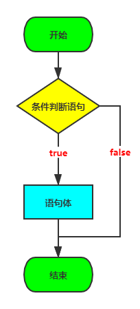
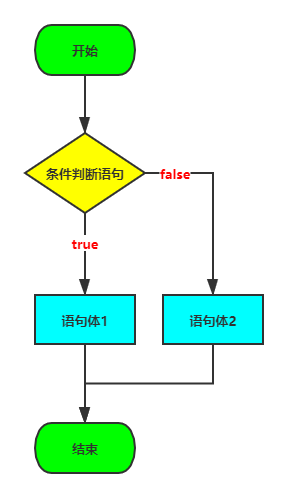
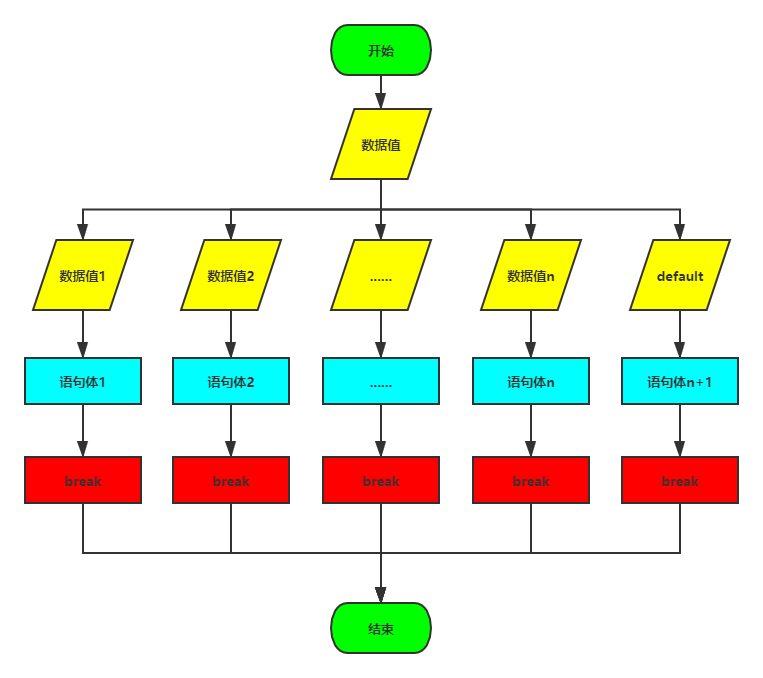
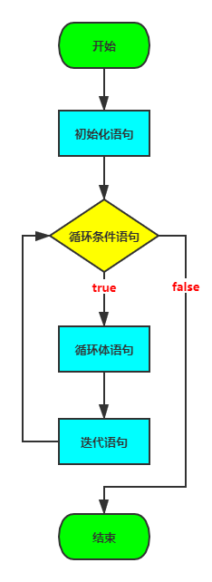
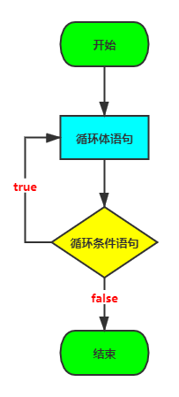

# 尚硅谷\_JavaSE\_day03

# day03【流程控制语句】

## 今日内容

-   if 判断语句
-   switch选择语句
-   for循环语句
-   while循环语句
-   dowhile循环语句

## 学习目标

-   [ ] 理解if语句的格式和执行流程
-   [ ] 理解if...else语句的格式和执行流程
-   [ ] 理解if...else if语句的格式和执行流程
-   [ ] 了解if语句和三元运算符互换
-   [ ] 理解switch选择语句的格式和执行流程
-   [ ] 了解switch选择语句接收的数据类型
-   [ ] 了解case的穿透性
-   [ ] 理解for语句的格式和执行流程
-   [ ] 理解while语句的格式和执行流程
-   [ ] 了解do...while语句的格式和执行流程

# 第一章 流程控制概述

不论哪一种编程语言，都会提供两种基本的流程控制结构：分支结构和循环结构。其中分支结构用于实现根据条件来选择性地执行某段代码，循环结构则用于实现根据循环条件重复执行某段代码。Java同样提供了这两种流程控制结构的语法，Java提供了if和switch两种分支语句，并提供了for，while，do...while三种循环语句。除此之外，JDK5.0还提供了一种新的循环：foreach循环，能以更简单的方式来遍历集合、数组的元素。Java还提供了 break 和 continue语句来控制程序的循环结构。

## 1.1 顺序结构

任何编程语言中最常见的程序结构就是顺序结构。顺序结构就是程序从上到下逐行地执行，中间没有任何判断和跳转。如果main方法的多行代码之间没有任何流程控制，则程序总是从上向下依次执行，排在前面的代码先执行，排在后面的代码后执行。

```java
public static void main(String[] args){
    //顺序执行，根据编写的顺序，从上到下运行
    System.out.println(1);
    System.out.println(2);
    System.out.println(3);
}
```

## 1.2 流程控制语句分类

-   分支结构
    -   判断语句：if语句
    -   选择语句：switch语句
-   循环结构
    -   for语句
    -   while语句
    -   do...while语句

# 第二章 分支结构

## 2.1 判断语句：if

### if语句第一种格式

```java
if (条件判断语句) {
    语句体;
}

执行流程：
    1.先看条件判断语句中的结果是true还是false；
    2.如果是true，执行语句体，然后if语句结束；
      如果是false，if语句直接结束；
```



```java
// 需求：判断两个整数是否相等

public class IfDemo01 {
  public static void main (String[] args) {
    System.out.println("开始");

    //定义并初始化两个整数
    int a = 3;
        int b = 3;

    if (a == b) {
            System.out.println("a和b相等");
        }

    System.out.println("结束");
  }
}
```

### if语句第二种格式

```java
if (条件判断语句) { 
    语句体1;
} else {
    语句体2;
}

执行流程：
    1.先看条件判断语句中的结果是true还是false；
    2.如果是true，执行语句体1，然后if语句结束；
      如果是flase，执行语句体2，然后if语句结束；
```



```java
// 需求：判断一个整数是奇数还是偶数

public class IfDemo02 {
  public static void main (String[] args) {
    //需求:判断一个数是奇数还是偶数
    int num = 123;

    if (num % 2 == 0) {
      System.out.println("偶数");
    } else {
      System.out.println("奇数");
    }
  }
}
```

### if语句第三种格式

```java
if (条件判断语句1) {
  语句体1;
} else if (条件判断语句2) {
  语句体2;
}
......
else if (条件判断语句n) {
  语句体n;
} else {
  语句体n+1;
}

执行流程：
    1.先看条件判断语句1中的结果是true还是false；
    2.如果是true，执行语句体1，然后if语句结束；
      如果是false，看条件判断语句2中的结果是true还是false；
    ......
    3.当所有的条件判断语句的结果都为false时，执行else语句中的语句体n+1；
```


```java
// 需求：判断两个整数之间的关系

public class IfDemo03 {
  public static void main (String[] args) {
    int a = 3;
    int b = 4;

    if (a > b) {
      System.out.println("a > b");
    } else if (a < b) {
      System.out.println("a < b");
    } else {
      System.out.println("a = b");
    }
  }
}
```

### 练习：根据指定整数x的值，计算整数y的值

```java
/*
  x和y的关系满足如下：
    x>=3 y = 2x + 1;
    -1<x<3 y = 2x;
    x<=-1 y = 2x - 1;
  根据给定的x的值，计算出y的值并输出。
*/

public class IfTest01 {
  public static void main (String[] args) {
    //定义并初始化x变量
    int x = 5;
    int y;

    if (x >= 3) {
      y = 2 * x + 1;
    } else if (x > -1 && x < 3) {
      y = 2 * x;
    } else {
      y = 2 * x - 1;
    }

    System.out.println("y = " + y);
  }
}
```

### 练习：通过指定考试成绩，判断学生等级

-   通过指定考试成绩，判断学生等级
    -   90-100      优秀
    -   80-89        好
    -   70-79        良
    -   60-69        及格
    -   60以下    不及格

```java
/*
  练习：通过指定考试成绩，判断学生等级
    90-100      优秀
    80-89        好
    70-79        良
    60-69        及格
    60以下    不及格
*/

public class IfTest02 {
  public static void main (String[] args) {
    //定义并初始化学生成绩变量
    int score = 115;

    //根据分数范围进行条件判断
    if (score >= 90 && score <= 100) {
      System.out.println("优秀");
    } else if (score >= 80 && score <= 89) {
      System.out.println("好");
    } else if (score >= 70 && score <= 79) {
      System.out.println("良");
    } else if (score >= 60 && score <= 69) {
      System.out.println("及格");
    } else if (score >= 0 && score <= 59){
      System.out.println("不及格");
    } else {
      System.out.println("成绩有误");
    }
  }
}
```

## 2.2 选择语句：switch

### switch语句的格式

```java
switch (数据值) {
  case 数据值1:
    语句体1;
    break;
  case 数据值2:
    语句体2;
    break;
  ......
  case 数据值n:
    语句体n;
    break;
  default:
    语句体n+1;
    break;
}

执行流程：
    1.先确定switch语句()中的数据值是多少；
    2.将数据值和数据值1进行匹配,看是否匹配成功；
    3.如果匹配成功,执行语句体1，执行break语句，switch结束;
    如果匹配失败，将数据值和数据值2进行匹配,看是否匹配成功；
    ......
    4.当数据值和所有case后的数据值都没有匹配成功，执行default中语句体n+1，执行break语句，switch结束;
```



```java
// 需求:通过数字选择对应的星期

public class SwitchDemo01 {
  public static void main (String[] args) {
    //定义初始化int类型变量weekday
    int weekday = 5;

    //进行匹配
    switch (weekday) {
      case 1:
        System.out.println("星期一");
        break;
      case 2:
        System.out.println("星期二");
        break;
      case 3:
        System.out.println("星期三");
        break;
      case 4:
        System.out.println("星期四");
        break;
      case 5:
        System.out.println("星期五");
        break;
      case 6:
        System.out.println("星期六");
        break;
      case 7:
        System.out.println("星期七");
        break;
      default:
        System.out.println("哥们你是火星来的吧,地球上没有这个星期");
        break;
    }
  }
}
```

### switch语句的注意事项：

-   switch语句的()中数据值的数据类型只能是\*\*`四种基本数据类型`**和**`两种引用数据类型`\*\*。
    -   四种基本数据类型：byte，short，char，int
    -   两种引用数据类型：
        -   在JDK5.0（包含）之后，支持枚举类型enum
        -   在JDK7.0（包含）之后，支持字符串类型String
-   switch语句中的default语句和if语句第三种格式中的else语句一样，都可以省略不写，但推荐写上
-   switch语句中的case语句和default语句的位置可以随意调换，且不影响执行流程
-   switch语句中的break关键字可以省略不写，但如果省略不写会出现case穿透的效果

```java
public class SwitchDemo02 {
  public static void main (String[] args) {
    int num = 2;

    switch (num) {
      case 1:
        System.out.println("1");
        //break;
      case 2:
        System.out.println("2");
        //break;
      case 3:
        System.out.println("3");
        //break;
      default:
        System.out.println("4");
        //break;
    }
  }
}
```

### 练习：根据指定的月份输出对应季节（使用if语句实现）

``````java
/*
  需求：定义一个月份，输出该月份对应的季节。
      一年有四季`````
      3,4,5  春季
      6,7,8  夏季
      9,10,11  秋季
      12,1,2  冬季
  
  分析：
      A:指定一个月份
      B:判断该月份是几月,根据月份输出对应的季节
        if
        switch
*/
public class SwitchTest01 {
  public static void main(String[] args) {
    //指定一个月份
    int month = 5;
    
    /*
    if (month == 1) {
      System.out.println("冬季");
    } else if (month == 2) {
      System.out.println("冬季");
    } else if (month == 3) {
      System.out.println("春季");
    } else if (month == 4) {
      System.out.println("春季");
    } else if (month == 5) {
      System.out.println("春季");
    } else if (month == 6) {
      System.out.println("夏季");
    } else if (month == 7) {
      System.out.println("夏季");
    } else if (month == 8) {
      System.out.println("夏季");
    } else if (month == 9) {
      System.out.println("秋季");
    } else if (month == 10) {
      System.out.println("秋季");
    } else if (month == 11) {
      System.out.println("秋季");
    } else if (mouth == 12) {
      System.out.println("冬季");
        } else {
            System.out.println("你输入的月份有误");
        }
    */
    
    // 改进版
    if ((month == 1) || (month == 2) || (month == 12)) {
      System.out.println("冬季");
    } else if ((month == 3) || (month == 4) || (month == 5)) {
      System.out.println("春季");
    } else if ((month == 6) || (month == 7) || (month == 8)) {
      System.out.println("夏季");
    } else if ((month == 9) || (month == 10) || (month == 11)) {
      System.out.println("秋季");
    } else {
      System.out.println("你输入的月份有误");
    }
  }
}
``````

### 练习：根据指定的月份输出对应季节（使用switch语句实现）

```java
/*
 * 需求：指定一个月份，输出该月份对应的季节。
 *     一年有四季
 *     3,4,5  春季
 *     6,7,8  夏季
 *     9,10,11  秋季
 *     12,1,2  冬季
 * 
 * 分析：
 *     A:指定一个月份
 *     B:判断该月份是几月,根据月份输出对应的季节
 *       if
 *       switch
 */
public class SwitchTest02 {
  public static void main(String[] args) {
    //指定一个月份
    int month = 5;
    
    /*
    switch(month) {
            case 1:
                System.out.println("冬季");
                break;
            case 2:
                System.out.println("冬季");
                break;
            case 3:
                System.out.println("春季");
                break;
            case 4:
                System.out.println("春季");
                break;
            case 5:
                System.out.println("春季");
                break;
            case 6:
                System.out.println("夏季");
                break;
            case 7:
                System.out.println("夏季");
                break;
            case 8:
                System.out.println("夏季");
                break;
            case 9:
                System.out.println("秋季");
                break;
            case 10:
                System.out.println("秋季");
                break;
            case 11:
                System.out.println("秋季");
                break;
            case 12:
                System.out.println("冬季");
                break;
            default:
                System.out.println("你输入的月份有误");
                break;
    }
    */
  
        // 改进版 
    switch(month) {
            case 1:
            case 2:
            case 12:
                System.out.println("冬季");
                break;
            case 3:
            case 4:
            case 5:
                System.out.println("春季");
                break;
            case 6:
            case 7:
            case 8:
                System.out.println("夏季");
                break;
            case 9:
            case 10:
            case 11:
                System.out.println("秋季");
                break;
            default:
                System.out.println("你输入的月份有误");
                break;
    }
  }
}
```

# 第三章 循环结构

## 3.1 循环语句：for

循环语句可以在满足循环条件的情况下，反复执行某一段代码，这段被重复执行的代码被称为循环体语句，当反复执行这个循环体时，需要在合适的时候把循环判断条件修改为false，从而结束循环，否则循环将一直执行下去，形成死循环。

### for语句格式

```java
for (初始化语句;循环条件语句;迭代语句) {
  循环体语句;
}

执行流程：
    1.先执行初始化语句；
    2.看循环条件语句中的结果是true还是false；
    3.如果是true，执行循环体语句，继续执行；
      如果是false，for语句结束；
    4.执行迭代语句；
    5.跳回第2步，继续执行；
```



```java
// 需求：打印10遍HelloWorld

public class ForDemo {
  public static void main(String[] args) {
      //控制台输出10次HelloWorld，不使用循环
    System.out.println("HelloWorld");
    System.out.println("HelloWorld");
    System.out.println("HelloWorld");
    System.out.println("HelloWorld");
    System.out.println("HelloWorld");
    System.out.println("HelloWorld");
    System.out.println("HelloWorld");
    System.out.println("HelloWorld");
    System.out.println("HelloWorld");
    System.out.println("HelloWorld");
    System.out.println("-------------------------");

    //用循环改进，循环10次
    //定义变量从1开始，循环条件为<=10
    for(int x = 1; x <= 10; x++) {
      System.out.println("HelloWorld");
    }
  }
}
```

### 练习：打印1-5和5-1

```java
/*
 * 练习：利用for语句打印1-5和5-1
 */
public class ForTest01 {
  public static void main(String[] args) {
    //原始做法
    System.out.println(1);
    System.out.println(2);
    System.out.println(3);
    System.out.println(4);
    System.out.println(5);
    System.out.println("===============");
    
    //用循环改进
    for(int x=1; x<=5; x++) {
      System.out.println(x);
    }
        
    System.out.println("===============");
    
    //1-5的数据我们获取到了，如何获取5-1呢?
    for(int x=5; x>=1; x--){
      System.out.println(x);
    }
  }
}
```

### 练习：求出1-5之间数据之和

```java
/*
 * 练习：求出1-5之间数据之和
 * 
 * 分析：
 *     1.定义求和变量，初始化值是0
 *     2.获取1-5之间的数据，用for循环实现
 *     3.把每一次获取到的数据，累加起来就可以了
 *     4.输出求和变量即可
 */
public class ForTest02 {
  public static void main(String[] args) {
    //定义求和变量，初始化值是0
    int sum = 0;
    
    //获取1-5之间的数据，用for循环实现
    for(int x=1; x<=5; x++) {
      //把每一次获取到的数据，累加起来就可以了
      //sum = sum + x;
      /*
       * 第一次：sum = 0 + 1 = 1
       * 第二次：sum = 1 + 2 = 3
       * 第三次：sum = 3 + 3 = 6
       * 第四次：sum = 6 + 4 = 10
       * 第五次：sum = 10 + 5 = 15
       */
      sum += x;
    }
    
    //输出求和结果
    System.out.println("sum:" + sum);
  }
}
```

### 练习：求出1-100之间偶数和

```java
/*
 * 练习：求出1-100之间偶数和
 * 
 * 分析：
 *     1.定义求和变量，初始化值是0
 *     2.获取1-100之间的数据，用for循环实现
 *     3.把获取到的数据进行判断，看是否是偶数
 *       如果是，就累加
 *     4.输出求和结果
 */
public class ForTest03 {
  public static void main(String[] args) {
    //定义求和变量，初始化值是0
    int sum = 0;
    
    //获取1-100之间的数据，用for循环实现
    for(int x=1; x<=100; x++) {
      //把获取到的数据进行判断，看是否是偶数
      if(x % 2 == 0) {
        sum += x;
      }
    }
    
    //输出求和结果
    System.out.println("sum:"+sum);
  }
}
```

### 练习：打印所有的水仙花数

```java
/*
  练习：打印所有的水仙花数
  
  分析：
      什么是水仙花数呢?
        所谓的水仙花数是指一个三位数，其各位数字的立方和等于该数本身。
       举例：153就是一个水仙花数。
       153 = 1*1*1 + 5*5*5 + 3*3*3
 
     1.三位数其实就告诉了我们水仙花数的范围
       100-999
     2.如何获取一个数据的每一个位上的数呢?
       举例：我有一个数据153，请问如何获取到个位，十位，百位
       个位：153%10 = 3;
       十位：153/10%10 = 5;
       百位：153/10/10%10 = 1;
       千位：...
       万位：...
     3.让每个位上的立方和相加，并和该数据进行比较，如果相等，就说明该数据是水仙花数，在控制台输出
*/
public class ForTest04 {
  public static void main(String[] args) {
    //通过循环获取到每一个三位数
    for(int x=100; x<1000; x++) {
      //获取个位，十位，百位
      int ge = x % 10;
      int shi = x / 10 % 10;
      int bai = x / 10 / 10 % 10;
      
      //让每个位上的立方和相加，并和该数据进行比较，如果相等，就说明该数据是水仙花数，在控制台输出
      if((ge * ge * ge + shi * shi * shi + bai * bai * bai) == x) {
        System.out.println(x); 
      }
    }
  }
}
```

### 练习：打印所有的水仙花数共有多少个

```java
/*
 * 练习：打印所有的水仙花数共有多少个
 * 
 * 分析：
 *     1.定义统计变量，初始化值是0
 *     2.获取三位数，用for循环实现
 *     3.获取三位数的个位，十位，百位
 *     4.判断这个三位数是否是水仙花数，如果是，统计变量++
 *     5.输出统计结果就可以了
 */
public class ForTest5 {
  public static void main(String[] args) {
    //定义统计变量，初始化值是0
    int count = 0;
    
    //获取三位数，用for循环实现
    for(int x=100; x<1000; x++) {
      //获取三位数的个位，十位，百位
      int ge = x%10;
      int shi = x/10%10;
      int bai = x/10/10%10;
      
      //判断这个三位数是否是水仙花数，如果是，统计变量++
      if((ge*ge*ge+shi*shi*shi+bai*bai*bai) == x) {
        count++;
      }
    }
    
    //输出统计结果就可以了
    System.out.println("水仙花数共有："+count+"个");
  }
}
```

### 练习：打印符合要求的数字

```java
分析以下需求，并用代码实现：
  (1)打印出四位数字中个位+百位=十位+千位并且个位数为偶数，千位数为奇数的数字,并打印符合条件的数字的个数    (2)符合条件的数字,每行显示5个,用空格隔开,打印格式如下:
    1012 1034 1056 1078 1100 
    1122 1144 1166 1188 1210
    //......
    符合条件的数字总共有: 165个
```

## 3.2 循环语句：while

### while语句格式：

```java
while (循环条件语句) {
  循环体语句;
}

执行流程：
    1.先看循环条件语句的结果是true还是false；
  2.如果是true，执行循环体语句，继续执行；
     如果是false，while语句结束；
  3.跳回第1步，继续执行；
```


```java
// 需求：输出10次HelloWorld

public class WhileDemo {
  public static void main(String[] args) {
    // 利用for循环实现
    for(int x = 1; x <= 10; x++) {
      System.out.println("HellloWorld");
    }
    
        System.out.println("==================================");
    
    //while循环实现
    int x=1;
    while(x <= 10) {
      System.out.println("HellloWorld");
      x++;
    }
  }
}
```

### 练习：趣味折纸

```java
/*
 *  练习：趣味折纸
 *   
 *  题目：
 *    世界最高山峰是珠穆朗玛峰，它的高度是8848.86米，假如我有一张足够大的纸，它的厚度是0.1毫米。
 *    请问，折叠多少次，不低于珠穆朗玛峰的高度?
 */
public class WhileTest01 {
    public static void main(String[] args) {
    //定义一个计数器，初始值为0
    int count = 0;
    
    //定义纸张厚度
    double paper = 0.1;
    
    //定义珠穆朗玛峰的高度
    int zf = 88488600;
    
    //因为要反复折叠，所以要使用循环，但是不知道折叠多少次，这种情况下更适合使用while循环
    //折叠的过程中当纸张厚度大于珠峰就停止了，因此继续执行的要求是纸张厚度小于珠峰高度
    while(paper <= zf) {
      //循环的执行过程中每次纸张折叠，纸张的厚度要加倍
      paper *= 2;
      
      //在循环中执行累加，对应折叠了多少次
      count++;
    }
    
    //打印计数器的值
    System.out.println("需要折叠：" + count + "次");
    }
}
```

## 3.3 循环语句：do...while循环

### do...while语句格式

```java
do {
  循环体语句;
} while (循环条件语句);

执行流程：
    1.先执行循环体语句；
    2.看循环条件语句的结果是true还是false；
    3.如果是true，跳回第1步，继续执行；
      如果是false，dowhile循环结束；
```



```java
// 需求：输出10次HelloWorld

public class DoWhileDemo {
  public static void main (String[] args) {
        // 利用for循环实现
    for (int i = 1; i <= 10 ; i++ ) {
      System.out.println("HelloWorld");
    }

    System.out.println("======================");
        
     // 利用dowhile循环实现
    int i = 1;
    do {
      System.out.println("HelloWorld");
      i++;
    } while (i <= 10);
  }
}
```

## 3.4 循环语句的区别

### 扩展格式的区别（了解）

-   从循环次数角度分析
    -   do...while循环至少执行一次循环体语句
    -   for和while循环先循环条件语句是否成立，然后决定是否执行循环体，至少执行零次循环体语句
-   从循环变量的生命周期角度分析
    -   for循环的循环变量，在循环语句结束后，不可以被访问；
    -   while和do...while循环的循环变量，是可以被继续使用的；

### 标准格式的区别（理解）：

-   遍历有明显的循环次数（范围）的需求，选择for循环
-   遍历没有明显的循环次数（范围）的需求，循环while循环

## 3.5  控制语句

### break

-   **使用场景：终止switch或者循环**
    -   在选择结构switch语句中
    -   在循环语句中
    -   离开使用场景的存在是没有意义的

```java
public static void main(String[] args) {
    for (int i = 1; i<=10; i++) {
        //需求:打印完两次HelloWorld之后结束循环
        if(i == 3){
          break;
        }
        System.out.println("HelloWorld"+i);
    }
}
```

### continue

-   **使用场景：结束本次循环，继续下一次的循环**

```java
public static void main(String[] args) {
    for (int i = 1; i <= 10; i++) {
        //需求:不打印第三次HelloWorld
        if(i == 3){
          continue;
        }
        System.out.println("HelloWorld"+i);
    }
}
```
