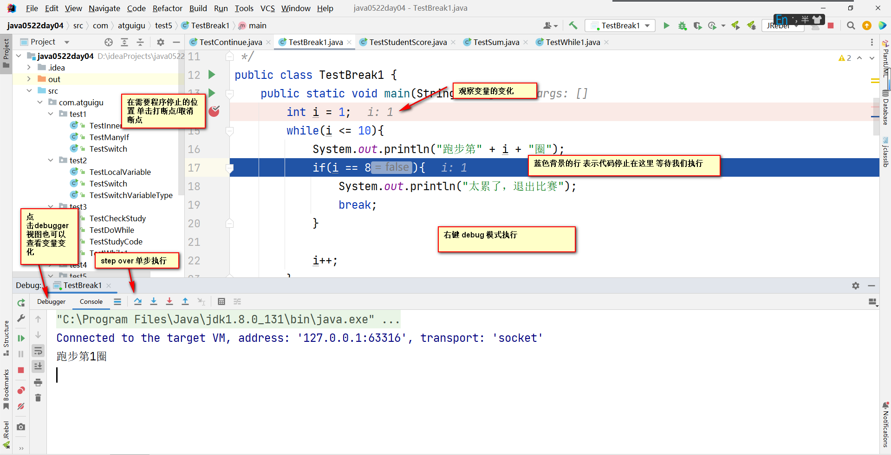

## 分支结构

### 1. 多重if补充

> 多重if也可以处理条件非区间的情况 处理这种情况对于条件顺序没有要求
>
> 但是还是推荐将条件书写有规律 顺序 这样便于阅读

> 需求：根据名次进行奖励
>
> 第一名：奖励夏令营三天
>
> 第二名：奖励苹果14袋
>
> 第三名：奖励笔记本一本
>
> 第四名：奖励口头表扬一次

````java
package com.atguigu.test1;

import java.util.Scanner;

/**
 * @author WHD
 * @description TODO
 * @date 2023/5/27 9:10
 *  多重if也可以处理条件非区间的情况 处理这种情况对于条件顺序没有要求
 *  但是还是推荐将条件书写有规律 顺序 这样便于阅读
 *
 *  需求：根据名次进行奖励
 *  第一名：奖励夏令营三天
 *  第二名：奖励苹果14袋
 *  第三名：奖励笔记本一本
 *  第四名：奖励口头表扬一次
 */
public class TestManyIf {
    public static void main(String[] args) {
        Scanner input = new Scanner(System.in);

        System.out.println("请输入您的名次");

        int number = input.nextInt();


        if(number == 2 ){
            System.out.println("奖励苹果14袋");
        }else if(number == 1){
            System.out.println("奖励夏令营三天");
        }else if(number == 4){
            System.out.println("奖励口头表扬一次");
        }else if(number == 3){
            System.out.println("奖励笔记本一本");
        }else{
            System.out.println("继续加油！");
        }


        System.out.println("程序结束");


    }
}

````


### 2. 嵌套if

> 嵌套if 外层条件满足的情况下 再进行内部条件的判断

>  需求：学校举行百米跑步比赛 跑步时间小于13秒的可以进入决赛 然后再根据性别进行男子 或者 女子 分组
>
> 并且最终提示 恭喜你，进入xx组  或者 很遗憾 被淘汰
>
>
> 扩展需求：学校举行百米跑步比赛  现根据不同的性别做出要求 男生跑步时间小于12进入决赛 女生跑步时间小于13进入决赛 编写代码实现 并且分组

```java
package com.atguigu.test1;

import java.util.Scanner;

/**
 * @author WHD
 * @description TODO
 * @date 2023/5/27 9:20
 *  嵌套if 外层条件满足的情况下 再进行内部条件的判断
 *
 *  需求：学校举行百米跑步比赛 跑步时间小于13秒的可以进入决赛 然后再根据性别进行男子 或者 女子 分组
 *  并且最终提示 恭喜你，进入xx组  或者 很遗憾 被淘汰
 *
 *  扩展需求：学校举行百米跑步比赛  现根据不同的性别做出要求 男生跑步时间小于12进入决赛 女生跑步时间小于13进入决赛 编写代码实现 并且分组
 */
public class TestInnerIf {
    public static void main(String[] args) {
        Scanner input = new Scanner(System.in);

        System.out.println("请输入你的跑步时间");

        double time = input.nextDouble();


        //        char gender =  input.next().charAt(1);

        if(time < 13){

            System.out.println("请输入你的性别");

            String sex = input.next();


            // 对字符串进行判断 比较 不要使用== 必须使用equals方法
            // 用法：变量名.equals("比较的内容") 最终的结果为布尔类型 如果完全相同 则为true 不同则为false
            // equalsIgnoreCase 忽略大小写比较
            if(sex.equals("男") || sex.equalsIgnoreCase("man") || sex.equalsIgnoreCase("boy")){
                System.out.println("恭喜你，进入男子组");
            }else if(sex.equals("女")){
                System.out.println("恭喜你，进入女子组");
            }else{
                System.out.println("暂未开放第三性别，请等待下一届");
            }

        }else{
            System.out.println("很遗憾 被淘汰");
        }
        System.out.println("程序结束");
    }
}

```

### 3. switch

> switch用于处理某个值属于固定等值的情况
>
> switch支持的数据类型 byte short int char String(JDK7+) 枚举
>
>  case穿透：如果每个case之间不写break  那么前边满足的case执行完毕之后 会继续执行后续的case代码块
>
>
> 如果需要每个case都独立 则可以在每个case末尾加上break  表示执行完此case之后 跳出switch结构
>
>
> default是可选的 位置也是可以灵活变动的 推荐写在所有case之后
>
> 如果需要每一个case都独立  那么default之后也推荐加上break 可以提高代码的阅读性

```java
package com.atguigu.test1;

import java.util.Scanner;

/**
 * @author WHD
 * @description TODO
 * @date 2023/5/27 9:52
 *  switch用于处理某个值属于固定等值的情况
 *  switch支持的数据类型 byte short int char String(JDK7+) 枚举
 *  需求：根据名次进行奖励
 *    第一名：奖励夏令营三天
 *    第二名：奖励苹果14袋
 *    第三名：奖励笔记本一本
 *    第四名：奖励口头表扬一次
 *
 *  case穿透：如果每个case之间不写break  那么前边满足的case执行完毕之后 会继续执行后续的case代码块
 *
 *  如果需要每个case都独立 则可以在每个case末尾加上break  表示执行完此case之后 跳出switch结构
 *
 *  default是可选的 位置也是可以灵活变动的 推荐写在所有case之后
 *  如果需要每一个case都独立  那么default之后也推荐加上break 可以提高代码的阅读性
 *
 *
 *
 */
public class TestSwitch {
    public static void main(String[] args) {
        Scanner input = new Scanner(System.in);

        System.out.println("请输入你的名次");

        int number = input.nextInt();

        switch(number){

            case 1:
                System.out.println("奖励夏令营三天");
                break; // 打破 折断

            case 2:
                System.out.println("奖励苹果14袋");
                break; // 打破 折断
            case 3:
                System.out.println("奖励笔记本一本");
                break; // 打破 折断
            case 4:
                System.out.println("奖励口头表扬一次");
                break;
            default:
                System.out.println("继续加油");
                break;
        }

        System.out.println("程序结束");


    }
}

```

> 利用case穿透实现如下效果
>
> 需求：根据名次进行奖励
>
> 第一名：奖励夏令营三天
>
> 第二名：奖励夏令营三天
>
> 第三名：奖励笔记本一本
>
> 第四名：奖励口头表扬一次

```java
package com.atguigu.test2;

import java.util.Scanner;

/**
 * @author WHD
 * @description TODO
 * @date 2023/5/27 10:27
 *  利用case穿透实现如下效果
 *  需求：根据名次进行奖励
 *      第一名：奖励夏令营三天
 *      第二名：奖励夏令营三天
 *      第三名：奖励笔记本一本
 *      第四名：奖励口头表扬一次
 *
 *
 */
public class TestSwitch {
    public static void main(String[] args) {
        Scanner input = new Scanner(System.in);

        System.out.println("请输入名次");

        int number = input.nextInt();

        switch(number){
            case 1:
            case 2:
                System.out.println("奖励夏令营三天");
                break;
            case 3:
                System.out.println("奖励笔记本一本");
                break;
            case 4:
                System.out.println("奖励口头表扬一次");
                break;
            default:
                System.out.println("继续加油");
                break;
        }


        System.out.println("程序结束");


    }
}

```

> switch支持的数据类型 byte short int char String(JDK7+) 枚举

```java
package com.atguigu.test2;

/**
 * @author WHD
 * @description TODO
 * @date 2023/5/27 10:32
 *   switch支持的数据类型 byte short int char String(JDK7+) 枚举
 */
public class TestSwitchVariableType {
    public static void main(String[] args) {
        byte b1 = 1;
        short s2 = 2;
        int i3 = 3;
        char ch1 = 'A';
        String str = "A";

        switch(str){
            case "A":
                System.out.println("值为1");
                break;
            case "B":
                System.out.println("值为2");
                break;
            case "3":
                System.out.println("值为3");
                break;
            case "4":
                System.out.println("值为4");
                break;
        }

        System.out.println("程序结束");

    }
}

```

### 4. 局部变量

> 凡是在方法中定义、使用的变量，都属于局部变量。

| 局部变量       | 描述                                                         |
| -------------- | ------------------------------------------------------------ |
| 定义位置       | 定义在方法体内                                               |
| 默认值         | 没有默认值，必须先赋值才能使用                               |
| 作用范围       | (从定义行开始到包含其结构结束)离当前变量最近的大括号之内     |
| 重名问题       | 重合的作用范围以内 不能重名 不重合 可以重名                  |
| 存储位置(了解) | 基本数据类型 全部存在栈(stack)中 引用数据类型 名字在栈 值在堆(heap) |
| 生命周期(了解) | 随着方法的入栈(压栈)而生效 随着方法的出栈(弹栈)而死亡        |


## 循环结构

> 任何循环都有四个必不可少的部分
>
> 1.计数器初始化
>
> 2.循环条件
>
> 3.循环体
>
> 4.计数器变化

### 1. while循环

> 计数器初始化;
>
> while ( 循环条件 ) {
> ​	循环操作
>
> ​	计数器变化；
>
> }
>
> while循环可以用于解决循环次数确定的情况 也可以用于处理循环次数不确定的情况
>
> 通常用于处理循环次数不确定的情况 因为循环次数确定的情况 for循环更加简洁

```java
package com.atguigu.test3;

/**
 * @author WHD
 * @description TODO
 * @date 2023/5/27 11:05
 *  while循环 实现打印100遍好好学习 天天向上
 *
 *  任何循环都有四个必不可少的部分
 *  1.计数器初始化
 *  2.循环条件
 *  3.循环体
 *  4.计数器变化
 *
 *  while循环可以用于解决循环次数确定的情况 也可以用于处理循环次数不确定的情况
 *  通常用于处理循环次数不确定的情况 因为循环次数确定的情况 for循环更加简洁
 *
 */
public class TestWhile1 {
    public static void main(String[] args) {
        int i = 1;
        while(i <= 10000){
            System.out.println("第" + i + "遍好好学习，天天向上" );
            i++;
        }

        System.out.println("程序结束");

    }
}

```

> 需求：老师每天检查赵四的学习任务是否合格，如果不合格，则继续进行。
>
> 老师给赵四安排的每天的学习任务为：上午阅读教材，学习理论部分，下午上机编程，掌握代码部分。

```java
package com.atguigu.test3;

import java.util.Scanner;

/**
 * @author WHD
 * @description TODO
 * @date 2023/5/27 11:12
 *  需求：老师每天检查赵四的学习任务是否合格，如果不合格，则继续进行。
 *  老师给赵四安排的每天的学习任务为：上午阅读教材，学习理论部分，下午上机编程，掌握代码部分。
 */
public class TestCheckStudy {
    public static void main(String[] args) {
        Scanner input = new Scanner(System.in);

        System.out.println("请输入你的学习任务是否合格？y/n");

        String answer = input.next();

        while(answer.equals("n")){
            System.out.println("上午阅读教材");
            System.out.println("下午上机编程");

            System.out.println("请输入你的学习任务是否合格？y/n");
            answer = input.next();

        }
        System.out.println("恭喜你，完成学习任务");
    }
}

```

### 2. do-while循环

> 计数器初始化；
>
> do {
>
>   循环操作
>
> }while ( 循环条件 );
>
> do-while循环也可以用于处理循环次数确定 以及 不确定的情况
>
> 通常用来处理循环次数不确定的情况 循环次数确定 for循环更加简洁

> while和do-while的区别？
>
> while是先判断再执行 如果条件不成立 则一次都不执行
>
> do-while先执行 后判断 即使条件不成立 也至少执行一次

```java
package com.atguigu.test3;

/**
 * @author WHD
 * @description TODO
 * @date 2023/5/27 11:26
 *  使用do-while实现打印100遍好好学习 天天向上
 *
 *  do-while是先执行 后判断 所以 即使条件不成立 也至少执行一次
 *
 *  do-while循环也可以用于处理循环次数确定 以及 不确定的情况
 *  通常用来处理循环次数不确定的情况 循环次数确定 for循环更加简洁
 *
 *
 */
public class TestDoWhile {
    public static void main(String[] args) {
        int i = 1;
        do{
            System.out.println("第" + i + "遍好好学习，天天向上");
            i++;
        }while(i <= 10000);

        System.out.println("程序结束");
    }
}

```

> 经过几天的学习，老师给赵四一道测试题，让他先上机编写程序完成，然后老师检查是否合格。
>
> 如果不合格，则继续编写……

```java
package com.atguigu.test3;

import java.util.Scanner;

/**
 * @author WHD
 * @description TODO
 * @date 2023/5/27 11:30
 *  经过几天的学习，老师给赵四一道测试题，让他先上机编写程序完成，然后老师检查是否合格。
 *  如果不合格，则继续编写……
 *
 *  while和do-while的区别？
 *  while是先判断再执行 如果条件不成立 则一次都不执行
 *  do-while先执行 后判断 即使条件不成立 也至少执行一次
 *
 */
public class TestStudyCode {
    public static void main(String[] args) {
        Scanner input = new Scanner(System.in);
        String answer;
        do{
            System.out.println("上机编写测试……");

            System.out.println("请输入你的成绩是否合格？y/n");

            answer = input.next();

        }while(answer.equals("n"));


        System.out.println("恭喜你，完成任务");
    }
}

```

### 3. for循环

> 循环次数确定的情况，通常选用for循环
>
> for循环执行顺序：
>
> 1：计数器初始化(只执行一次)
>
> 2：判断条件
>
> 3：执行循环体
>
> 4：执行计数器变化 

```java
package com.atguigu.test4;

/**
 * @author WHD
 * @description TODO
 * @date 2023/5/27 13:52
 *  使用for循环打印100次好好学习
 */
public class TestFor {
    public static void main(String[] args) {
        for(int i = 1;i <= 10000;i++){
            System.out.println("第" + i + "遍好好学习");
        }

        System.out.println("程序结束");
    }
}

```

> 根据用户输入的数字 输出加法表

````java
package com.atguigu.test4;

import java.util.Scanner;

/**
 * @author WHD
 * @description TODO
 * @date 2023/5/27 13:58
 *  根据用户输入的数字 输出加法表
 */
public class TestAddition {
    public static void main(String[] args) {
        Scanner input = new Scanner(System.in);

        System.out.println("请输入一个数字");

        int number = input.nextInt();

        for(int i = 0;i <= number;i++){
            System.out.println( i + "+" + (number - i) + "=" + number);
        }

        System.out.println("程序结束");

    }
}

````

> 循环输入某同学结业考试的5门课成绩，并计算平均分

```java
package com.atguigu.test4;

import java.util.Scanner;

/**
 * @author WHD
 * @description TODO
 * @date 2023/5/27 13:54
 *  循环输入某同学结业考试的5门课成绩，并计算平均分
 */
public class TestInputScore {
    public static void main(String[] args) {
        Scanner input = new Scanner(System.in);

        System.out.println("请输入你的名字");

        String name = input.next();

        double sum = 0;
        for(int i = 1;i <= 5;i++){
            System.out.println("请输入第" + i + "门成绩");
            double score = input.nextDouble();

            sum += score; // sum = sum + score;
        }

        System.out.println(name + "的平均分为：" + sum / 5);


    }
}

```

### 4. 三种循环对比

> 需要多次重复执行一个或多个任务的问题考虑使用循环来解决
>
> 无论哪一种循环结构，都有4个必不可少的部分：初始部分、循环条件、循环体、更新循环变量

> 区别1：语法
>
> 区别2：执行顺序 
>
> ​	while 循环：先判断，再执行
>
> ​	do-while循环：先执行，再判断
>
> ​	for循环：先判断，再执行
>
> 区别3：适用情况
>
> ​	循环次数确定的情况，通常选用for循环
>
> ​	循环次数不确定的情况，通常选用while或do-while循环

### 5. 流程控制关键字

#### 5.1 break

> break关键字：可以用于switch或者循环结构中 在switch中表示跳出switch结构
>
> 在循环中表示中断循环 未执行完的循环次数 不再执行 通常(99%)结合分支语句来使用

```java
package com.atguigu.test5;

/**
 * @author WHD
 * @description TODO
 * @date 2023/5/27 14:17
 *  break关键字：可以用于switch或者循环结构中 在switch中表示跳出switch结构
 *  在循环中表示中断循环 未执行完的循环次数 不再执行 通常(99%)结合分支语句来使用
 *
 *  需求：使用三种循环实现跑步10圈 当跑完第8圈 退出
 */
public class TestBreak1 {
    public static void main(String[] args) {
        int i = 1;
        while(i <= 10){
            System.out.println("跑步第" + i + "圈");
            if(i == 8){
                System.out.println("太累了，退出比赛");
                break;
            }

            i++;
        }

        System.out.println("while循环实现：跑步完毕");


        System.out.println("---------------------------------------------------------");

        int j = 1;
        do{
            System.out.println("跑步第" + j + "圈");
            if(j == 3){
                System.out.println("太累了，退出比赛");
                break;
            }
            j++;

        }while(j <= 10);

        System.out.println("do-while循环实现：跑步完毕");

        System.out.println("---------------------------------------------------------");

        for(int k = 1;k <= 10;k++){
            System.out.println("跑步第" + k + "圈");
            if(k == 5){
                System.out.println("太累了，退出比赛");
                break;
            }
        }

        System.out.println("for循环实现：跑步完毕");


    }
}

```

> 循环录入某学生5门课的成绩并计算平均分，如果某分数录入为负，停止录入并提示录入错误

```java
package com.atguigu.test5;

import java.util.Scanner;

/**
 * @author WHD
 * @description TODO
 * @date 2023/5/27 14:26
 *  循环录入某学生5门课的成绩并计算平均分，如果某分数录入为负，停止录入并提示录入错误
 */
public class TestInputScore {
    public static void main(String[] args) {
        Scanner input = new Scanner(System.in);
        int sum  = 0;
        boolean flag = true; // 此标记用于判断是否录入分数有误
        for(int i = 1;i <=5 ;i++){
            System.out.println("请输入第" + i + "门课的成绩");
            int score = input.nextInt();

            if(score < 0){
                System.out.println("分数录入错误，停止录入");
                flag = false;
                break;
            }

            sum += score;
        }
        if(flag){
            System.out.println("平均分为：" + sum / 5);
        }else{
            System.out.println("分数录入有误，不再计算平均分");
        }


    }
}

```

> 1~10之间的整数相加，得到累加值大于20的当前数

```java
package com.atguigu.test5;

/**
 * @author WHD
 * @description TODO
 * @date 2023/5/27 14:32
 *  1~10之间的整数相加，得到累加值大于20的当前数
 */
public class TestNumberSum {
    public static void main(String[] args) {
        int sum = 0;
        for(int i = 1;i <=10;i++){
            sum += i;
            if(sum > 20){
                System.out.println("i = " + i);
                System.out.println("sum = " + sum);
                break;
            }
        }

        System.out.println("程序结束");
    }
}

```


#### 5.2 continue

> ontinue关键字：只能用在循环中 表示跳出本次循环 继续执行下一次循环

> 三种循环实现打印1~10 当i取值为5 跳过

```java
package com.atguigu.test6;

/**
 * @author WHD
 * @description TODO
 * @date 2023/5/27 14:37
 *  continue关键字：只能用在循环中 表示跳出本次循环 继续执行下一次循环
 *  三种循环实现打印1~10 当i取值为5 跳过
 */
public class TestContinue {
    public static void main(String[] args) {
        int i = 0;
        while(i < 10){
            i++;
            if(i == 5){
                continue;
            }
            System.out.println(i);

        }

        System.out.println("--------------------------------------------------");

        int j = 0;
        do{
            j++;
            if(j == 5){
                continue;
            }
            System.out.println("j = " + j);


        }while(j < 10);

        System.out.println("--------------------------------------------------");

        for(int k = 1;k <= 10;k++){
            if(k == 5){
                continue;
            }
            System.out.println("k = " + k);

        }


    }
}

```

> 循环录入Java课的学生成绩，统计分数大于等于80分的学生比例

```java
package com.atguigu.test6;

import java.util.Scanner;

/**
 * @author WHD
 * @description TODO
 * @date 2023/5/27 14:44
 *  循环录入Java课的学生成绩，统计分数大于等于80分的学生比例
 */
public class TestStudentScore {
    public static void main(String[] args) {
        Scanner input = new Scanner(System.in);

        System.out.println("请输入班级总人数");

        int number = input.nextInt();

        double count = 0 ; // 用于统计大于等于80的总人数

        for(int i = 1;i <= number;i++){
            System.out.println("请输入第" + i + "个人的成绩");
            int score = input.nextInt();
            if(score < 80){
                continue;
            }
            count++;
        }

        System.out.println("大于等于80分的人数占比为：" + (count / number) * 100 + "%");


    }
}

```

> 求1~10之间的所有偶数和

```java
package com.atguigu.test6;

/**
 * @author WHD
 * @description TODO
 * @date 2023/5/27 14:50
 *  求1~10之间的所有偶数和
 */
public class TestSum {
    public static void main(String[] args) {
        int sum = 0;
        for(int i = 1;i <= 10;i++){
            if(i % 2 == 0){
                sum += i;
            }
        }
        System.out.println("sum = " + sum);

        System.out.println("-------------------------------------------------");

        sum = 0;

        for(int i = 1;i <= 10;i++){
            if(i % 2 != 0){
                continue;
            }
            sum += i;
        }

        System.out.println("sum = " + sum);

        System.out.println("-------------------------------------------------");

        sum  = 0;

        for(int i = 0;i <= 10;i+=2){
            sum += i;
        }

        System.out.println("sum = " + sum);


    }
}

```


#### 5.3 break和continue区别

> 使用场合
> ​	break用于switch结构和循环结构中
> ​	continue用于循环结构中
>
>
>
> 作用（循环结构中）
> ​	break语句终止某个循环，程序跳转到循环块外的下一条语句
> ​	continue跳出本次循环，进入下一次循环
> ​	双重循环亦如此 

### 6. debug



### 7.多重循环

> 语法格式正确的情况，循环之间支持任意的组合和嵌套，一般不超过三层，因为更多会导致代码阅读性降低。

#### 7.1 打印矩形

> 分别使用单层/多层循环实现打印 矩形
>
> 关于多重循环的执行：外层循环变量变化一次 内层循环变量变化一轮
>
> 使用多重循环打印图案：外层循环控制行数 内层循环控制列数

```java
package com.atguigu.test7;

/**
 * @author WHD
 * @description TODO
 * @date 2023/5/27 15:39
 *  分别使用单层/多层循环实现打印 矩形
 *
 *  关于多重循环的执行：外层循环变量变化一次 内层循环变量变化一轮
 *
 *  使用多重循环打印图案：外层循环控制行数 内层循环控制列数
 */
public class TestRectangle {
    public static void main(String[] args) {
        for(int i  =1;i <= 5;i++){
            System.out.println("*****"); // alt + shift ↑↓ 移动整行代码
        }

        System.out.println("-----------------------------------");


        for(int j = 1; j <= 4;j++){
            for(int i = 1;i <= 5;i++){
                System.out.print("*");
            }
            System.out.println();
        }


    }
}

```

#### 7.2 打印平行四边形

> 打印平行四边形
>
>
> 打印三角形规律：
>
> 第一行元素的个数 决定了计数器的初始值
>
> 如果元素越来越多 那么计数器就++ 此时判断条件必须设置一个上限 也就是应该小于或者小于等于某个值
>
> 如果元素越来越少 那么计数器就-- 此时判断条件必须设置一个下限 也就是应该大于或者大于等于某个值

```java
package com.atguigu.test7;

/**
 * @author WHD
 * @description TODO
 * @date 2023/5/27 15:52
 *  打印平行四边形
 *
 *  打印三角形规律：
 *      第一行元素的个数 决定了计数器的初始值
 *      如果元素越来越多 那么计数器就++ 此时判断条件必须设置一个上限 也就是应该小于或者小于等于某个值
 *      如果元素越来越少 那么计数器就-- 此时判断条件必须设置一个下限 也就是应该大于或者大于等于某个值
 */
public class TestParallelogram {
    public static void main(String[] args) {
        for(int i = 1;i <= 5;i++){
            //  左半部分
            for(int j = 5;j >= i;j--){
                System.out.print("&");
            }
            // 右半部分
            for(int j = 1;j <= 5;j++){
                System.out.print("*");
            }
            // 换行
            System.out.println();
        }
    }
}

```

