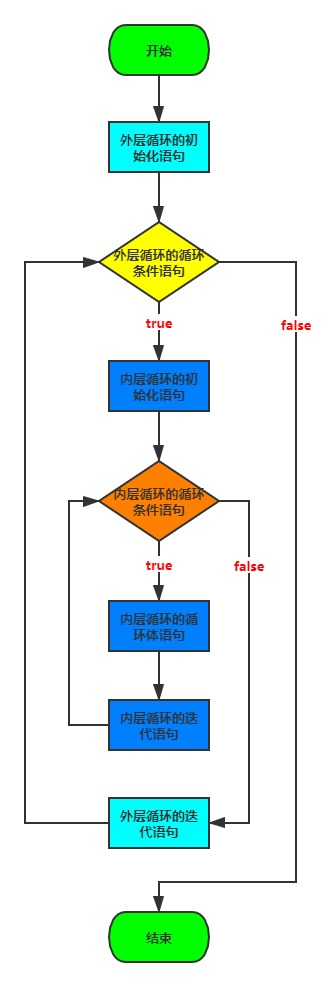
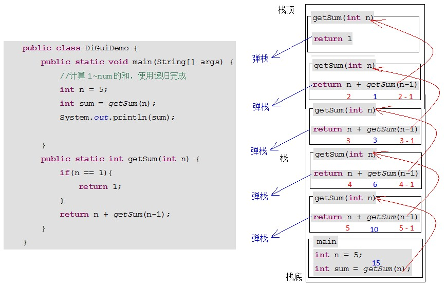

# 尚硅谷\_JavaSE\_day04

# day04【流程控制语句&方法】

## 今日内容

-   跳出语句break，continue
-   方法的格式
-   方法的调用方式
-   方法的参数和返回值
-   方法的重载

## 学习目标

-   [ ] 了解跳出语句break，continue的意义
-   [ ] 理解死循环的执行流程
-   [ ] 掌握方法定义的格式
-   [ ] 掌握方法定义的参数和返回值含义
-   [ ] 掌握方法的调用过程
-   [ ] 掌握方法的三种调用形式
-   [ ] 掌握方法定义的注意事项
-   [ ] 掌握方法重载的概念

# 第一章  流程控制语句

## 1.1 死循环

-   死循环：在程序中无法通过靠自身控制终止的循环
-   分类：
    -   for语句的死循环
    -   while语句的死循环

### for语句的死循环格式

```java
for (;;) {
    循环体语句;
}
```

### while语句的死循环格式

```java
while (true) {
  循环体语句;
}
```

### 死循环的补充

-   for语句的死循环执行效率优于while语句的死循环，在编写算法，设计模式，框架，计算机编程语言等，推荐使用for语句的死循环格；
-   在实际业务需求开发过程中，选择while语句的死循环，while语句的死循环代码阅读性更强，更容易理解；

## 1.2 嵌套循环

如果把 环语句放在另外一个循环语句的循环体中，那么就可以形成嵌套循环，嵌套循环既可以是 for 循环语句的嵌套，也可以是 while 循环语句的嵌套和do...while循环语句的嵌套……即各种类型的循环语句都可以作为外层循环，也可以作为内层循环；但常规的嵌套循环一般指代**for循环语句的嵌套**。

### for语句的嵌套循环格式

```java
for (外层循环的初始化语句;外层循环的循环条件语句;外层循环的迭代语句) {
  for (内层循环的初始化语句;内层循环的循环条件语句;内层循环的迭代语句) {
    内层循环的循环体语句;
  }
}
```



```java
// 需求：将一天中的时间打印到控制台

public class ForForDemo {
  public static void main (String[] args) {
    for (int hour = 0;hour < 24 ;hour++ ) {
      for (int min = 0; min < 60 ; min++) {
        System.out.println(hour + "时" + min +"分");
      }
    }  
  }
}
```

### 练习：百钱买百鸡

```java
/*
  花100文钱买100只鸡
  公鸡5文1只
  母鸡3文1只
  小鸡1文3只
  花100文钱正好买100只鸡
*/

public class ForForTest01 {
  public static void main (String[] args) {
    // 公鸡只数的可能性
    for (int gong = 0; gong <= 20 ;gong++ ) {
      // 母鸡只数的可能性
      for (int mu = 0; mu <= 33 ;mu++ ) {
        // 小鸡只数
        int xiao = 100 - gong - mu;
        // 进行条件的判断
        if ((xiao % 3 == 0) && (gong * 5 + mu * 3 + xiao / 3 == 100)) {
          System.out.println("公鸡有"+gong+"只，母鸡有"+mu+"只，小鸡有"+xiao+"只");
        }
      }
    }
  }
}
```

### 练习：打印1-100之间所有质数

```java
/*
  打印1-100之间所有质数

  被除数 / 除数 = 商 ...... 余数

  解题思路：一个数一个数试，看有没有整除

  外层循环控制：被除数
  内层循环控制：除数
  
*/

public class ForForTest02 {
  public static void main (String[] args) {
    for (int i = 2; i <= 100 ;i++) {
      // 给每个被除数定义一个计数器
      // int count = 0;
      boolean flag = true;
      for (int j = 2; j < i ;j++ ) {
        if (i % j == 0) {
          //count++;
          flag = false;
          break;
        }
      }

      if (flag) {
        System.out.println(i);
      }
    }
  }
}
```

# 第二章 方法

方法是后面所讲面向对象部分中类或对象的行为功能的抽象，是类或对象最重要的组成部分。但从功能上来看，方法就是封装特殊功能的代码块，我们可以将main方法中多次重复操作的功能性代码抽取出来，封装到方法中，以便可以重复使用。需要注意的是，Java中的方法不能独立存在，所有的方法都必须定义在类中或接口中。

## 2.1 方法的好处

-   提高代码的复用性，减少代码的书写量，从而提高开发效率。
-   将程序中每个功能性的代码进行独立，从而降低代码的耦合性。

> 耦合性，也叫耦合度，是对模块间关联程度的度量。耦合的强弱取决于模块间接口的复杂性、调用模块的方式以及通过界面传送数据的多少。模块间的耦合度是指模块之间的依赖关系，包括控制关系、调用关系、数据传递关系。模块间联系越多，其耦合性越强，同时表明其独立性越差( 降低耦合性，可以提高其独立性)。软件设计中通常用耦合度和内聚度作为衡量模块独立程度的标准。划分模块的一个准则就是高内聚低耦合。

### 代码简化前：

```java
public class MethodDemo01 {
  public static void main (String[] args) {
    System.out.println("HelloWorld");
        System.out.println("HelloWorld");
        System.out.println("HelloWorld");
        System.out.println("HelloWorld");
        System.out.println("HelloWorld");
        System.out.println("HelloWorld");
        System.out.println("HelloWorld");
        System.out.println("HelloWorld");
        System.out.println("HelloWorld");
        
    System.out.println("排序功能");
        
    System.out.println("HelloWorld");
        System.out.println("HelloWorld");
        System.out.println("HelloWorld");
        System.out.println("HelloWorld");
        
    System.out.println("水仙花数功能");
        
    System.out.println("HelloWorld");
        System.out.println("HelloWorld");
        System.out.println("HelloWorld");
        System.out.println("HelloWorld");
        System.out.println("HelloWorld");
  }
}
```

### 代码简化后：

```java
public class MethodDemo01 {
  public static void main (String[] args) {
    printHW(9);
    System.out.println("排序功能");
    printHW(4);
    System.out.println("水仙花数功能");
    printHW(5);
    
  }

  // 打印指定次数的HelloWorld
  public static void printHW (int num) {
    for (int i = 1; i <= num ; i++ ) {
      System.out.println("HelloWorld");
    }
  }
}
```

## 2.2 定义方法的格式详解

```java
修饰符 返回值类型 方法名 (形参类型1 形参名1 ,形参类型2 形参名2 , ...... ,形参类型n 形参名n) {
  方法体;
  return 返回值;
}

修饰符：目前没有学习修饰符，暂时用 public static 固定写法进行替代；
返回值类型：方法运行结果（返回值）的数据类型，方法执行完毕后将结果数据返回到调用者方法；方法的返回值类型可以是以下几种：
    基本数据类型：四类八种
    引用数据类型：数组，类，接口
    无返回值类型：void
方法名：给方法起的名字，需做到"见名知意"；
():形参列表，方法在执行的过程中需要使用调用者方法中的数据时，因为作用域的原因无法直接使用，需要通过参数传递的方式将数据传递过来；形参的数据类型可以是以下几种：
    基本数据类型：四类八种
    引用数据类型：数组，类，接口
    无参数：()形参列表中什么都不写
方法体：在原有程序中抽取的特殊功能代码;
return:
  (1):结束方法；
  (2):如果return关键字的后面有返回值，在结束方法的同时将返回值返回给调用者方法
返回值：方法体执行的最终结果；        
```

## 2.3 定义方法的两个明确

-   **返回值类型**：
    -   明确方法返回值的数据类型
-   **形参列表**：
    -   明确形参列表中需要使用调用者方法中几个数据
    -   明确每个数据的数据类型分别是什么

```java
// 需求：定义方法实现两个整数的求和计算

public class MethodDemo2 {
    public static void main(String[] args) {

    }

    /*
      定义计算两个整数求和的方法
      两个明确：
        返回值类型：int
        形参列表：int a,int b
    */
    public static int getSum(int a, int b) {
        return a + b;
    }
}
```

## 2.4 方法调用

### 方法的特点

-   不调用，不执行

### 方法的调用格式分类

-   如果调用属于类的方法（后面讲解）
    ```java
    类名.方法名(实参);
    ```
-   如果调用属于对象的方法（后面讲解）
    ```java
    对象名.方法名(实参);
    ```
-   如果调用同一个类中的方法
    -   直接调用，格式如下：
        ```java
        方法名(实参);
        ```
    -   输出调用，格式如下：
        ```java
        System.out.println(方法名(实参));
        ```
    -   赋值调用，格式如下：
        ```纯文本
        数据类型 变量名 = 方法名(实参);
        ```

### 形式参数和实际参数

-   形式参数：在定义方法时方法名后面()中的变量称为形式参数（简称形参）。
-   实际参数：在调用方法时方法名后面()中的参数称为实际参数（简称实参）。

```java
// 需求：定义方法实现两个整数的求和计算

public class MethodDemo2 {
    public static void main(String[] args) {
    // 直接调用
    // getSum(3,4);
    // 输出调用
    // System.out.println(getSum(3,4));
    // 赋值调用
    int sum = getSum(3,4);//通过getSum(3,4)找到同一个类中的getSum(int a, int b)，代码从第10行，直接跳到第20行，同时将3和4一起带过去
    System.out.println("sum = " + sum);
    }

    /*
      定义计算两个整数求和的方法
      两个明确：
        返回值类型：int
        形参列表：int a,int b
    */
    public static int getSum(int a, int b) { //
        return a + b;
    }
}
```

## 2.5 方法的练习

### 练习：比较两个整数是否相同

```java
public class MethodTest01 {
    public static void main(String[] args) {
        //调用方法compare，传递两个整数
        //并接收方法计算后的结果，布尔值
        boolean bool = compare(3, 8);
        System.out.println(bool);
    }

    /*
        定义比较两个整数是否相同的方法
        返回值类型，比较的结果布尔类型
        参数：不确定参与比较的两个整数
    */
    public static boolean compare(int a, int b) {
        if (a == b) {
            return true;
        } else {
            return false;
        }
    }
}
```

### 练习：计算1+2+3...+100的和

```java
public class MethodTest02 {
    public static void main(String[] args) {
        //调用方法getSum
        //并接收方法计算后的结果，整数
        int sum = getSum();
        System.out.println(sum);
    }

    /*
        定义计算1~100的求和方法
        返回值类型，计算结果整数int
        参数：没有不确定数据
    */
    public static int getSum() {
        //定义变量保存求和
        int sum = 0;
        //从1开始循环，到100结束
        for (int i = 1; i <= 100; i++) {
            sum = sum + i;
        }
        return sum;
    }
}

```

## 2.6 void关键字

-   void关键字：方法没有返回值
-   void关键字注意事项：
    -   在方法没有合适的返回值的时候，定义方法时返回值类型的位置不能什么都不写，需要用到void关键字进行占位；
    -   当方法的返回值类型是void时，调用的方式只能是直接调用
        -   方法返回值类型为void时，只能使用直接调用
        -   方法返回值类型不是void时，推荐使用赋值调用
    -   当方法的返回值类型是void时，方法后面的return关键字可以省略不写

```java
public class MethodDemo03 {
    public static void main(String[] args) {
        //调用方法printHelloWorld，传递整数
        print(9);
    }

    /*
          定义打印HelloWorld方法
          返回值类型，计算没有结果 void
          参数：不确定打印几次
    */
    public static void print(int n) {
        for (int i = 0; i < n; i++) {
            System.out.println("HelloWorld");
        }
    }
}

```

## 2.7 方法的重载（Overload）

-   **方法重载**：在同一个类中（或者子父类继承关系中），出现了方法名相同,形参列表不同的现象
-   **重载的特点**
    -   必须在同一个类中（或者子父类继承关系中）
    -   方法名必须相同
    -   形参列表必须不同（至少满足以下一点）
        -   形参列表中的数据类型不同
        -   形参列表中形参个数不同
        -   形参列表中数据类型的顺序不同

```java
public class MethodDemo04 {
  public static void main (String[] args) {
    
  }

  public static void getSum (int a , int b) {}

  public static void getSum (int a , double b) {}

  public static int getSum (double a , int b) {
    return 0;
  }

  public static void getSum (double a , double b) {}

  public static void getSum (int a , int b , int c) {}
}
```

## 2.8 方法的递归

-   **递归**：指在当前方法内调用自己的这种现象。
-   **递归的分类:**
    -   递归分为两种，直接递归和间接递归。
    -   直接递归称为方法自身调用自己。
    -   间接递归可以A方法调用B方法，B方法调用C方法，C方法调用A方法。
-   **注意事项**：
    -   递归一定要有条件限定，保证递归能够停止下来，否则会发生栈内存溢出。
    -   在递归中虽然有限定条件，但是递归次数不能太多。否则也会发生栈内存溢出。

```java
// 需求：求1到指定数之前的累加和

public class  MethodDemo05 {
  public static void main(String[] args) {
    //计算1~num的和，使用递归完成
    int num = 5;
        // 调用求和的方法
    int sum = getSum(num);
        // 输出结果
    System.out.println(sum);
    
  }
    /*
      通过递归算法实现.
      参数列表:int 
      返回值类型: int 
    */
  public static int getSum(int num) {
        /* 
           num为1时,方法返回1,
           相当于是方法的出口,num总有是1的情况
        */
    if(num == 1){
      return 1;
    }
        /*
          num不为1时,方法返回 num +(num-1)的累和
          递归调用getSum方法
        */
    return num + getSum(num-1);
  }
}
```

### 代码执行图解



> 小贴士：递归一定要有条件限定，保证递归能够停止下来，次数不要太多，否则会发生栈内存溢出。

## 2.9 递归的练习：斐波那契数列

```java
/*
 * 需求：
 *     有一对兔子，从出生后第3个月起每个月都生一对兔子，小兔子长到第三个月后每个月又生一对兔子，
 *     假如兔子都不死，问指定月份的兔子对数为多少？ 
 * 
 * 规律：
 *     第一个月：1
 *     第二个月：1
 *     第三个月：2
 *     第四个月：3
 *     第五个月：5
 *     第六个月：8
 *     ...
 * 
 *     规律：从第三个月开始，每个月的兔子对数是前两个月的兔子对数之和
 *          第一个月和第二个月的兔子对数都是1
 * 
 */

  public static long getNum(int month) {

    // 定义方法的结束条件
    if (month == 1 || month == 2) {
      return 1;
    }
    
    return getNum01(month - 1) + getNum01(month -2);
    
  }
```
