# 尚硅谷\_JavaSE\_day05

# day05【数组】

## 今日内容

-   idea的基本使用
-   数组的定义初始化
-   数组的基本使用

## 学习目标

-   [ ] 掌握数组的求和
-   [ ] 掌握数组最值的获取
-   [ ] 掌握数组平均值的获取

# 第一章 开发工具IDEA

## IntelliJ IDEA概述

IDEA 全称 IntelliJ IDEA，是java语言开发的集成环境，IntelliJ在业界被公认为最好的java开发工具之一，尤其在智能代码助手、代码自动提示、重构、J2EE支持、Ant、JUnit、CVS整合、代码审查、 创新的GUI设计等方面的功能可以说是超常的。IDEA是JetBrains公司的产品，这家公司总部位于捷克共和国的首都布拉格。

## 1.1 IDEA的优势和劣势（相比Eclipse而言）

-   优势
    -   强大的整合能力。比如：Git、Maven、Spring 等
    -   提示功能的快速、便捷
    -   提示功能的范围广
    -   好用的快捷键和代码模板 private static final psf
    -   精准搜索
-   劣势
    -   旗舰版收费
    -   上手复杂度更高
    -   对硬件的支持要求更高
        -   个人建议，电脑配置内存 8G 或以上，CPU 最好 i5 以上，最好安装块固态硬盘(SSD)，将 IDEA安装在固态硬盘上，这样流畅度会相对快很多。

## 1.2 IDEA的安装

-   双击`ideaIU-2018.3.6.exe`文件，弹出以下窗口，单击`Next`下一步：

    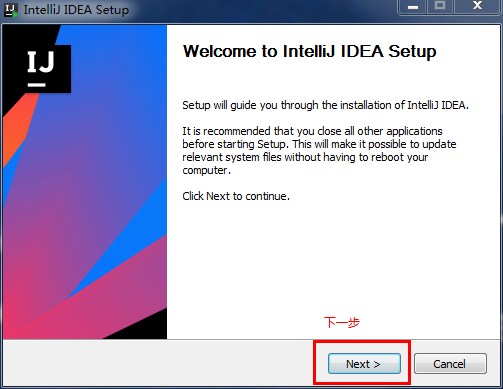
-   更改idea安装路径，建议安装路径中，不要存在中文和空格，然后单击`Next`下一步：

    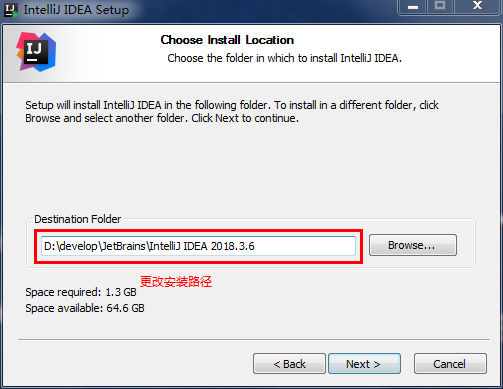
-   选择适合自己操作系统的快捷方式，因为目前操作系统普遍为64位，选择64位，然后单击`Next`下一步：

    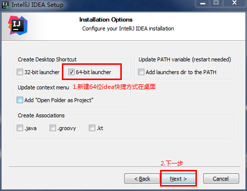
-   默认单击`Install`安装

    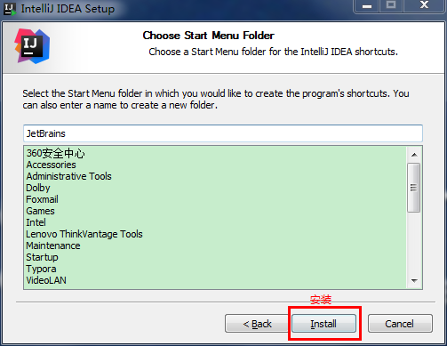
-   等待安装完成，单击`Finish`完成安装

    

## 1.3 IDEA配置前准备

-   IDEA设置的导入，选择`Do not import settings` 不导入设置，单击`ok`

    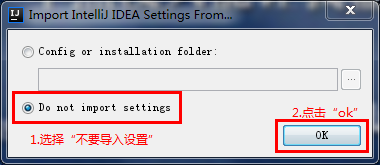
-   同意用户使用协议

    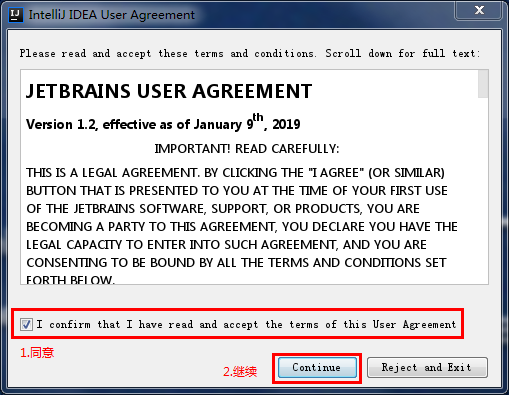
-   单击`Don't send`,继续

    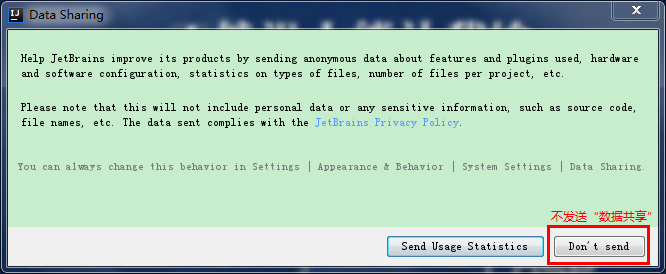
-   设置主题，根据自己的爱好，选择黑色背景主题或白色背景主题，然后单击`Skip Remaining and Set Defaults`继续

    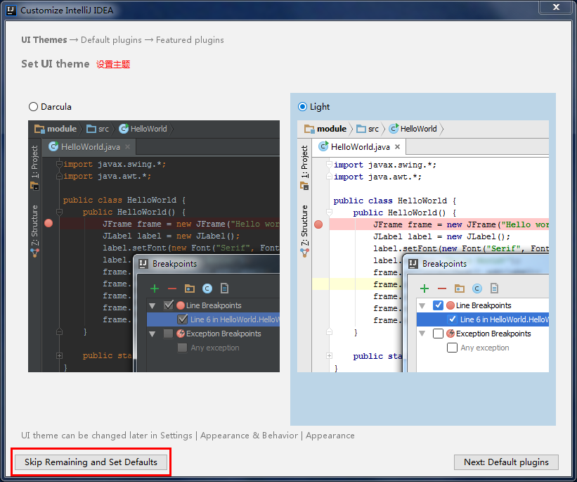
-   选择30天免费试用，单击`Evluate`继续

    

## 1.4 基本配置

### 1.4.1 取消自动更新

-   进入方式Configure-->Settings

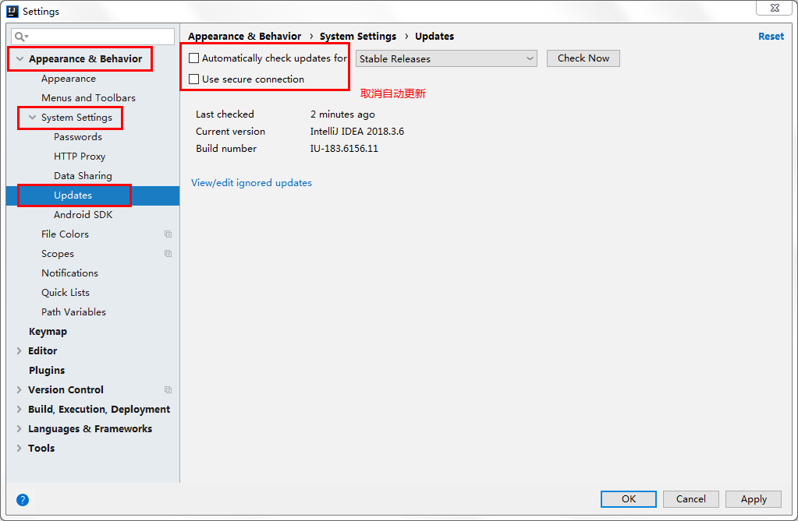

### 1.4.2 设置编码

#### （1）当前项目编码设置

方式一：Settings-->Editor-->File Encodings

方式二：工具类的详细配置按钮


\-->Editor-->File Encodings

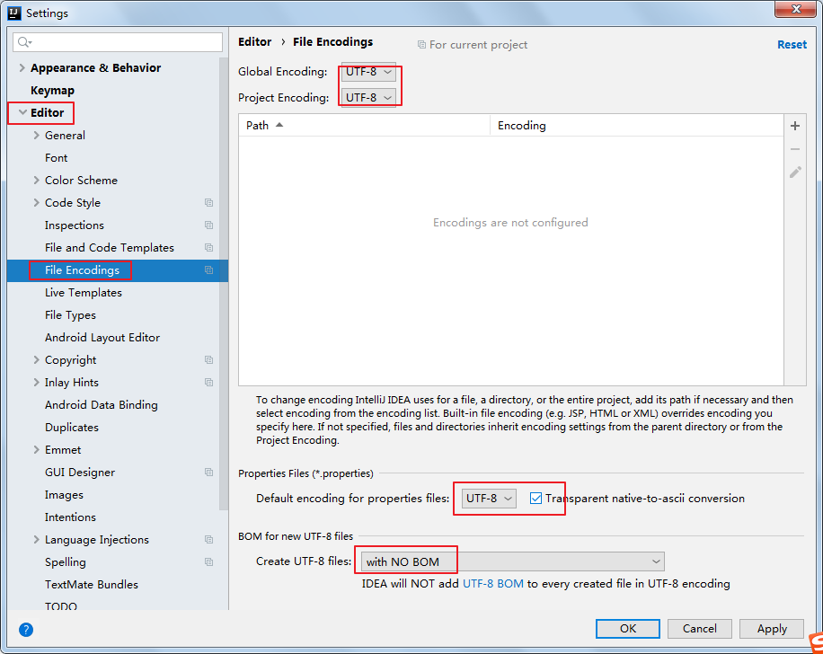

说明： Transparent native-to-ascii conversion主要用于转换ascii，一般都要勾选。

#### （2）新建项目默认编码设置

方式一：File菜单-->Other Settings-->Settings for New Projects...-->Editor-->File Encodings


方式二：启动界面右下角有Config-->Settings-->Editor-->File Encodings

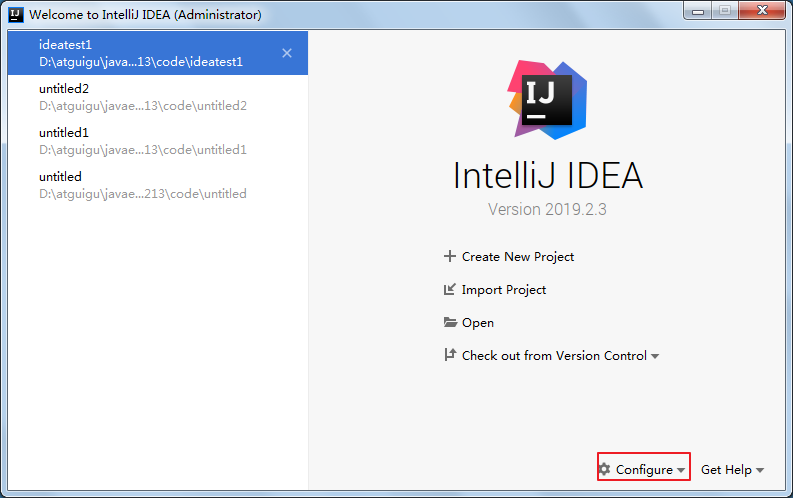


### 1.4.3 设置自动编译

方式一：File菜单-->Settings-->Build,Execution,Deployment-->Compiler

方式二：工具类的详细配置按钮


\-->Build,Execution,Deployment-->Compiler

注意：该项配置只针对当前项目有效。


### 1.4.4 设置编辑器

#### （1）编辑器主题


#### （2）字体大小与颜色

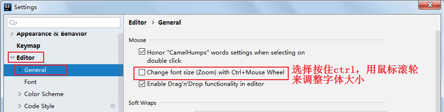

更详细的字体与颜色如下：

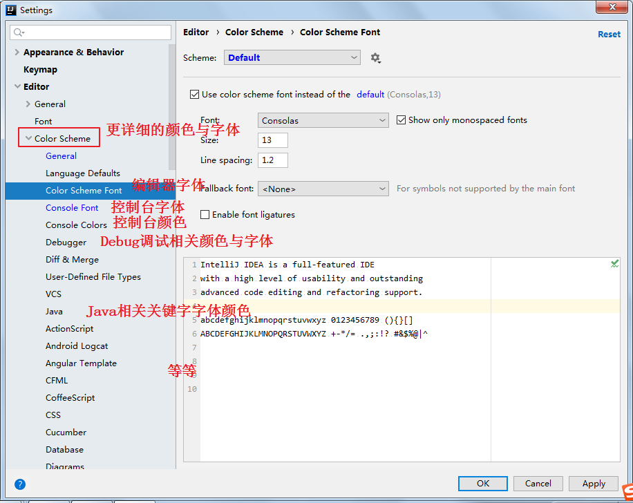

#### （3）显示行号与方法分隔符


### 1.4.5 设置快捷键

idea工具提供的代码自动提示快捷键和Windows系统输入法的快捷键冲突,需要手工进行设置,要不无法通过快捷键自动提示

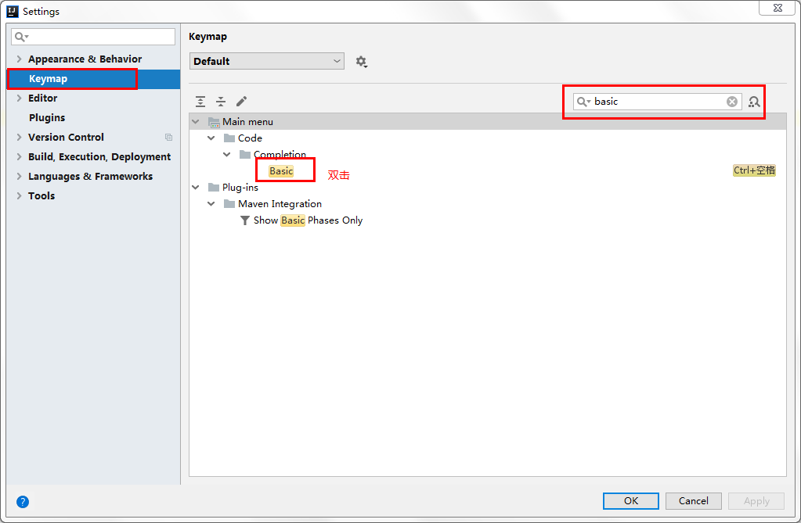

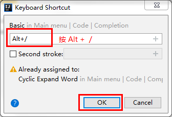

### 1.4.6 运行内存大小配置(了解)

找到IDEA安装目录的bin目录例如：D:\develop\JetBrains\IntelliJ\_IDEA\_2018.3.6\bin，找到idea64.exe.vmoptions文件，用文本编辑器打开：

-   大家根据电脑系统的位数，选择 32 位的 VM 配置文件或者 64 位的 VM 配置文件
-   32 位操作系统内存不会超过 4G，所以没有多大空间可以调整，建议不用调整了
-   64 位操作系统中 8G 内存以下的机子或是静态页面开发者是无需修改的。
-   64 位操作系统且内存大于 8G 的，如果你是开发大型项目、Java 项目或是 Android 项目，建议进行修改，常修改的就是下面 3 个参数：


```.properties
-Xms128m
  如果16 G 内存的机器可尝试设置为 -Xms512m(设置初始的内存数，增加该值可以提高 Java 程序的启动速度。)
-Xmx750m
   如果16 G 内存的机器可尝试设置为 -Xmx1500m(设置最大内存数，提高该值，可以减少内存 Garage 收集的频率，提高程序性能)
-XX:ReservedCodeCacheSize=240m
  如果16G 内存的机器可尝试设置为-XX:ReservedCodeCacheSize=500m(保留代码占用的内存容量)
```

## 1.5 IDEA的基本使用

-   新建项目

    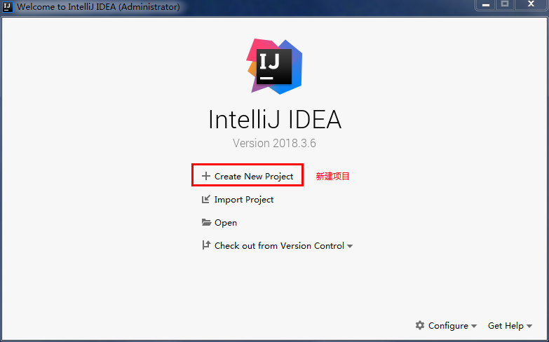
-   选择空项目,单击下一步

    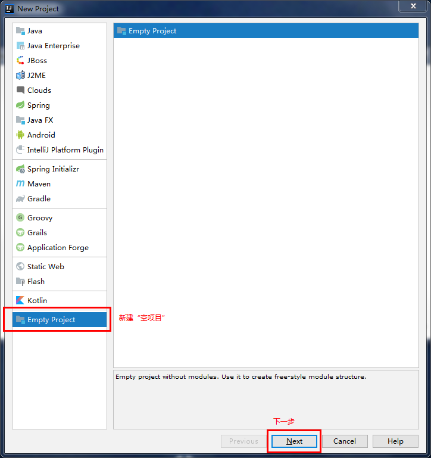
-   设置项目名称和路径，切记不要出现中文和空格

    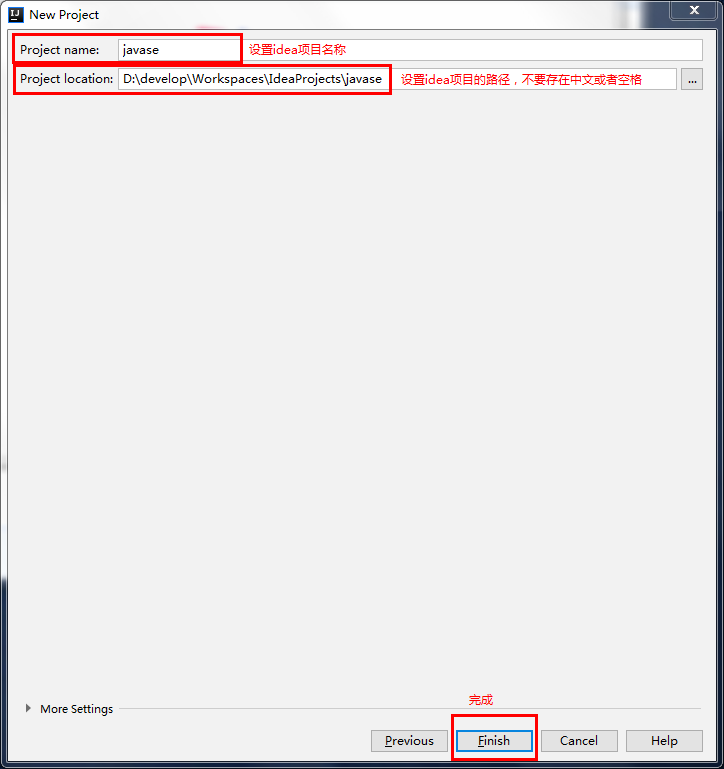
-   在弹出的窗口中，依次选择如图所示

    
-   设置模块名称和路径

    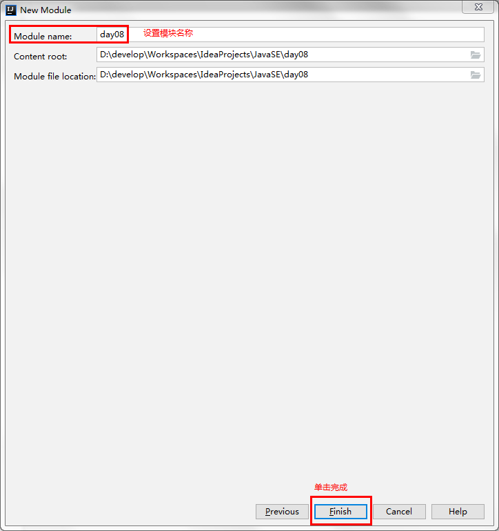
-   选择模块下的src，单击鼠标右键，依次选择new、package新建包名，如图所示

    
-   新建类

    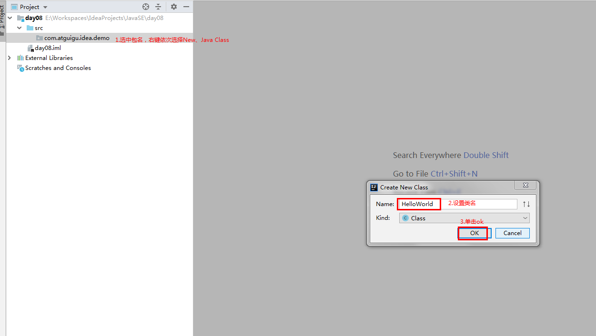
-   编写完“HelloWorld”代码后， 在空白处单击鼠标右键运行代码

    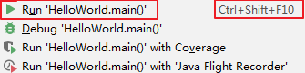
-   代码输出结果，会在下面的控制台呈现

    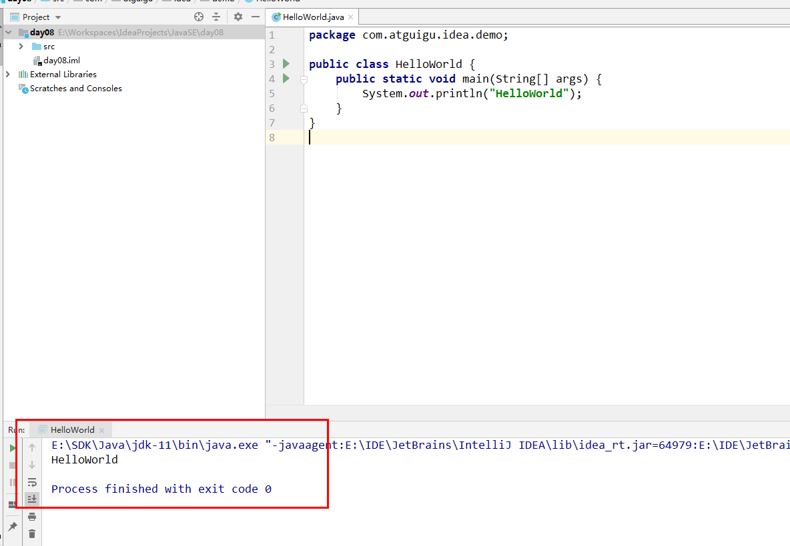

## 1.6 Debug调试

### 1.6.1 启动Debug

在所有调试中，调试一个Java程序是最简单的，主要有设置断点、启动调试、单步执行、结束调试几步。

1）设置断点：在源代码文件中，在想要设置断点的代码行的前面的标记行处，单击鼠标左键就可以设置断点


2）启动调试：IDEA提供多种方式来启动程序(Launch)的调试，分别是通过菜单(Run –> Debug)、图标(“绿色臭虫”


等等


### 1.6.2 单步调试工具介绍


或


：Step Over（F8）：进入下一步，如果当前行断点是调用一个方法，则不进入当前方法体内


：Step Into（F7）：进入下一步，如果当前行断点是调用一个自定义方法，则进入该方法体内


：Force Step Into（Alt +Shift  + F7）：进入下一步，如果当前行断点是调用一个核心类库方法，则进入该方法体内


：Step Out（Shift  + F8）：跳出当前方法体


：Run to Cursor（Alt + F9）：直接跳到下一个断点处继续调试


：Resume Program（F9）：恢复程序运行，但如果该断点下面代码还有断点则停在下一个断点上


：Stop（Ctrl + F2）：结束调试


：View Breakpoints（Ctrl + Shift  + F8）：查看所有断点


：Mute Breakpoints：使得当前代码后面所有的断点失效， 一下执行到底


# 第二章 数组

## 2.1 容器概述

### 案例分析

现在需要统计某公司员工的工资情况，例如计算平均工资、找到最高工资等。假设该公司有50名员工，用前面所学的知识，程序首先需要声明50个变量来分别记住每位员工的工资，然后在进行操作，这样做会显得很麻烦，而且错误率也会很高。因此我们可以使用容器进行操作。将所有的数据全部存储到一个容器中，统一操作。

### 容器概念

-   **容器：** 是将多个数据存储到一起，每个数据称为该容器的元素。
-   **生活中的容器：** 水杯，衣柜，教室
-   **Java中的容器：** 数组，集合

## 2.2 数组概念

-   **数组概念：** 数组就是存储同一种数据类型多个元素的固定容器
-   **数组的特点：**
    -   存储的元素的数据类型相同
    -   数组一旦初始化长度是固定的,不可以改变
    -   数组中需要存在多个元素，数组中可以没有元素或一个元素，但这样的数组没有任何意义

## 2.3 数组的定义

### 数组定义格式

-   Java语言支持两种语法格式来定义数组：

```java
数据类型[] 数组名;(推荐)
  例如：int[] arr;
    描述：定义存储int类型元素的数组，数组名为arr
数据类型 数组名[];
  例如：int arr[];
    描述：定义存储int类型元素的变量，变量名为arr[]
        
数据类型[]:定义数组的数据类型
  数据类型：数组中元素的数据类型；
    []:定义的是一个数组
数组名：给数组起的名字，遵循标识符的命名规则和规范
```

> 对这两种语法格式而言，通常推荐使用第一种格式。因为第一种格式不仅具有更好的语意，而且具有更好的可读性。对于**int\[] arr**，很容易理解这是定义一个数组，其中数组名是arr ,而数组类型是int\[]。前面已经指出：int\[]确实是一种新类型，与 int类型完全不同（例如 int类型是基本类型，但 int\[]是引用类型)。因此，这种方式既容易理解，也符合定义变量的语法。但第二种格式**int arr\[]** 的可读性就差了,看起来好像定义了一个类型为int的变量,而变量名是arr\[],这与真实的含义相去甚远。可能之前有些程序员非常喜欢int arr\[];这种定义数组的方式，但从现在开始就不要再使用这种方式了。Java 的模仿者 C#就不再支持int arr\[]这种语法，它只支持第一种定义数组的语法，而且越来越多的语言不再支持int arr\[]这种数组定义语法。

## 2.4 数组的初始化

### 数组的初始化有如下两种方式：

-   动态初始化：初始化时程序员只指定数组长度，由系统为数组元素分配初始值。
-   静态初始化：初始化时由程序员显式指定每个数组元素的初始值，由系统决定数组长度。

### 动态初始化

```java
数据类型[] 数组名 = new 数据类型[数组长度];
int[] arr = new int[3];

new：向JVM申请内存空间，用来存储数据
数据类型：数组中元素的数据类型；
[数组长度]：数组的长度，表示创建的数组容器中可以存储多少个元素数据
```

### 静态初始化

```java
标准版：
    数据类型[] 数组名 = new 数据类型[]{元素1,元素2,......,元素n};
  例如：
        int[] arr = new int[]{11,22,33};
简化版：
    数据类型[] 数组名 = {元素1,元素2,......,元素n};
  例如：
        int[] arr = {11,22,33};

new：向JVM申请内存空间，用来存储数据
数据类型：数组中元素的数据类型
[]:定义的是一个数组
{元素1,元素2,......,元素n}:数组中的具体元素
```

### 注意事项：

-   Java中不要同时使用静态初始化和动态初始化，也就是说，不要在进行数组初始化时，既指定数组的长度，也为每个数组元素分配初始值。
-   标准版的静态初始化可以先定义，后赋值；简化版的静态初始化不可以先定义，后赋值；

```java
public class ArrayDemo01 {
  public static void main (String[] args) {
    //数据类型[] 数组名
    int[] arr01;
    //数据类型 数组名[]
    int arr02[];
    //数据类型[] 数组名 = new 数据类型[数组长度];
    int[] arr03 = new int[3];
    //数据类型[] 数组名 = new 数据类型[]{元素1,元素2,......,元素n};
    int[] arr04 = new int[]{11,22,33};
    //数据类型[] 数组名 = {元素1,元素2,......,元素n};
    int[] arr05 = {11,22,33};

    //int[] arr06 = new int[5]{11,22,33};java语言中不允许动静结合的方式创建数组

    int[] arr06;
    arr06 = new int[]{11,22,33};

    int[] arr07;
    //arr07 = {11,22,33}; 编译报错，思考：为什么报错？
  }
}
```

## 2.5 数组的访问

### 访问数组元素

数组最常用的用法就是访问数组元素，包括对数组元素进行赋值和取出数组元素的值。访问数组元素都是通过在数组引用变量后紧跟一个**方括号\[]**，方括号里是数组元素的索引值，这样就可以访问数组元素了,具体格式如下：

```java
存储数组的元素值
    数组名[索引值] = 元素值;
  例如：arr[0] = 11;
   
获取数组的元素值
    数组名[索引值];
  例如：arr[0]
```

-   **索引：** 开发人员针对数组中的元素做的编号，从0开始依次递增；
-   **规律：** 数组第一个元素的索引值为 0，最后一个元素的索引值为数组长度减1。

```java
public class ArrayDemo02 {
  public static void main (String[] args) {
    //定义并初始化数组
    int[] arr = {11,22,33};
    System.out.println(arr);//[I@5c8da962 
    System.out.println(arr[0]);
    System.out.println(arr[1]);
    System.out.println(arr[2]);

    System.out.println("===============");

    //针对数组里面的元素重新进行赋值

    arr[0] = 100;
    arr[2] = 300;

    System.out.println(arr);
    System.out.println(arr[0]);
    System.out.println(arr[1]);
    System.out.println(arr[2]);
  }
}
```

### 动态访问数组长度

所有的数组都提供了一个length 属性，通过这个属性可以动态访问到数组的长度，一旦获得了数组的长度,就可以通过循环来遍历该数组的每个数组元素。

```java
public class ArrayDemo03 {
  public static void main (String[] args) {
    int[] arr = {11,22,33};

    System.out.println(arr[0]);
    System.out.println(arr[1]);
    System.out.println(arr[2]);

    System.out.println("===========================");

    for (int i = 0; i < 3 ; i++ ) {
      System.out.println(arr[i]);
    }

    System.out.println("===========================");
  
        System.out.println(“数组的长度 = ” + arr.length);
        
    for (int i = 0; i < arr.length ;i++ ) {
      System.out.println(arr[i]);
    }
  }
}
```

# 第三章 内存中的数组

## 3.1 内存概述

内存是计算机中的重要原件，临时存储区域，作用是运行程序。我们编写的程序是存放在硬盘中的，在硬盘中的程序是不会运行的，必须放进内存中才能运行，运行完毕后会清空内存。Java虚拟机要运行程序，必须要对内存进行空间的分配和管理。

## 3.2 Java虚拟机的内存划分

为了提高运算效率，就对空间进行了不同区域的划分，因为每一片区域都有特定的处理数据方式和内存管理方式。

### JVM的内存划分：

| 区域名称       | 作用                           |
| ---------- | ---------------------------- |
| 程序计数器（寄存器） | 给CPU使用，和我们开发关联不大。            |
| 本地方法栈      | JVM在使用操作系统功能的时候使用，和我们开发关联不大。 |
| 方法区        | 存储需要运行的字节码文件（.class文件）       |
| 堆内存        | 存储new出来的东西                   |
| 方法栈        | 存储正在运行的方法                    |

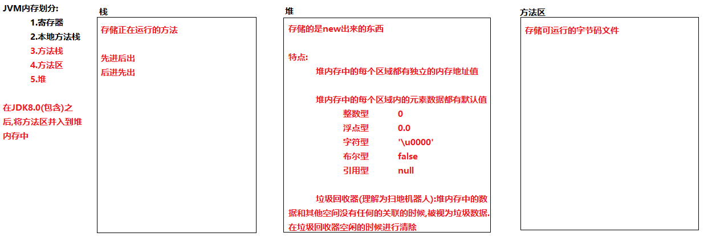

## 3.3 数组存储的内存图解

### 动态初始化内存图解

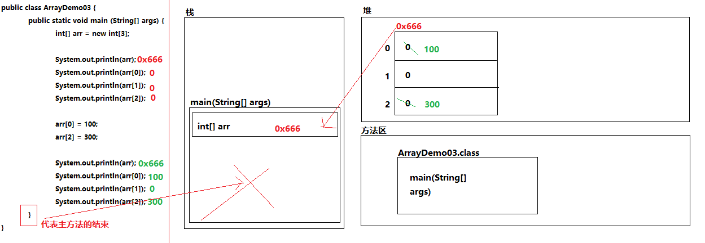

### 静态初始化内存图解

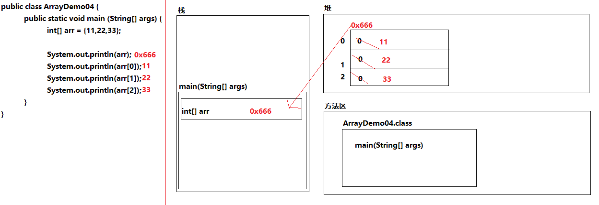

### 两个数组指向同一内存地址值内存图解

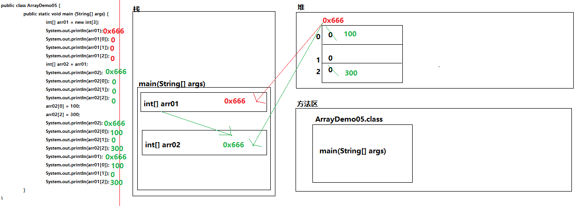

### 数组不可变性内存图解

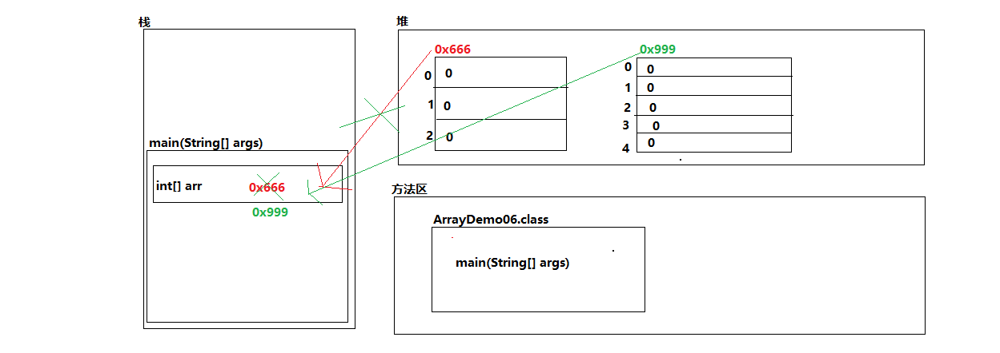

### 注意事项

-   数组索引越界异常(ArrayIndexOutOfBoundsException)
    -   产生原因：如果访问数组元素时指定的索引值小于0，或者大于等于数组的长度时，编译不会出现任何错误，但运行时出现异常：**java.lang.ArrayIndexOutOfBoundsException：N**，异常信息后的N就是程序员试图访问的数组索引。
-   空指针异常(NullPointerException):
    -   产生原因:如果引用数据类型的变量的值为null时,通过这个null访问数组中的元素或者对象中的变量和方法时,会报出**java.lang.NullPointerException**

# 第四章 数组基本应用

## 4.1 按照固定格式进行数组的打印

```java
public class ArrayDemo07 {
  public static void main (String[] args) {
    int[] arr = {11,22,33,44};
  
    for (int i = 0; i < arr.length ;i++ ) {
      System.out.println(arr[i]);
    }

    System.out.println("===========================");

    //数组:[11, 22, 33, 44]
    System.out.print("数组:[");

    for (int i = 0; i < arr.length ;i++ ) {
      if (i == arr.length - 1) { //判断索引是否为最后的索引
        System.out.println(arr[i] + "]");
      } else {
        System.out.print(arr[i] + ", ");
      }
    }
  }
}
```

## 4.2 数组的求和

```java
/**
 * 练习：数组的求和（获取数组中所有元素的累加和）
 * 
 * @author Shark
 *
 */
public class ArraysDemo08 {
  public static void main(String[] args) {
    // 定义一个数组
    int[] arr = { 11, 22, 33, 44, 55 };

    // 定义求和遍历
    int sum = 0;

    // 遍历数组
    for (int i = 0; i < arr.length; i++) {
      // 针对数组中每个元素累加求和
      sum += arr[i];
    }

    System.out.println("sum:" + sum);
  }
}
```

## 4.3 数组获取最大值元素

-   **最大值获取：** 从数组的所有元素中找出最大值。
-   **实现思路：**
    -   定义变量，保存数组0索引上的元素
    -   遍历数组，获取出数组中的每个元素
    -   将遍历到的元素和保存数组0索引上值的变量进行比较
    -   如果数组元素的值大于了变量的值，变量记录住新的值
    -   数组循环遍历结束，变量保存的就是数组中的最大值
        

```java
/**
 * 练习：获取数组的最大值
 * 
 * @author Shark
 *
 */
public class ArraysDemo09 {
  public static void main(String[] args) {
        int[] arr = { 5, 15, 2000, 10000, 100, 4000 };
        //定义变量，保存数组中0索引的元素
        int max = arr[0];
        //遍历数组，取出每个元素
        for (int i = 0; i < arr.length; i++) {
          //遍历到的元素和变量max比较
          //如果数组元素大于max
          if (arr[i] > max) {
            //max记录住大值
            max = arr[i];
          }
        }
        System.out.println("数组最大值是： " + max);
    }
}
```

## 4.4 练习：评委打分

```java
/**
 * 分析以下需求，并用代码实现：
 *  （1）在编程竞赛中，有10位评委为参赛的选手打分，分数分别为：5，4，6，8，9，0，1，2，7，3
 *  （2）求选手的最后得分（去掉一个最高分和一个最低分后其余8位评委打分的平均值）
 * 
 * @author Shark
 *
 */
```

## 4.5 练习：查找指定元素在数组中出现的第一次索引

```java
/*
  查找指定元素在数组中出现的第一次索引
  
  分析：
    1.定义一个数组
    2.定义一个指定元素
    3.遍历数组，获取每个元素
    4.指定元素和数组中每个元素进行比较
      如果相等，打印对应的索引，终止循环
      如果不相等，指定的元素在数组中找不到
*/

public class ArrayDemo08 {
  public static void main (String[] args) {
    //1.定义一个数组
    int[] arr = {11,22,33,44,55,22,45,22,54,22};
    //2.定义一个指定元素
    int num = 22;
    //3.遍历数组，获取每个元素
    
    // 定义一个计数器
    int count = 0;
    
    for (int i = 0;i < arr.length;i++) {
      //指定元素和数组中每个元素进行比较
      if (num == arr[i]){
        count++;
        System.out.println("指定元素"+num+"在数组中出现的第一次索引是"+i);
        break;
      }
    }
    
    
    if (count == 0) {
      System.out.println("指定元素"+num+"在数组中找不到");
    } 
    
  }
}
```
