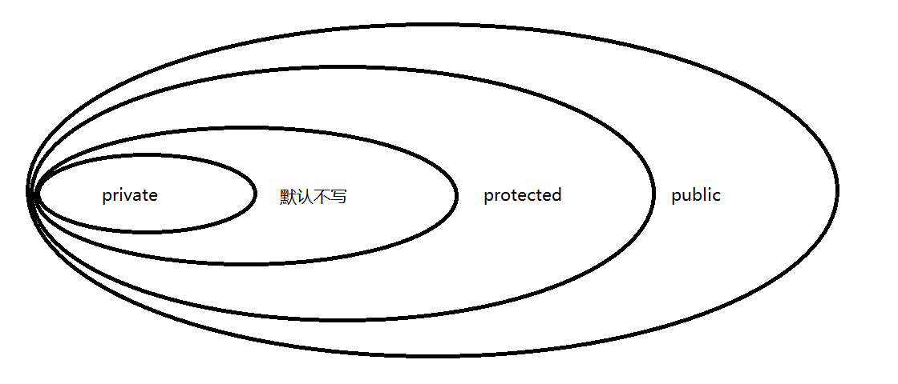

## 封装和继承

### 1. 封装

> 封装：面向对象三大特征之一 将类中的属性隐藏在类的内部 不让外部直接访问 而是通过公开的getter 以及 setter
>
> 方法来实现属性的访问
>
>
> 属性私有 每个属性使用private修饰
>
> 方法公开 针对每个属性编写两个方法 用于属性的赋值setter 和 取值getter
>
>
> 高内聚 一个类中的信息应该直接与本类关联 不能间接关联 或者 没有关联  即必须有紧密连接关系
>
> 低耦合 降低紧密连接程度 降低耦合度意味着各个组件之间的紧密连接程度降低  随之将提高扩展性

> 便于使用者正确使用系统，防止错误修改属性
> 降低了构建大型系统的风险
> 提高程序的可重用性
> 降低程序之间的耦合度

```java
package com.atguigu.test1;

/**
 * @author WHD
 * @description TODO
 * @date 2023/6/3 9:06
 *  企鹅类(宠物类)
 *      属性：名字 性别 健康值
 *      方法：打印企鹅信息
 *
 *  封装：面向对象三大特征之一 将类中的属性隐藏在类的内部 不让外部直接访问 而是通过公开的getter 以及 setter
 *  方法来实现属性的访问
 *
 *  属性私有 每个属性使用private修饰
 *  方法公开 针对每个属性编写两个方法 用于属性的赋值setter 和 取值getter
 *
 *  高内聚 一个类中的信息应该直接与本类关联 不能间接关联 或者 没有关联  即必须有紧密连接关系
 *  低耦合 降低紧密连接程度 降低耦合度意味着各个组件之间的紧密连接程度降低  随之将提高扩展性
 *
 */
public class Penguin {
    private String name;
    public void setName(String name){
        this.name = name;
    }
    public String  getName(){
        return name;
    }
    private char sex;
    public void setSex(char sex){
        if(sex == '雌' || sex == '雄'){
            this.sex = sex;
        }else{
            System.out.println("企鹅性别赋值不合法，将使用默认性别：雄");
            this.sex = '雄';
        }
    }
    public char getSex(){
        return sex;
    }
    private int health;
    public void setHealth(int health){
        if(health >= 0 && health <= 100){
            this.health = health;
        }else{
            System.out.println("企鹅健康值赋值不合法，将使用默认值：80");
            this.health = 80;
        }
    }
    public int getHealth(){
        return health;
    }

}


```

```java
package com.atguigu.test1;

/**
 * @author WHD
 * @description TODO
 * @date 2023/6/3 9:11
 *  企鹅测试类
 */
public class TestPenguin {
    public static void main(String[] args) {
        Penguin p1 = new Penguin();
//        p1.name = "小白";
//        p1.sex = '男';
//        p1.health = -5678;
        p1.setName("小白");
        p1.setSex('男');
        p1.setHealth(-789);

//        System.out.println(p1.name);
//        System.out.println(p1.sex);
//        System.out.println(p1.health);

        System.out.println("-----------------------------------------------");

        System.out.println(p1.getName());
        System.out.println(p1.getSex());
        System.out.println(p1.getHealth());


        Penguin p2 = new Penguin();


    }
}

```

### 2. 访问权限修饰符

#### 2.1 类的访问权限

> 类的访问权限：
>
> public： 本项目中任何位置都可以访问
>
> 默认不写： 只能在同包中访问

#### 2.2 类成员的访问权限



#### 2.3 补充

> 如果需要在同一个作用域访问两个同名 但是不同包的类 可以使用全限定名使用一个类 
>
> 包名 +  类名 = 全限定名

### 3.JavaBean

> JavaBean是一种Java语言写成的可重用组件。
>
> 所谓javaBean，是指符合如下标准的Java类：
> 类是公共的
> 有一个无参的公共的构造器
> 有属性，且有对应的get、set方法

### 4. 继承

> 子类与父类是is-a关系 表示子类和父类 符合 is-a的关系 才要使用继承设计。
>
> 继承是Java中实现代码重用的重要手段之一。Java中只支持单根继承，即一个类只能有一个直接父类。
>
> 何时使用继承？
> 继承与真实世界类似
> 只要说“猫是哺乳动物”，猫的很多属性、行为就不言自明了
> 藏獒是一种狗
>
> 将子类共有的信息编写在父类中
>
> 将子类独有的信息编写在子类中

### 5. 子类继承父类哪些内容

> 继承public和protected修饰的属性和方法，不管子类和父类是否在同一个包里
>
> 继承默认权限修饰符修饰的属性和方法，但子类和父类必须在同一个包里
>
> private修饰的属性和方法不能被继承

### 6. 不能继承哪些内容

> private成员 
>
> 子类与父类不在同包，使用默认访问权限的成员
>
> 构造方法

### 7. super关键字

> super关键字 super用于表示父类的信息 是包含在this之内的
>
> super可以访问父类的属性、方法、构造方法

#### 7.1 访问属性

```java
package com.atguigu.test6;

/**
 * @author WHD
 * @description TODO
 * @date 2023/6/3 11:32
 *  宠物类 父类
 *  父类中书写子类共有的信息 (属性和方法)
 *
 *  关于属性 和 字段
 *  严格意义来说 直接写在类中的变量 称之为 字段 只有给这些字段添加了 封装以后 才可以被称之为属性
 *
 *
 */
public class Pet {
    protected String name;
    protected int health;
    protected int love;

    public String getName() {
        return name;
    }

    public void setName(String name) {
        this.name = name;
    }

    public int getHealth() {
        return health;
    }

    public void setHealth(int health) {
        this.health = health;
    }

    public int getLove() {
        return love;
    }

    public void setLove(int love) {
        this.love = love;
    }

    public void print(){
        System.out.println("宠物的名字是：" + name);
        System.out.println("宠物的健康值是：" + health);
        System.out.println("宠物的亲密值是：" + love);
    }

}

```

```java
package com.atguigu.test6;

/**
 * @author WHD
 * @description TODO
 * @date 2023/6/3 11:27
 *  狗类
 */
public class Dog extends Pet {
    private String strain;
    public String getStrain() {
        return strain;
    }
    public void setStrain(String strain) {
        this.strain = strain;
    }
    public Dog(){}

    public Dog(String name,int health,int love,String strain){
        this.strain = strain;
        super.name = name;
        super.health = health;
        super.love = love;
    }
}
```

```java
package com.atguigu.test7;

import com.atguigu.test6.Pet;

/**
 * @author WHD
 * @description TODO
 * @date 2023/6/3 14:35
 */
public class Cat extends Pet {
    private String furColor;

    public String getFurColor() {
        return furColor;
    }

    public void setFurColor(String furColor) {
        this.furColor = furColor;
    }

    public Cat(){}

    public Cat(String name,int health,int love,String furColor){
        this.furColor = furColor;
        super.name = name;
        super.health = health;
        super.love = love;
    }

}

```

#### 7.2 访问方法

> 我们在子类的方法中可以使用super.方法名() 访问父类的方法 以实现功能组合的效果
>
> 对于父类的方法 
>
> 我们可以使用super.方法名() 访问 
>
> 也可以使用 this.方法名() 访问 
>
> 也可以直接写方法名() 访问

```java
package com.atguigu.test6;

/**
 * @author WHD
 * @description TODO
 * @date 2023/6/3 11:28
 *  企鹅类
 */
public class Penguin extends Pet {
    private String sex;

    public String getSex() {
        return sex;
    }

    public void setSex(String sex) {
        this.sex = sex;
    }

    public Penguin(){}
    
    public Penguin(String name,int health,int love,String sex){
        this.sex = sex;
        super.name = name;
        super.health = health;
        super.love = love;
    }

    public void printPenguin(){
        super.print();
        System.out.println("企鹅的性别是：" + sex);
    }

}

```

```java
package com.atguigu.test6;

import com.atguigu.test7.Cat;

/**
 * @author WHD
 * @description TODO
 * @date 2023/6/3 14:42
 *  super访问父类的方法
 */
public class TestPet2 {
    public static void main(String[] args) {
 
        Penguin penguin = new Penguin("大白", 100, 100, "雄");
        penguin.printPenguin();      
    }
}

```

#### 7.3 访问构造

> 子类构造方法 默认都将访问父类的无参构造方法
>
> 除非子类构造方法 访问父类的有参构造方法 则不再访问父类的无参构造
>
> 总结：子类构造方法 要么访问父类的无参构造 要么访问父类的有参构造 二选一
>
> 在子类构造中 可以同时使用this和super关键字 但是不同同时使用this和super访问本类 以及 父类的构造方法

````java
package com.atguigu.test8;

/**
 * @author WHD
 * @description TODO
 * @date 2023/6/3 11:32
 *  宠物类 父类
 *  父类中书写子类共有的信息 (属性和方法)
 *
 */
public class Pet {
    protected String name;
    protected int health;
    protected int love;

    public String getName() {
        return name;
    }

    public void setName(String name) {
        this.name = name;
    }

    public int getHealth() {
        return health;
    }

    public void setHealth(int health) {
        this.health = health;
    }

    public int getLove() {
        return love;
    }

    public void setLove(int love) {
        this.love = love;
    }

    public void print(){
        System.out.println("宠物的名字是：" + name);
        System.out.println("宠物的健康值是：" + health);
        System.out.println("宠物的亲密值是：" + love);
    }


    public Pet(){}

    public Pet(String name,int health,int love){
        this.name = name;
        this.health = health;
        this.love = love;
    }


}

````

```java
package com.atguigu.test8;

/**
 * @author WHD
 * @description TODO
 * @date 2023/6/3 11:27
 *  狗类
 */
public class Dog extends Pet {
    private String strain;
    public String getStrain() {
        return strain;
    }
    public void setStrain(String strain) {
        this.strain = strain;
    }

    public Dog(){}

    public Dog(String strain){
        this.strain = strain;
    }

    /**
     *  注意 ： 不能同时在子类的构造中 使用 super和 this分别访问 父类 和 本类的构造方法
     * @param name
     * @param health
     * @param love
     * @param strain
     */
    public Dog(String name,int health,int love,String strain){
        super(name,health,love);
        this.strain = strain;
    }

    public void printDog(){
        print(); // super.print(); print(); this.print();
        System.out.println("狗狗的品种是:" + strain);
    }


}

```

```java
package com.atguigu.test8;

/**
 * @author WHD
 * @description TODO
 * @date 2023/6/3 11:28
 *  企鹅类
 */
public class Penguin extends Pet {
    private String sex;

    public String getSex() {
        return sex;
    }

    public void setSex(String sex) {
        this.sex = sex;
    }

    public Penguin(){}

    public Penguin(String name,int health,int love,String sex){
        super(name,health,love); // alt + shift + ↑↓ 移动整行代码
        this.sex = sex;
    }


    public void printPenguin(){
        super.print();
        System.out.println("企鹅的性别是：" + sex);
    }

}

```

