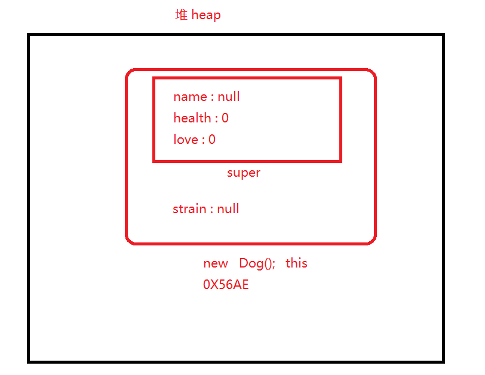
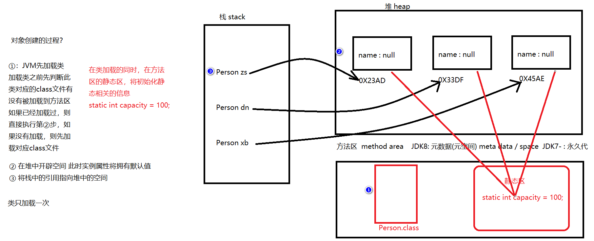
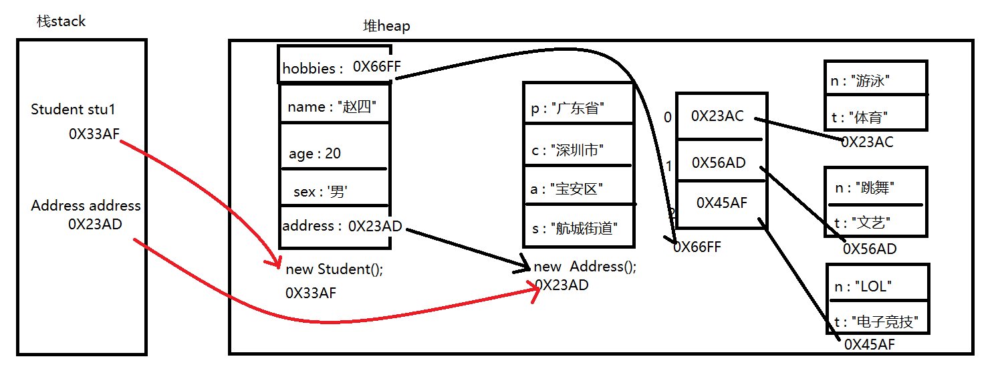

## 方法重写和多态

### 1. this和super关键字内存图



### 2. this关键字的实现原理

> this关键字属于一个隐式(隐藏式)参数 在Java文件编译之后 会帮我们以参数的形式 添加在对应的位置
>
> 比如 实例方法 构造方法等等 
>
> javap -verbose 文件名.class

### 3. static关键字



#### 3.1 static修饰属性

> static修饰的属性称之为静态属性 不属于任何对象 属于整个类 可以被此类所有对象共享 在内存中只存在一份
>
> static修饰的属性推荐使用类名加点访问 不推荐使用对象名加点访问

```java
package com.atguigu.test2;

/**
 *  使用程序模拟饮水机接水操作
 *
 *  static修饰的属性称之为静态属性 不属于任何对象 属于整个类 可以被此类所有对象共享 在内存中只存在一份
 *  static修饰的属性推荐使用类名加点访问 不推荐使用对象名加点访问
 *
 *
 *
 */
public class Person {
    String name;
    static int capacity = 100; // 单位L

    public void getWater(){
        if(capacity > 0){
            capacity -= 2;
            System.out.println(name + "接水2L，还剩余" + capacity + "升");
        }else{
            System.out.println("没水了");
        }
    }

    public static void main(String[] args) {
        Person zs = new Person();
        Person dn = new Person();
        Person xb = new Person();

        zs.name = "赵四";
        dn.name = "大拿";
        xb.name = "小宝";

        zs.getWater();
        dn.getWater();
        xb.getWater();


    }


}

```

```java
package com.atguigu.test2;

/**
 */
public class Student {
    String name;
    int age;
    static String country = "中国";


    public static void main(String[] args) {
        System.out.println(Student.country);


        Student stu1 = new Student();
        stu1.name = "赵四";
        stu1.age = 20;
        stu1.country = "中华人民共和国";
        System.out.println(stu1.country);

        stu1 = null; // GC 垃圾回收器会判断没有任何引用指向的(对象)空间


        Student stu2 = new Student();
        stu2.name = "大拿";
        stu2.age = 21;
        System.out.println(stu2.country);

        Student stu3 = new Student();
        stu3.name = "小宝";
        stu3.age = 22;
        System.out.println(stu3.country);

        System.out.println("----------------------------------");

        System.out.println(Student.country);


    }
}

```


#### 3.2 static修饰方法

>  静态方法
>
> 本类中直接访问 其他类通过类名加点访问 不推荐使用对象名加点访问
>
> Arrays类中全部为静态方法 所以 我们使用此类不需要new对象
>
>
> 关于静态级别和实例级别互相访问 一共四种情况
>
> 1.同级别互相直接访问
>
> 2.实例访问静态 直接访问
>
> 3.静态访问实例 先new对象 (回顾main方法)

```java
package com.atguigu.test3;

/**
 *  静态方法
 *  本类中直接访问 其他类通过类名加点访问 不推荐使用对象名加点访问
 *  Arrays类中全部为静态方法 所以 我们使用此类不需要new对象
 *
 *  关于静态级别和实例级别互相访问 一共四种情况
 *  1.同级别互相直接访问
 *  2.实例访问静态 直接访问
 *  3.静态访问实例 先new对象 (回顾main方法)
 */
public  class TestStaticMethod {
    String name;
    int age;
    public static void m1(){


        TestStaticMethod tsm = new TestStaticMethod();
        System.out.println(tsm.name);
        System.out.println(tsm.age);
        tsm.m3();
        System.out.println("静态方法m1");
    }

    public static void m2(){
        System.out.println("静态方法m2");
    }

    public void m3(){
        System.out.println("本类实例方法m3");
    }


    public static void main(String[] args) {
        m1();
        m2();

        TestStaticMethod tsm = new TestStaticMethod();
        tsm.m1();
        tsm.m2();
    }
}

```

```java
package com.atguigu.test3;

import java.util.Arrays;

public class Test {
    public static void main(String[] args) {
        TestStaticMethod.m1(); // 直接通过类名访问
        TestStaticMethod.m2();
    }
}

```


#### 3.3 static修饰代码块

> 静态代码块 ： 随着类的加载而执行 多个静态代码块按照书写顺序执行 每个只执行一次 因为类只加载一次
>
>
> 什么时候需要加载类？
>
> 1.创建对象之前
>
> 2.访问一个类的静态信息
>
> 什么时候使用静态代码块？
>
> 1.用于初始化系统数据
>
> 2.用于执行一些前置操作

```java
package com.atguigu.test4;

/**
 *  静态代码块 ： 随着类的加载而执行 多个静态代码块按照书写顺序执行 每个只执行一次 因为类只加载一次
 *
 *  什么时候需要加载类？
 *  1.创建对象之前
 *  2.访问一个类的静态信息
 *
 *  什么时候使用静态代码块？
 *  1.用于初始化系统数据
 *  2.用于执行一些前置操作
 *
 *
 */
public class TestStaticCode {
    static int num = 100;

    static{
        System.out.println("静态代码块1");
    }

    static{
        System.out.println("静态代码块2");
    }

    {
        System.out.println("实例/普通 代码块1");
    }

    {
        System.out.println("实例/普通 代码块2");
    }


    public static void main(String[] args) {
       System.out.println(num);

       TestStaticCode testStaticCode1 = new TestStaticCode();
       TestStaticCode testStaticCode2 = new TestStaticCode();
       TestStaticCode testStaticCode3 = new TestStaticCode();
    }
}
```

### 4. 自定义类类型的属性

> 我们自定义的类 同样是可以作为属性类型来使用的  与String类性质相同 都属于引用数据类型

```java
package com.atguigu.test5;

/**
 *  学生类
 *  属性：名字 年龄 性别 地址
 *
 *  目前使用String类型存储地址信息 将会出现 地址信息混乱 不规范的问题
 *  我们可以使用自定义的类型来解决这个问题
 *
 */
public class Student {
    private String name;
    private int age;
    private char sex;
    private Address address; // 广东省深圳市    深圳市宝安区   宝安区航城街道   航城街道5巷15号

    public void setAddress(Address address){
        this.address = address;
    }

    public Address getAddress(){
        return address;
    }


    public String getName() {
        return name;
    }

    public void setName(String name) {
        this.name = name;
    }

    public int getAge() {
        return age;
    }

    public void setAge(int age) {
        this.age = age;
    }

    public char getSex() {
        return sex;
    }

    public void setSex(char sex) {
        this.sex = sex;
    }
}


class Address{
    private String province;
    private String city;
    private String area;
    private String street;

    public String getProvince() {
        return province;
    }

    public void setProvince(String province) {
        this.province = province;
    }

    public String getCity() {
        return city;
    }

    public void setCity(String city) {
        this.city = city;
    }

    public String getArea() {
        return area;
    }

    public void setArea(String area) {
        this.area = area;
    }

    public String getStreet() {
        return street;
    }

    public void setStreet(String street) {
        this.street = street;
    }
}


```

```java
package com.atguigu.test5;

public class TestStudent {
    public static void main(String[] args) {
        Student stu1 = new Student();
        stu1.setName("赵四");
        stu1.setAge(20);
        stu1.setSex('男');

        Address address = new Address();
        address.setProvince("广东省");
        address.setCity("深圳市");
        address.setArea("宝安区");
        address.setStreet("航城街道");

        System.out.println(address);


        stu1.setAddress(address);

        System.out.println(stu1.getAddress());

        System.out.println("----------------------------------------------------");

        System.out.println(stu1.getName());
        System.out.println(stu1.getAge());
        System.out.println(stu1.getSex());
        System.out.println(stu1.getAddress());
        System.out.println(stu1.getAddress().getProvince());
        System.out.println(stu1.getAddress().getCity());
        System.out.println(stu1.getAddress().getArea());
        System.out.println(stu1.getAddress().getStreet());

        System.out.println("----------------------------------------------------");

        // 我们也可以直接通过address对象访问 此对象具体的四个属性信息
        // 但是这样的访问属于将地址对象独立使用了 而学生 和 地址对象是绑定在一起的
        // 所以 我们应该通过学生访问到地址 再继续访问具体的地址信息
        System.out.println(address.getProvince());
        System.out.println(address.getCity());
        System.out.println(address.getArea());
        System.out.println(address.getStreet());

        System.out.println("----------------------------------------------------");
        // 空指针的问题 空指针是一种异常 NullPointerException
        // 什么是空指针/什么情况下会出现空指针？
        // 当你使用一个指向为null的对象 (继续加点访问任何内容)继续访问属性 或者 方法 就会出现空指针异常

        Student stu2 = new Student();
        stu2.setName("大拿");
        stu2.setAge(15);
        stu2.setSex('男');

        System.out.println(stu2.getName());
        System.out.println(stu2.getAge());
        System.out.println(stu2.getSex());
        System.out.println(stu2.getAddress());
//        System.out.println(stu2.getAddress().getProvince());
//        System.out.println(stu2.getAddress().getCity());
//        System.out.println(stu2.getAddress().getArea());
//        System.out.println(stu2.getAddress().getStreet());

        System.out.println("----------------------------------------------------");

        Student stu3 = null;
        System.out.println(stu3.getName());
    }
}

```


### 5. 自定义类类型的数组属性



> 我们自定义的类 同样是可以作为数组类型来使用的  同时也可以作为属性使用  属于引用数据类型

```java
package com.atguigu.test6;

/**
 *  学生类
 *  属性：名字 年龄 性别 地址  爱好
 *
 *  目前使用String类型存储地址信息 将会出现 地址信息混乱 不规范的问题
 *  我们可以使用自定义的类型来解决这个问题
 *
 *  对象之间的关系：
 *  一对一
 *  一对多
 *  多对一
 *  多对多
 *
 */
public class Student {
    private String name;
    private int age;
    private char sex;
    private Address address; // 广东省深圳市    深圳市宝安区   宝安区航城街道   航城街道5巷15号

    private Hobby[] hobbies;

    public void setHobbies(Hobby [] hobbies){
        this.hobbies = hobbies;
    }

    public Hobby[] getHobbies(){
        return hobbies;
    }


    public void setAddress(Address address){
        this.address = address;
    }

    public Address getAddress(){
        return address;
    }


    public String getName() {
        return name;
    }

    public void setName(String name) {
        this.name = name;
    }

    public int getAge() {
        return age;
    }

    public void setAge(int age) {
        this.age = age;
    }

    public char getSex() {
        return sex;
    }

    public void setSex(char sex) {
        this.sex = sex;
    }
}

class Hobby{
    private String hobbyName; // 爱好名称
    private String hobbyType; // 爱好类型

    public String getHobbyName() {
        return hobbyName;
    }

    public void setHobbyName(String hobbyName) {
        this.hobbyName = hobbyName;
    }

    public String getHobbyType() {
        return hobbyType;
    }

    public void setHobbyType(String hobbyType) {
        this.hobbyType = hobbyType;
    }
}


class Address{
    private String province;
    private String city;
    private String area;
    private String street;

    public String getProvince() {
        return province;
    }

    public void setProvince(String province) {
        this.province = province;
    }

    public String getCity() {
        return city;
    }

    public void setCity(String city) {
        this.city = city;
    }

    public String getArea() {
        return area;
    }

    public void setArea(String area) {
        this.area = area;
    }

    public String getStreet() {
        return street;
    }

    public void setStreet(String street) {
        this.street = street;
    }
}


```

```java
package com.atguigu.test6;

public class TestStudent {
    public static void main(String[] args) {
        Student stu1 = new Student();
        stu1.setName("赵四");
        stu1.setAge(25);
        stu1.setSex('男');

        System.out.println("-------------------------------------------------");

        Address address = new Address();
        address.setProvince("广东省");
        address.setCity("深圳市");
        address.setArea("南山区");
        address.setStreet("文化路街道");

        stu1.setAddress(address);
        System.out.println("-------------------------------------------------");
        Hobby [] hobbies = new Hobby[3];

        System.out.println(hobbies[0]);
        System.out.println(hobbies[1]);
        System.out.println(hobbies[2]);


        Hobby swim = new Hobby();
        swim.setHobbyType("体育类");
        swim.setHobbyName("游泳");

        hobbies[0] = swim;

        System.out.println("~~~~~~~~~~~~~~~~~~~");

        hobbies[1] = new Hobby();
        hobbies[1].setHobbyType("电子竞技");
        hobbies[1].setHobbyName("LOL");

        System.out.println("~~~~~~~~~~~~~~~~~~~");

        hobbies[2] = new Hobby();
        hobbies[2].setHobbyType("文艺类");
        hobbies[2].setHobbyName("跳舞");


        stu1.setHobbies(hobbies);

        System.out.println("------------------打印信息--------------------");

        System.out.println(stu1.getName());
        System.out.println(stu1.getAge());
        System.out.println(stu1.getSex());

        System.out.println(stu1.getAddress());
        System.out.println(stu1.getAddress().getProvince());
        System.out.println(stu1.getAddress().getCity());
        System.out.println(stu1.getAddress().getArea());
        System.out.println(stu1.getAddress().getStreet());


        System.out.println(stu1.getHobbies());
        System.out.println(stu1.getHobbies()[0]);
        System.out.println(stu1.getHobbies()[0].getHobbyName());
        System.out.println(stu1.getHobbies()[0].getHobbyType());

        System.out.println(stu1.getHobbies()[1]);
        System.out.println(stu1.getHobbies()[1].getHobbyName());
        System.out.println(stu1.getHobbies()[1].getHobbyType());


        System.out.println(stu1.getHobbies()[2]);
        System.out.println(stu1.getHobbies()[2].getHobbyName());
        System.out.println(stu1.getHobbies()[2].getHobbyType());

        System.out.println("-----------------------------------------------------");

        for(int i  =0;i < hobbies.length;i++){
            System.out.println(hobbies[i].getHobbyName());
            System.out.println(hobbies[i].getHobbyType());
        }

        System.out.println("-----------------------------------------------------");

        for(int i  =0;i < stu1.getHobbies().length;i++){
            System.out.println(hobbies[i].getHobbyName());
            System.out.println(hobbies[i].getHobbyType());
        }

    }
}

```

