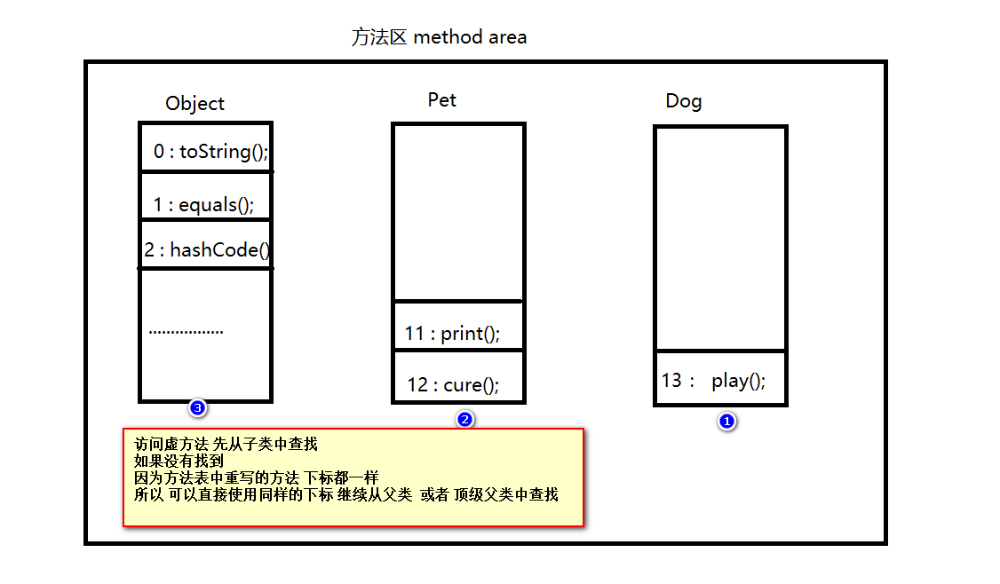

## 多态

### 1.多态向上转型

> 多态： 同一个引用类型 使用不同的实例而执行不同操作
>
> 父类引用指向子类对象 属于多态向上转型
>
>
> 向上转型：此时通过父类的引用 可以访问的是 子类重写父类的方法 或者 继承 父类的方法
>
> 不能访问子类独有的方法
>
>
> 使用向上转型将无法访问子类独有的方法，为什么还要使用呢？
>
> 因为使用了向上转型以后 虽然调用的方法个数受到了影响 但是我们可以通过这种方式提高程序的灵活性
>
>
> 多态向上转型具体的表现：
>
> 1.父类作为形参 子类作为实参
>
> 2.父类作为声明返回值 实际返回值为子类类型
>
> 3.父类类型的数组、集合 其元素为子类类型
>
> 对于创建对象的语句而言： 等号左边的称之为引用 等号右边的为对象

#### 1.1 父类作为形参

> 父类作为形参 实参为子类类型 属于多态向上转型 可以提高程序的灵活性

```java
package com.atguigu.test1;

/**
 * @author WHD
 * @description TODO
 * @date 2023/6/6 15:38
 *  主人类
 *  属性：名字 年龄 性别 ……
 *  方法：
 *      1.带宠物去看病
 *      2.抽奖送宠物方法
 *      一等奖 送企鹅一只
 *      二等奖 送狗狗一只
 *      三等奖 送猫咪
 *      幸运奖 送成年东北虎一只
 */
public class Master {

    public void toHospitalWithPet(Pet pet){
        pet.cure();
    }
}
```

#### 1.2 父类作为返回值

> 父类作为声明返回值 实际返回值为子类类型 也是多态向上转型的表现形式之一

```java
package com.atguigu.test1;

/**
 * @author WHD
 * @description TODO
 * @date 2023/6/6 15:38
 *  主人类
 *  属性：名字 年龄 性别 ……
 *  方法：
 *      1.带宠物去看病
 *      2.抽奖送宠物方法
 *      一等奖 送企鹅一只
 *      二等奖 送狗狗一只
 *      三等奖 送猫咪
 *      幸运奖 送成年东北虎一只
 */
public class Master {

    public Pet givePet(int num){
       switch(num){
           case 1:
               Penguin penguin = new Penguin("大白", 100, 100, "雄");
               return penguin;
           case 2:
               Dog dog = new Dog("大黄", 100, 100, "金毛");
               return dog;
           case 3:
               Cat cat = new Cat();
               return cat;
           case 4:
               Tiger tiger = new Tiger();
               return tiger;
       }
       return null;
    }

}
```

#### 1.3 父类作为数组类型

> 父类类型的数组 其元素为具体的子类类型 也属于多态向上转型

```java
package com.atguigu.test1;

/**
 * @author WHD
 * @description TODO
 * @date 2023/6/6 15:28
 */
public class TestPet {
    public static void main(String[] args) {
     
        Pet [] pets = new Pet[3];

        Penguin p = new Penguin("大白", 100, 100, "雄");

        Cat cat = new Cat();

        pets[0] = p;
        pets[1] = new Dog("大黄", 100, 100, "金毛");;
        pets[2] = cat;
    }
}
```

### 2. 多态向下转型

> 多态向下转型：
>
> 什么是向下转型?
>
> 将父类类型转换为子类类型
>
> 为什么需要向下转型?
>
>  当我们向上转型以后 是无法访问子类独有的方法 如需访问 则必须向下转型
>
> `向下转型是将指向子类对象的父类引用 转换为子类类型`
>
> `而不是将一个指向父类对象的父类引用 转换为子类类型`
>
> `总结：也就是必须先向上转型 才可以向下转型`
>
> 在实际开发中，我们会使用`instanceof`关键字在向下转型之前进行类型判断 以避免类型转换异常
>
>
> 用法 ： 对象名 instanceof 类名 表示此对象是否属于此类类型

```java
package com.atguigu.test1;

/**
 * @author WHD
 * @description TODO
 * @date 2023/6/7 9:38
 *  多态向下转型：
 *    什么是向下转型  将父类类型转换为子类类型
 *    为什么需要向下转型 当我们向上转型以后 是无法访问子类独有的方法 如需访问 则必须向下转型
 *
 *
 *  向下转型是将指向子类对象的父类引用 转换为子类类型
 *  而不是将一个指向父类对象的父类引用 转换为子类类型
 *  总结：也就是必须先向上转型 才可以向下转型
 *
 *  在实际开发中，我们会使用instanceof关键字在向下转型之前进行类型判断 以避免类型转换异常
 *
 *  用法 ： 对象名 instanceof 类名 表示此对象是否属于此类类型
 *
 *
 */
public class Test1 {
    public static void main(String[] args) {
        Pet pet = new Dog();
        
        if(pet instanceof Dog){
            Dog dog = (Dog)pet;

        	dog.playWithMaster();
        }
        System.out.println("---------------------------------------");

        Pet p1 = new Pet();

        if(p1 instanceof  Dog){
            Dog dog2 = (Dog)p1;
        }else{
            System.out.println("类型不匹配");
        }


        System.out.println("---------------------------------------");

        Dog dog1 = new Dog();

        dog1.playWithMaster();
        dog1.print();
        dog1.cure();

        System.out.println("程序结束");

    }
}

```


### 3. 关于向上向下转型

> 分析：我们重写顶层父类Object类中的equals方法，本身父类中的方法形参为Object类型，因为考虑到所有子类的可重用性，所以参数类型为顶级父类，这里属于多态向上转型。但我们在实际使用的时候，应该是一个具体的类型，比如 Person、Dog等等，所以这时我们需要向下转型。
>
> 总结：
>
> 向上转型是为了灵活性，扩展性
>
> 向下转型是为了实用性 

```java
package com.atguigu.test2;

import com.atguigu.test1.Dog;

/**
 * @author WHD
 * @description TODO
 * @date 2023/6/6 10:41
 */
public class Person {
    private String name;
    private String idCard;

    public String getName() {
        return name;
    }

    public void setName(String name) {
        this.name = name;
    }

    public String getIdCard() {
        return idCard;
    }

    public void setIdCard(String idCard) {
        this.idCard = idCard;
    }

    public Person(String name, String idCard) {
        this.name = name;
        this.idCard = idCard;
    }

    public Person() {
    }


    public boolean equals(Object obj){
        if(this == obj){
            return true;
        }
        if(obj instanceof  Person){
            Person p1 = (Person)obj;

            if(this.name.equals(p1.name) && this.idCard.equals(p1.idCard)){
                return true;
            }
        }
        return false;
    }

    public static void main(String[] args) {
        Person p1 = new Person("赵四", "56789454798764612984552");
        Person p2 = new Person("赵四", "56789454798764612984552");

        Dog dog = new Dog();
        System.out.println(p1.equals(dog));

    }


}

```


### 4. 多态相关原理

> 面试极少问： 关于多态的底层实现原理
>
>
> 虚方法（Virtual Method ）和非虚方法
>
> 虚方法：
>
> 可以被子类继承 并且重写的方法 称之为虚方法
>
> 即在编译期间无法确定方法的版本的 这种方法 称之为虚方法
>
> JVM底层是通过 #invokevirtual 这个指令来实现方法的调用的
>
>
> 非虚方法：
>
> 非虚方法即在编译期间可以确定方法的版本的 这种方法 称之为非虚方法
>
> 比如 private修饰的方法  static修饰的方法  final修饰的方法(不能被重写)
>
> JVM底层是通过 #invokestatic 这个指令来实现方法的调用的
>
>
> 关于方法的隐藏和方法的覆盖：
>
> 如果在子类中书写和父类完全相同的静态方法 属于方法的隐藏 因为通过多态的方式依然可以访问到父类的方法
>
> 如果在子类中对父类的实例方法进行重写 属于方法的覆盖 因为不管是通过子类对象 还是多态的方式 都无法访问父类的方法
>
>
> 动态绑定和静态绑定
>
> 虚方法属于动态绑定  因为在编译期间 无法确定方法的版本 所以只有在程序运行期间 动态的创建对象 从而确定方法的版本信息
>
> 非虚方法 因为在编译期间 就可以确定方法的版本 所以是跟调用此方法的对象 或者类 静态绑定
>
>
>
> 虚方法表：即只要是虚方法(子类可以继承并且重写的方法)就存在此表中 是一个数组结构 当我们访问一个虚方法的时候
>
> 先从本类即子类中查找 如果没有 再依次向上从父类中查找



### 5. 抽象类

> 1.抽象方法没有方法体 必须存在于抽象类中 均使用abstract修饰
>
> 2.抽象类不能直接new对象 必须通过new子类的方式创建对象(即多态向上转型的方式)
>
> 3.子类必须重写父类中的所有抽象方法 除非子类也是抽象类
>
> 4.抽象类中可以书写普通属性 普通方法 静态方法 构造方法
>
> 5.抽象类实现多态的方式与之前一致

```java
package com.atguigu.test7;

/**
 * @author WHD
 * @description TODO
 * @date 2023/6/7 15:11
 *  门 父类  抽象类
 *  子类 普通门 防盗门
 */
public abstract class Door {
    private String brand;
    private double price;

    public String getBrand() {
        return brand;
    }

    public void setBrand(String brand) {
        this.brand = brand;
    }

    public double getPrice() {
        return price;
    }

    public void setPrice(double price) {
        this.price = price;
    }

    public Door(String brand, double price) {
        this.brand = brand;
        this.price = price;
    }

    public Door() {
    }

    public abstract void open();

    public abstract void close();


}

```

```java
package com.atguigu.test7;

/**
 * @author WHD
 * @description TODO
 * @date 2023/6/7 15:13
 */
public class CommonDoor extends Door{
    @Override
    public void open() {
        System.out.println("普通门开门，插入钥匙，轻轻一转，zhi~ya~一声，门开了");
    }

    @Override
    public void close() {
        System.out.println("普通门关门，duang的一声，门关了");
    }
}

```

```java
package com.atguigu.test7;

/**
 * @author WHD
 * @description TODO
 * @date 2023/6/7 15:15
 */
public class SecurityDoor extends Door{
    @Override
    public void open() {
        System.out.println("防盗门开门，输入密码，人脸识别，门开了");
    }

    @Override
    public void close() {
        System.out.println("防盗门关门，自动关门");
    }
}

```

```java
package com.atguigu.test7;

/**
 * @author WHD
 * @description TODO
 * @date 2023/6/7 15:17
 *  人类 行为 操作门
 */
public class Person {
    public void openCommonDoor(CommonDoor commonDoor){
        commonDoor.open();
    }

    public void closeCommonDoor(CommonDoor commonDoor){
        commonDoor.close();
    }


    public void openSecurityDoor(SecurityDoor securityDoor){
        securityDoor.open();
    }

    public void closeSecurityDoor(SecurityDoor securityDoor){
        securityDoor.close();
    }

    // 以上四个方法针对每一种都书写 了具体的方法来实现开和关
    // 这种方式不灵活 如果后续更多的门的子类 还要继续编写更多的 方法
    // 我们应该编写一个方法 实现所有门的开和关
    public void openDoor(Door door){
        door.open();
    }

    public void closeDoor(Door door){
        door.close();
    }

    public Door buyDoor(double price){
        if(price > 2000){
            return new SecurityDoor();
        }else{
            return new CommonDoor();
        }
    }


}

```

```java
package com.atguigu.test7;

/**
 * @author WHD
 * @description TODO
 * @date 2023/6/7 15:16
 */
public class Test {
    public static void main(String[] args) {
        Door commonDoor = new CommonDoor();
        commonDoor.open();
        commonDoor.close();

        System.out.println("--------------------------------------------");

        Door securityDoor = new SecurityDoor();
        securityDoor.open();
        securityDoor.close();

        System.out.println("--------------------------------------------");

        CommonDoor cd = new CommonDoor();

        SecurityDoor sd = new SecurityDoor();

        Person person = new Person();


        person.openDoor(cd);
        person.openDoor(sd);

        person.closeDoor(cd);
        person.closeDoor(sd);

        System.out.println("--------------------------------------------");

        Door [] doors = new Door[2];

        doors[0] = new CommonDoor();
        doors[1] = sd;


    }
}

```

### 6.final关键字

> final关键字可以修饰属性、方法、类

#### 6.1 修饰属性

>  final 修饰属性
>
> final修饰的属性称之为常量 名称全部大写 多个单词之间使用下划线分割
>
> 基本数据类型常量：使用final修饰基本数据类型 表示其值只能被赋值一次 且不能改变
>
> 引用数据类型常量：使用final修饰引用数据类型 地址不能改变 但是地址中的值是可以改变的
>
>
> 常量的赋值：通常(99%)在定义的时候直接赋值 或者 在构造方法中赋值
>
> 这两种赋值方式 都是为了保证在使用常量之前是有值的

```java
package com.atguigu.test8;

/**
 * @author WHD
 * @description TODO
 * @date 2023/6/7 15:58
 *  final 修饰属性
 *  final修饰的属性称之为常量 名称全部大写 多个单词之间使用下划线分割
 *  基本数据类型常量：使用final修饰基本数据类型 表示其值只能被赋值一次 且不能改变
 *  引用数据类型常量：使用final修饰引用数据类型 地址不能改变 但是地址中的值是可以改变的
 *
 *  常量的赋值：通常(99%)在定义的时候直接赋值 或者 在构造方法中赋值
 *  这两种赋值方式 都是为了保证在使用常量之前是有值的
 *
 */
public class TestFinalFiled {
    final double PI = 3.14;
    double radius;

    final String COUNTRY_NAME;

    public TestFinalFiled(){
        COUNTRY_NAME = "中国";
    }

    public TestFinalFiled(double radius){
        this.radius = radius;
        COUNTRY_NAME = "中华人民共和国";
    }


    final char [] SIGNS = new char[3];

    public static void main(String[] args) {
        TestFinalFiled testFinalFiled = new TestFinalFiled();
//        testFinalFiled.pi = 3.34;
        testFinalFiled.radius = 10;
        System.out.println( testFinalFiled.PI * testFinalFiled.radius * testFinalFiled.radius );


        testFinalFiled.SIGNS[0] = 'a';
        testFinalFiled.SIGNS[1] = 'b';
        testFinalFiled.SIGNS[2] = 'c';

    }
}

```

> 通常情况下，不允许被改变的数据，往往也没有必要存在多份，所以我们可以再加上static修饰
>
> 表示：静态常量 作用范围也通常设置为public  因为静态常量 需要被更多的类使用
>
>
> 关于静态常量的赋值：通常在定义的时候直接赋值 或者 在静态代码块中赋值

```java
package com.atguigu.test8;

/**
 * @author WHD
 * @description TODO
 * @date 2023/6/7 16:13
 *  通常情况下，不允许被改变的数据，往往也没有必要存在多份，所以我们可以再加上static修饰
 *  表示：静态常量 作用范围也通常设置为public  因为静态常量 需要被更多的类使用
 *
 *  关于静态常量的赋值：通常在定义的时候直接赋值 或者 在静态代码块中赋值
 *
 */
public class TestStaticFinalField {
    public static final double PI = 3.14;

    static final String COUNTRY_NAME;

    static{
        COUNTRY_NAME = "中国";
    }
}
```


#### 6.2 修饰方法

> final修饰方法 表示此方法可以被继承  不能被子类重写

```java
package com.atguigu.test8;

/**
 * @author WHD
 * @description TODO
 * @date 2023/6/7 16:18
 *  final修饰方法 表示此方法可以被继承  不能被子类重写
 */
public class TestFinalMethod {
}

class A{
    public final  void m1(){

    }

    public void m2(){

    }

}

class B extends A {
    @Override
    public void m2() {

    }

//    @Override
//    public void m1() {
//
//    }

}


```


#### 6.3 修饰类

> final修饰类 表示此类不能被继承

```java
package com.atguigu.test8;

/**
 * @author WHD
 * @description TODO
 * @date 2023/6/7 16:21
 *  final修饰类 表示此类不能被继承
 */
public class TestFinalClass {
}

final class C {

}

//class D extends C{
//
//}

```

